# 一、消息队列


## 1. 消息队列的介绍

消息(Message)是指在应用之间传送的数据,消息可以非常简单,比如只包含文本字符串,也可以更复杂,可能包含嵌入对象。 消息队列(Message Queue)是一种应用间的通信方式,消息发送后可以立即返回,有消息系统来确保信息的可靠专递,消息发布者只管把消息发布到 <u>MQ</u> 中而不管谁来取,消息使用者只管从 <u>MQ</u> 中取消息而不管谁发布的,这样发布者和使用者都不用知道对方的存在。


## 2. 消息队列的应用场景

消息队列在实际应用中包括如下四个场景:

- **异步处理**:多应用对消息队列中同一消息进行处理,应用间并发处理消息,相比串行处理,减少处理时间;

- **应用耦合**:多应用间通过消息队列对同一消息进行处理,避免调用接口失败导致整个过程失败;

- **限流削峰**:广泛应用于秒杀或抢购活动中,避免流量过大导致应用系统挂掉的情况;

- **消息驱动的系统**:系统分为消息队列、消息生产者、消息消费者,生产者负责产生消息,消费者(可能有多个)负责对消息进行处理;

下面详细介绍上述四个场景以及消息队列如何在上述四个场景中使用:

1. <font color = "blue">异步处理</font>

具体场景:用户为了使用某个应用,进行注册,系统需要发送注册邮件并验证短信。对这两个操作的处理方式有两种:串行及并行。

- 串行方式:新注册信息生成后,先发送注册邮件,再发送验证短信;


在这种方式下,需要最终发送验证短信后再返回给客户端。

- 并行处理:新注册信息写入后,由发短信和发邮件并行处理;

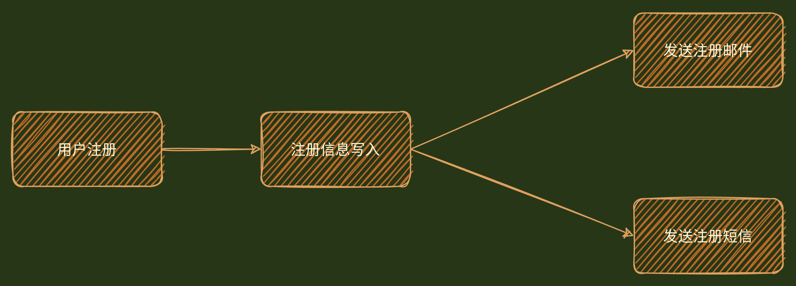

在这种方式下,发短信和发邮件 需处理完成后再返回给客户端。 假设以上三个子系统处理的时间均为 50ms,且不考虑网络延迟,则总的处理时间:

串行:50+50+50=150ms

并行:50+50 = 100ms


- 若使用消息队列:


在写入消息队列后立即返回成功给客户端,则总的响应时间依赖于写入消息队列的时间,而写入消息队列的时间本身是可以很快的,基本可以忽略不计,因此总的处理时间相比串行提高了 2 倍,相比并行提高了一倍;

2. <font color = "blue">应用耦合</font>

具体场景:用户使用 QQ 相册上传一张图片,人脸识别系统会对该图片进行人脸识别,一般的做法是,服务器接收到图片后,图片上传系统立即调用人脸识别系统,调用完成后再返回成功,如下图所示:


该方法有如下缺点

- 人脸识别系统被调失败,导致图片上传失败;

- 延迟高,需要人脸识别系统处理完成后,再返回给客户端,即使用户并不需要立即知道结果;
- 图片上传系统与人脸识别系统之间互相调用,需要做耦合;

若使用消息队列:


客户端上传图片后,图片上传系统将图片信息如 uin、批次写入消息队列,直接返回成功;而人脸识别系统则定时从消息队列中取数据,完成对新增图片的识别。此时图片上传系统并不需要关心人脸识别系统是否对这些图片信息的处理、以及何时对这些图片信息进行处理。事实上,由于用户并不需要立即知道人脸识别结果,人脸识别系统可以选择不同的调度策略,按照闲时、忙时、正常时间,对队列中的图片信息进行处理。

3. <font color = "blue">限流削峰</font>

具体场景:购物网站开展秒杀活动,一般由于瞬时访问量过大,服务器接收过大,会导致流量暴增,相关系统无法处理请求甚至崩溃。而加入消息队列后,系统可以从消息队列中取数据,相当于消息队列做了一次缓冲。


该方法有如下优点:

- 请求先入消息队列,而不是由业务处理系统直接处理,做了一次缓冲,极大地减少了业务处理系统的压力;
- 队列长度可以做限制,事实上,秒杀时,后入队列的用户无法秒杀到商品,这些请求可以直接被抛弃,返回活动已结束或商品已售完信息;

4. <font color = "blue">消息驱动的系统</font>

具体场景:用户新上传了一批照片,人脸识别系统需要对这个用户的所有照片进行聚类,聚类完成后由对账系统重新生成用户的人脸索引(加快查询)。这三个子系统间由消息队列连接起来,前一个阶段的处理结果放入队列中,后一个阶段从队列中获取消息继续处理。


该方法有如下优点:

- 避免了直接调用下一个系统导致当前系统失败;
- 每个子系统对于消息的处理方式可以更为灵活,可以选择收到消息时就处理,可以选择定时处理,也可以划分时间段按不同处理速度处理;


## 3. 消息队列的两种模式

消息队列包括两种模式,点对点模式(point to point queue)和发布/订阅模式(publish/subscribe topic)

### 1）点对点模式

点对点模式下包括三个角色:

- 消息队列
- 发送者 (生产者)
- 接收者(消费者)


消息发送者生产消息发送到 queue 中,然后消息接收者从 queue 中取出并且消费消息。消息被消费后,queue 中不再有存储,所以消息接收者不可能消费到已经被消费的消息。

点对点模式特点:

- 每个消息只有一个接收者(Consumer)(即一旦被消费,消息就不再在消息队列中);
- 发送者和接发收者间没有依赖性,发送者发送消息之后,不管有没有接收者在运行,都不会影响到发送者下次发送消息;
- 接收者在成功接收消息之后需向队列应答成功,以便消息队列删除当前接收的消息;


### 2）发布/订阅模式 

发布/订阅模式下包括三个角色:

- 角色主题(Topic)
- 发布者(Publisher)
- 订阅者(Subscriber)

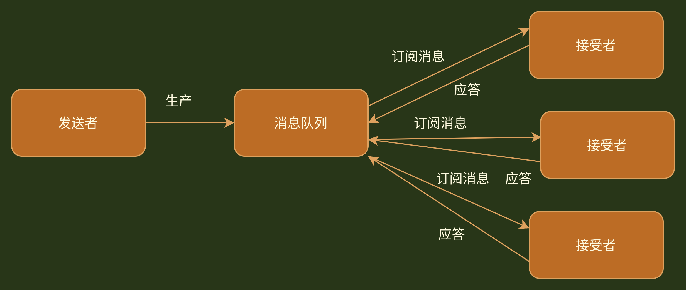

发布者将消息发送到 Topic,系统将这些消息传递给多个订阅者。

发布/订阅模式特点:

- 每个消息可以有多个订阅者;
- 发布者和订阅者之间有时间上的依赖性。针对某个主题(Topic)的订阅者,它必须创建一个订阅者之后,才能消费发布者的消息。
- 为了消费消息,订阅者需要提前订阅该角色主题,并保持在线运行;


## 4. 常用的消息队列

### 1）RabbitMQ

RabbitMQ2007 年发布,是一个在 AMQP(高级消息队列协议)基础上完成的,可复用的企业消息系统,是当前最主流的消息中间件之一。

### 2）ActiveMQ

ActiveMQ 是由 Apache 出品,ActiveMQ 是一个完全支持 JMS1.1 和 J2EE 1.4 规范的 JMS Provider 实现。它非常快速,支持多种语言的客户端和协议,而且可以非常容易的嵌入到企业的应用环境中,并有许多高级功能。

### 3）RocketMQ

RocketMQ 出自 阿里公司的开源产品,用 Java 语言实现,在设计时参考了Kafka,并做出了自己的一些改进,消息可靠性上比 Kafka 更好。RocketMQ 在阿里集团被广泛应用在订单,交易,充值,流计算,消息推送,日志流式处理等。

### 4）Kafka

Apache Kafka 是一个分布式消息发布订阅系统。它最初由 LinkedIn 公司基于独特的设计实现为一个分布式的提交日志系统( a distributed commit log),,之后成为 Apache 项目的一部分。Kafka 系统快速、可扩展并且可持久化。它的分区特性,可复制和可容错都是其不错的特性。


## 5. Pulsar
Apahce Pulasr 是一个企业级的发布-订阅消息系统,最初是由雅虎开发,是下一代云原生分布式消息流平台,集消息、存储、轻量化函数式计算为一体,采用计算与存储分离架构设计,支持多租户、持久化存储、多机房跨区域数据复制,具有强一致性、高吞吐、低延时及高可扩展性等流数据存储特性。Pulsar 非常灵活:它既可以应用于像 Kafka 这样的分布式日志应用场景,也可以应用于像 RabbitMQ 这样的纯消息传递系统场景。它支持多种类型的订阅、多
种交付保证、保留策略以及处理模式演变的方法,以及其他诸多特性。

### 1）Pulsar 的特性

- 内置多租户:不同的团队可以使用相同的集群并将其隔离,解决了许多管理难题。它支持隔离、身份验证、授权和配额;
- 多层体系结构:Pulsar 将所有 topic 数据存储在由 Apache BookKeeper支持的专业数据层中。存储和消息传递的分离解决了扩展、重新平衡和维护集群的许多问题。它还提高了可靠性,几乎不可能丢失数据。另外,在读取数据时可以直连 BookKeeper,且不影响实时摄取。例如,可以使用Presto 对 topic 执行 SQL 查询,类似于 KSQL,但不会影响实时数据处理;
- 虚拟 topic:由于采用 n 层体系结构,因此对 topic 的数量没有限制,topic 及其存储是分离的。用户还可以创建非持久性 topic;
- N 层存储:Kafka 的一个问题是,存储费用可能变高。因此,它很少用于存储"冷"数据,并且消息经常被删除,Apache Pulsar 可以借助分层存储自动将旧数据卸载到 Amazon S3 或其他数据存储系统,并且仍然向客户端展示透明视图;Pulsar 客户端可以从时间开始节点读取,就像所有消息都存在于日志中一样;


### 2）Pulsar 存储架构

Pulsar 的多层架构影响了存储数据的方式。Pulsar 将 topic 分区划分为分片(segment),然后将这些分片存储在 Apache BookKeeper 的存储节点上,以提高性能、可伸缩性和可用性。Pulsar 的无限分布式日志以分片为中心,借助扩展日志存储(通过 ApacheBookKeeper)实现,内置分层存储支持,因此分片可以均匀地分布在存储节点上。由于与任一给定 topic 相关的数据都不会与特定存储节点进行捆绑,因此很容易替换存储节点或缩扩容。另外,集群中最小或最慢的节点也不会成为存储或带宽的短板。

Pulsar 架构能实现分区管理,负载均衡,因此使用 Pulsar 能够快速扩展并达到高可用。这两点至关重要,所以 Pulsar 非常适合用来构建关键任务服务,如金融应用场景的计费平台,电子商务和零售商的交易处理系统,金融机构的实时风险控制系统等。通过性能强大的 Netty 架构,数据从 producers 到 broker,再到 bookie 的转移都是零拷贝,不会生成副本。这一特性对所有流应用场景都非常友好,因为数据直接通过网络或磁盘进行传输,没有任何性能损失。

### 3）Pulsar 消息消费

Pulsar 的消费模型采用了流拉取的方式。流拉取是长轮询的改进版,不仅实现了单个调用和请求之间的零等待,还可以提供双向消息流。通过流拉取模型,Pulsar 实现了端到端的低延迟,这种低延迟比所有现有的长轮询消息系统(如Kafka)都低。


## 6. pulsar和kafka对比

### 1）Pulsar 的主要优势:

- 更多功能:Pulsar Function、多租户、Schema registry、n 层存储、多种消费模式和持久性模式等;
- 更大的灵活性:3 种订阅类型(独占,共享和故障转移),用户可以在一个订阅上管理多个 topic;
- 易于操作运维:架构解耦和 n 层存储;
- 与 Presto 的 SQL 集成,可直接查询存储而不会影响 broker;
-  借助 n 层自动存储选项,可以更低成本地存储;


### 2）Pulsar 的劣势

Pulsar 并不完美,Pulsar 也存在一些问题:

- 相对缺乏支持、文档和案例;
- n 层体系结构导致需要更多组件:BookKeeper;
- 插件和客户端相对 Kafka 较少;
- 云中的支持较少,Confluent 具有托管云产品。


### 3）什么时候应该考虑 Pulsar

- 同时需要像 RabbitMQ 这样的队列和 Kafka 这样的流处理程序;

- 需要易用的地理复制;

- 实现多租户,并确保每个团队的访问权限;

-  需要长时间保留消息,并且不想将其卸载到另一个存储中;

-  需要高性能,基准测试表明 Pulsar 提供了更低的延迟和更高的吞吐量;

总之,Pulsar 还比较新,社区不完善,用的企业比较少,网上有价值的讨论和问题的解决比较少,远没有 Kafka 生态系统庞大,且用户量非常庞大,目前 Kafka 还是大数据领域消息队列的王者!所以我们还是要以 Kafka 为主!


## 7. 其他消息队列与kafka对比

| --             | RabbitMQ                                                     | ActiveMQ                                        | RocketMQ                                                     | Kafka                                                        |
| -------------- | ------------------------------------------------------------ | ----------------------------------------------- | ------------------------------------------------------------ | ------------------------------------------------------------ |
| 所属社区公司   | Mozila Public Licence                                        | Apache                                          | Ali                                                          | Apache                                                       |
| 成熟度         | 成熟                                                         | 成熟                                            | 比较成熟                                                     | 成熟                                                         |
| 授权放式       | 开源                                                         | 开源                                            | 开源                                                         | 开源                                                         |
| 客户端支持语言 | 官方支持Erlang、Java、Ruby等，社区产出多种语言API，几乎支持所有常用语言 | Java、C++、C、Python、PHP、Perl、.net等         | Java、C++(不成熟)                                            | 官方支持Java、开源社区有多语言版本，如PHP、Python、Go、C/C++、Ruby、Node，JS等编程语言，详见kafka客户端列表 |
| 协议支持       | 多协议支持AMQP、XMPP、SMTP、STOMP                            | OpenWire、STOMP、REST、XMPP、AMQP               | 自己定义的一套（社区提供JMS不成熟）                          | 自有协议，社区封装了HTTP协议支持                             |
| 消息批量操作   | 不支持                                                       | 支持                                            | 支持                                                         | 支持                                                         |
| 消息推拉模式   | 多协议，Pull/Push均支持                                      | 多协议，Pull/Push均支持                         | 多协议，Pull/Push均支持                                      | pull                                                         |
| HA             | master/slave模式，master提供服务，slave仅作为备份            | 基于Zookeeper + LevelDB的Master + Slave实现方式 | 支持多Masster模式、多Master多Slave模式，异步复制模式、多Master多Slave，同步双写 | 支持replica机制，leader宕机后，备份自动顶替，并重新选举leader（基于Zookeeper） |
| 数据可靠性     | 可以保证数据不丢，有slave用作备份                            | master/slave                                    | 支持异步实时刷盘，同步刷盘，同步复制，异步复制               | 数据可靠，并且有replica机制，有容错容灾能力                  |
| 单机吞吐量     | 其次（万级）                                                 | 最差（万级）                                    | 最高（十万级）                                               | 次之（十万级）                                               |
| 消息延迟       | 微秒级                                                       | \                                               | 比kafka快                                                    | 毫秒级                                                       |
| 持久化能力     | 内存、文件，支持数据堆积，但反过来数据堆积影响生产效率       | 内存、文件、数据库                              | 磁盘文件                                                     | 磁盘文件，只要磁盘文件够，可以做到无限消息堆积               |
| 是否有序       | 若想有序，只能使用一个Client                                 | 可以支持有序                                    | 有序                                                         | 多Client保证有序                                             |
| 事务           | 不支持                                                       | 支持                                            | 支持                                                         | 不支持，但可以通过Low Level API保证仅消费一次                |
| 集群           | 支持                                                         | 支持                                            | 支持                                                         | 支持                                                         |
| 负载均衡       | 支持                                                         | 支持                                            | 支持                                                         | 支持                                                         |
| 管理界面       | 较好                                                         | 一般                                            | 命令行界面                                                   | 官方只提供了命令行版本，Yahoo开源自己的kafka Web管理界面Kafka-Manager |
| 部署方式       | 独立                                                         | 独立                                            | 独立                                                         | 独立                                                         |


# 二、Kafka基础

## 1. kafka基本介绍

官网:http://kafka.apache.org/

kafka 是最初由 linkedin 公司开发的,使用 scala 语言编写,kafka 是一个分布式,分区的,多副本的,多订阅者的日志系统(分布式 MQ 系统),可以用于搜索日志,监控日志,访问日志等。

Kafka is a distributed,partitioned,replicated commit logservice。它提供了类似于 [JMS](https://zh.wikipedia.org/wiki/Java%E6%B6%88%E6%81%AF%E6%9C%8D%E5%8A%A1) 的特性,但是在设计实现上完全不同,此外它并不是 JMS 规范的实现。kafka 对消息保存时根据 Topic 进行归类,发送消息者成为 Producer,消息接受者成为 Consumer,此外 kafka 集群有多个 kafka 实例组成,每个实例(server)成为 broker。无论是 kafka 集群,还是 producer 和 consumer 都依赖于 zookeeper 来保证系统可用性集群保存一些 meta 信息。

## 2. kafka的好处

- 可靠性:分布式的,分区,复本和容错的。
- 可扩展性:kafka 消息传递系统轻松缩放,无需停机。
- 耐用性:kafka 使用分布式提交日志,这意味着消息会尽可能快速的保存在磁盘上,因此它是持久的。
- 性能:kafka 对于发布和定于消息都具有高吞吐量。即使存储了许多 TB的消息,他也爆出稳定的性能。
- kafka 非常快:保证零停机和零数据丢失。

## 3. 分布式的发布订阅系统

Apache Kafka 是一个分布式发布-订阅消息系统和一个强大的队列,可以处理大量的数据,并使能够将消息从一个端点传递到另一个端点,kafka 适合离线和在线消息消费。kafka 消息保留在磁盘上,并在集群内复制以防止数据丢失。kafka构建在 zookeeper 同步服务之上。它与 apache 和 spark 非常好的集成,应用于实时流式数据分析。


## 4. Kafka的主要应用场景

### 1） 指标分析

kafka 通常用于操作监控数据。这设计聚合来自分布式应用程序的统计信息,以产生操作的数据集中反馈


### 2）日志聚合解决方法

kafka 可用于跨组织从多个服务器收集日志,并使他们以标准的格式提供给多个服务器。


### 3）流式处理

流式处理框架(spark,storm,flink)从主题中读取数据,对齐进行处理,并将处理后的数据写入新的主题,供用户和应用程序使用,kafka 的强耐久性在流处理的上下文中也非常的有用。


# 三、Kafka架构及应用

## 1. Kafka架构

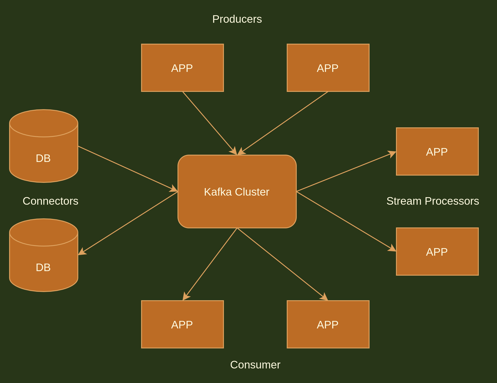

1）生产者 API

允许应用程序发布记录流至一个或者多个 kafka 的主题(topics)。

2）消费者 API

允许应用程序订阅一个或者多个主题,并处理这些主题接收到的记录流。

3）StreamsAPI

允许应用程序充当流处理器(stream processor),从一个或者多个主题获取输入流,并生产一个输出流到一个或 者多个主题,能够有效的变化输入流为输出流。

4）ConnectAPI

允许构建和运行可重用的生产者或者消费者,能够把 kafka 主题连接到现有的应用程序或数据系统。例如:一个连接到关系数据库的连接器可能会获取每个表的变化。

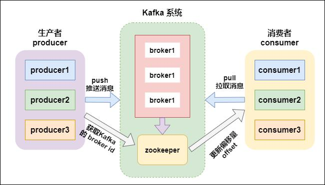

注:在 Kafka 2.8.0 版本,移除了对 Zookeeper 的依赖,通过 KRaft 进行自己的集群管理,使用 Kafka 内部的 Quorum 控制器来取代 ZooKeeper,因此用户第一次可在完全不需要 ZooKeeper 的情况下执行 Kafka,这不只节省运算资源,并且也使得 Kafka 效能更好,还可支持规模更大的集群。过去 Apache ZooKeeper 是 Kafka 这类分布式系统的关键,ZooKeeper 扮演协调代理的角色,所有代理服务器启动时,都会连接到 Zookeeper 进行注册,当代理状态发生变化时,Zookeeper 也会储存这些数据,在过去,ZooKeeper 是一个强大的工具,但是毕竟 ZooKeeper 是一个独立的软件,使得 Kafka 整个系统变得复杂,因此官方决定使用内部 Quorum 控制器来取代 ZooKeeper。

这项工作从去年 4 月开始,而现在这项工作取得部分成果,用户将可以在 2.8版本,在没有 ZooKeeper 的情况下执行 Kafka,官方称这项功能为 Kafka Raft元数据模式(KRaft)。在 KRaft 模式,过去由 Kafka 控制器和 ZooKeeper 所操作的元数据,将合并到这个新的 Quorum 控制器,并且在 Kafka 集群内部执行,

当然,如果使用者有特殊使用情境,Quorum 控制器也可以在专用的硬件上执行。好,说完在新版本中移除 zookeeper 这个事,咱们在接着聊 kafka 的其他功能:kafka 支持消息持久化,消费端是主动拉取数据,消费状态和订阅关系由客户端负责维护,消息消费完后,不会立即删除,会保留历史消息。因此支持多订阅时,消息只会存储一份就可以。

1. broker:kafka 集群中包含一个或者多个服务实例(节点),这种服务实例被称为 broker(一个 broker 就是一个节点/一个服务器);

2. topic:每条发布到 kafka 集群的消息都属于某个类别,这个类别就叫做topic;
3. partition:partition 是一个物理上的概念,每个 topic 包含一个或者多个 partition;
4. segment:一个 partition 当中存在多个 segment 文件段,每个 segment分为两部分,.log 文件和 .index 文件,其中 .index 文件是索引文件,主要用于快速查询, .log 文件当中数据的偏移量位置;
5. producer:消息的生产者,负责发布消息到 kafka 的 broker 中;
6. consumer:消息的消费者,向 kafka 的 broker 中读取消息的客户端;
7. consumer group:消费者组,每一个 consumer 属于一个特定的 consumer group(可以为每个 consumer 指定 groupName);
8. .log:存放数据文件;
9. .index:存放.log 文件的索引数据。


## 2. Kafka主要组件

### 2.1 producer(生产者)

producer 主要是用于生产消息,是 kafka 当中的消息生产者,生产的消息通过topic 进行归类,保存到 kafka 的 broker 里面去。

### 2.2 topic(主题)

- kafka 将消息以 topic 为单位进行归类;
- topic 特指 kafka 处理的消息源(feeds of messages)的不同分类;
- topic 是一种分类或者发布的一些列记录的名义上的名字。kafka 主题始终是支持多用户订阅的;也就是说,一 个主题可以有零个,一个或者多个消费者订阅写入的数据;
- 在 kafka 集群中,可以有无数的主题;
- 生产者和消费者消费数据一般以主题为单位。更细粒度可以到分区级别。

### 2.3 partition（分区）

​	kafka 当中,topic 是消息的归类,一个 topic 可以有多个分区(partition),每个分区保存部分 topic 的数据,所有的 partition 当中的数据全部合并起来,就是一个 topic 当中的所有的数据。一个 broker 服务下,可以创建多个分区,broker 数与分区数没有关系;在 kafka 中,每一个分区会有一个编号:编号从 0 开始。每一个分区内的数据是有序的,但全局的数据不能保证是有序的。(有序是指生产什么样顺序,消费时也是什么样的顺序)

### 2.4 consumer(消费者)

  ​	consumer 是 kafka 当中的消费者,主要用于消费 kafka 当中的数据,消费者一定是归属于某个消费组中的。

### 2.5 consumer group(消费者组)

  ​	消费者组由一个或者多个消费者组成,同一个组中的消费者对于同一条消息只消费一次。每个消费者都属于某个消费者组,如果不指定,那么所有的消费者都属于默认的组。每个消费者组都有一个 ID,即 group ID。组内的所有消费者协调在一起来消费一个订阅主题( topic)的所有分区(partition)。当然,每个分区只能由同一个消费组内的一个消费者(consumer)来消费,可以由不同的消费组来消费。partition 数量决定了每个 consumer group 中并发消费者的最大数量。如下图:

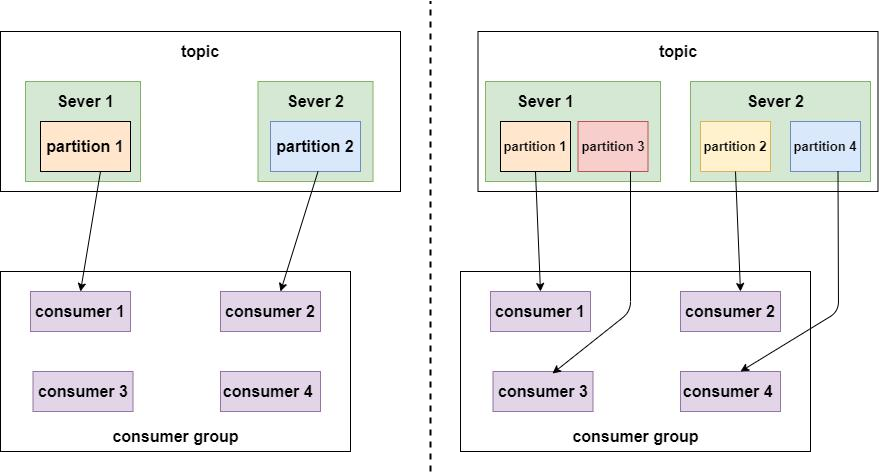

示例 1

如上面左图所示,如果只有两个分区,即使一个组内的消费者有 4 个,也会有两个空闲的。

如上面右图所示,有 4 个分区,每个消费者消费一个分区,并发量达到最大 4。

在来看如下一幅图:

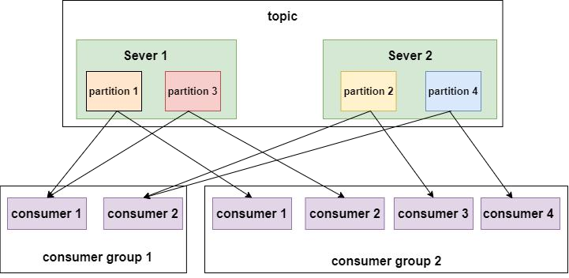

示例 2

如上图所示,不同的消费者组消费同一个 topic,这个 topic 有 4 个分区,分布在两个节点上。左边的 消费组 1 有两个消费者,每个消费者就要消费两个分区才能把消息完整的消费完,右边的 消费组 2 有四个消费者,每个消费者消费一个分区即可。

总结下 kafka 中分区与消费组的关系:

消费组: 由一个或者多个消费者组成,同一个组中的消费者对于同一条消息只消费一次。 某一个主题下的分区数,对于消费该主题的同一个消费组下的消费者数量,应该小于等于该主题下的分区数。

如:某一个主题有 4 个分区,那么消费组中的消费者应该小于等于 4,而且最好与分区数成整数倍 1 2 4 这样。

同一个分区下的数据,在同一时刻,不能同一个消费组的不同消费者消费。

总结:分区数越多,同一时间可以有越多的消费者来进行消费,消费数据的速度就会越快,提高消费的性能。


### 2.6 partition replicas(分区副本)

kafka 中的分区副本如下图所示:

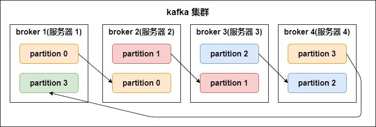

副本数(replication-factor):控制消息保存在几个 broker(服务器)上,一般情况下副本数等于 broker 的个数。
一个 broker 服务下,不可以创建多个副本因子。创建主题时,副本因子应该小于等于可用的 broker 数。

副本因子操作以分区为单位的。每个分区都有各自的主副本和从副本;主副本叫做 leader,从副本叫做follower(在有多个副本的情况下,kafka 会为同一个分区下的所有分区,设定角色关系:一个 leader 和 N 个 follower),
处于同步状态的副本叫做 in-sync-replicas(ISR);follower 通过拉的方式从 leader 同步数据。 消费者和生产者都是从 leader 读写数据,不与 follower 交互。

副本因子的作用:让 kafka 读取数据和写入数据时的可靠性。副本因子是包含本身,同一个副本因子不能放在同一个 broker 中。

如果某一个分区有三个副本因子,就算其中一个挂掉,那么只会剩下的两个中,选择一个 leader,但不会在其他的 broker 中,另启动一个副本(因为在另一台启动的话,存在数据传递,只要在机器之间有数据传递,就会长时间占用网络
IO,kafka 是一个高吞吐量的消息系统,这个情况不允许发生)所以不会在另一个 broker 中启动。如果所有的副本都挂了,生产者如果生产数据到指定分区的话,将写入不成功。

lsr 表示:当前可用的副本。


### 2.7 segment文件

一个 partition 当中由多个 segment 文件组成,每个 segment 文件,包含两部分,一个是 .log 文件,另外一个是.index 文件,其中 .log 文件包含了我们发送的数据存储,.index 文件,记录的是我们.log 文件的数据索引值,以便于我们加快数据的查询速度。

索引文件与数据文件的关系

既然它们是一一对应成对出现,必然有关系。索引文件中元数据指向对应数据文件中 message 的物理偏移地址。

比如索引文件中 3,497 代表:数据文件中的第三个 message,它的偏移地址为497。再来看数据文件中,Message 368772 表示:在全局 partiton 中是第 368772 个message。

注:segment index file 采取稀疏索引存储方式,减少索引文件大小,通过 mmap(内存映射)可以直接内存操作,稀疏索引为数据文件的每个对应 message 设置一个元数据指针,它比稠密索引节省了更多的存储空间,但查找起来需要消耗更多的时间。

.index 与 .log 对应关系如下:

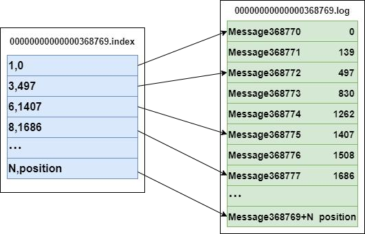

.index 与 .log

上图左半部分是索引文件,里面存储的是一对一对的 key-value,其中 key 是消息在数据文件(对应的 log 文件)中的编号,比如“1,3,6,8......”, 分别表示在 log 文件中的第 1 条消息、第 3 条消息、第 6 条消息、第 8 条消息......

那么为什么在 index 文件中这些编号不是连续的呢? 这是因为 index 文件中并没有为数据文件中的每条消息都建立索引,而是采用了稀疏存储的方式,每隔一定字节的数据建立一条索引。 这样避免了索引文件占用过多的空间,从而可以将索引文件保留在内存中。 但缺点是没有建立索引的 Message 也不能一次定位到其在数据文件的位置,从而需要做一次顺序扫描,但是这次顺序扫描的范围就很小了。

value 代表的是在全局 partiton 中的第几个消息。以索引文件中元数据 3,497 为例,其中 3 代表在右边 log 数据文件中从上到下第 3 个消息, 497 表示该消息的物理偏移地址(位置)为 497(也表示在全局partiton 表示第 497 个消息-顺序写入特性)。

log 日志目录及组成 kafka 在我们指定的 log.dir 目录下,会创建一些文件夹;名字是 (主题名字-分区名) 所组成的文件夹。 在(主题名字-分区名)的目录下,会有两个文件存在,如下所示:

```shell
#索引文件
00000000000000000000.index
#日志内容
00000000000000000000.log
```

在目录下的文件,会根据 log 日志的大小进行切分,.log 文件的大小为 1G 的时候,就会进行切分文件;如下:

```shell
-rw-r--r--. 1 root root 389k 1 月 17 18:03 00000000000000000000.index
-rw-r--r--. 1 root root 1.0G 1 月 17 18:03 00000000000000000000.log
-rw-r--r--. 1 root root 10M 1 月 17 18:03 00000000000000077894.index
-rw-r--r--. 1 root root 127M 1 月 17 18:03 00000000000000077894.log
```

在 kafka 的设计中,将 offset 值作为了文件名的一部分。segment 文件命名规则:partion 全局的第一个 segment 从 0 开始,后续每个segment 文件名为上一个全局 partion 的最大 offset(偏移 message 数)。数
值最大为 64 位 long 大小,20 位数字字符长度,没有数字就用 0 填充。通过索引信息可以快速定位到 message。通过 index 元数据全部映射到内存,可以避免 segment File 的 IO 磁盘操作;

通过索引文件稀疏存储,可以大幅降低 index 文件元数据占用空间大小。稀疏索引:为了数据创建索引,但范围并不是为每一条创建,而是为某一个区间创建; 好处:就是可以减少索引值的数量。 不好的地方:找到索引区间之后,要得进行第二次处理。

### 2.8 message的物理结构

生产者发送到 kafka 的每条消息,都被 kafka 包装成了一个 message，message 的物理结构如下图所示:

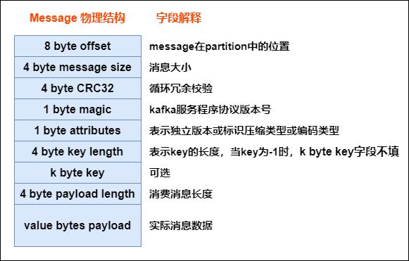

所以生产者发送给 kafka 的消息并不是直接存储起来,而是经过 kafka 的包装,每条消息都是上图这个结构,只有最后一个字段才是真正生产者发送的消息数据。


# 四、Kafka集群操作

## 1. 创建 topic
创建一个名字为 test 的主题, 有三个分区,有两个副本:

```shell
bin/kafka-topics.sh --create --zookeeper node01:2181 --replication-factor 2 --partitions 3 --topic test
```


## 2. 查看主题命令
查看 kafka 当中存在的主题:

```shell
bin/kafka-topics.sh --list --zookeeper node01:2181,node02:2181,node03:2181
```


## 3. 生产者生产数据

模拟生产者来生产数据:

```shell
bin/kafka-console-producer.sh --broker-list node01:9092,node02:9092,node03:9092 --topic test
```

## 4. 消费者消费数据
执行以下命令来模拟消费者进行消费数据:

```shell
bin/kafka-console-consumer.sh --from-beginning --topic test --zookeeper node01:218
1,node02:2181,node03:2181
```


## 5. 运行 describe topics 命令

执行以下命令运行 describe 查看 topic 的相关信息:

```sh
bin/kafka-topics.sh --describe --zookeeper node01:2181 --topic test
```

结果说明:

这是输出的解释。第一行给出了所有分区的摘要,每个附加行提供有关一个分区的信息。由于我们只有一个分 区用于此主题,因此只有一行。

“leader”是负责给定分区的所有读取和写入的节点。每个节点将成为随机选择的分区部分的领导者。(因为在 kafka 中 如果有多个副本的话,就会存在 leader和 follower 的关系,表示当前这个副本为 leader 所在的 broker 是哪一个)

“replicas”是复制此分区日志的节点列表,无论它们是否为领导者,或者即使它们当前处于活动状态。(所有副本列表 0,1,2)

“isr”是“同步”复制品的集合。这是副本列表的子集,该列表当前处于活跃状态并且已经被领导者捕获。(可用的列表数)

## 6. 增加 topic 分区数

执行以下命令可以增加 topic 分区数:

```sh
bin/kafka-topics.sh --zookeeper zkhost:port --alter --topic topicName --partitions
8
```


## 7. 增加配置

动态修改 kakfa 的配置:

```shell
bin/kafka-topics.sh --zookeeper node01:2181 --alter --topic test --config flush.messages=1
```


## 8. 删除配置
动态删除 kafka 集群配置:

```shell
bin/kafka-topics.sh --zookeeper node01:2181 --alter --topic test --delete-config flush.messages
```


## 9. 删除 topic

目前删除 topic 在默认情况下只是打上一个删除的标记,在重新启动 kafka 后才删除。如果需要立即删除,则需要在 server.properties 中配置:

```shell
delete.topic.enable=true
```

然后执行以下命令进行删除 topic:

```shell
kafka-topics.sh --zookeeper zkhost:port --delete --topic topicName
```


# 五、Kafka的JavaAPI 操作

## 1. 生产者代码

使用生产者,生产数据:

```java
/**
* 订单的生产者代码,
*/
public class OrderProducer {
    public static void main(String[] args) throws InterruptedException {
        /*1 、连接集群,通过配置文件的方式
        * 2 、发送数据 -topic:order , value
        */
        Properties props = new Properties(); 
        props.put("bootstrap.servers","node01:9092");
        props.put("acks", "all");
        props.put("retries", 0);
        props.put("batch.size", 16384);
        props.put("linger.ms", 1);
        props.put("buffer.memory", 33554432);
        props.put("key.serializer",                                                       "org.apache.kafka.common.serialization.StringSerializer");
        props.put("value.serializer",
"org.apache.kafka.common.serialization.StringSerializer");
        KafkaProducer<String, String> kafkaProducer = new KafkaProducer<String, String>
(props);
        for (int i = 0; i < 1000; i++) {
        // 发送数据 , 需要一个 producerRecord 对象 , 最少参数 String topic, V value 
            kafkaProducer.send(new ProducerRecord<String, String>("order", " 订单信息!"+i));
            Thread.sleep(100);
        }
    }
}
```

kafka 当中的数据分区:

kafka 生产者发送的消息,都是保存在 broker 当中,我们可以自定义分区规则,决定消息发送到哪个 partition 里面去进行保存 查看 ProducerRecord 这个类的源码,就可以看到 kafka 的各种不同分区策略kafka 当中支持以下四种数据的分区方式:

```java
// 第一种分区策略,如果既没有指定分区号,也没有指定数据 key ,那么就会使用轮询的方式将数据均匀的发送到不同的分区里面去
ProducerRecord<String, String> producerRecord1 = new ProducerRecord<>("mypartition", "mymessage" + i);
kafkaProducer.send(producerRecord1);

// 第二种分区策略 如果没有指定分区号,指定了数据 key ,通过 key.hashCode % numPartitions 来计算数据究竟会保存在哪一个分区里面
// 注意:如果数据 key 没有变化，key.hashCode % numPartitions = 固定值,那么所有的数据都会写入到某一个分区里面去
ProducerRecord<String, String> producerRecord2 = new ProducerRecord<>("mypartition", "mykey", "mymessage" + i);
kafkaProducer.send(producerRecord2);
// 第三种分区策略:如果指定了分区号,那么就会将数据直接写入到对应的分区里面去
ProducerRecord<String, String> producerRecord3 = new ProducerRecord<>("mypartition", 0, "mykey", "mymessage" + i);
kafkaProducer.send(producerRecord3);
// 第四种分区策略:自定义分区策略。如果不自定义分区规则,那么会将数据使用轮询的方式均匀的发送到各个分区里面去
kafkaProducer.send(new ProducerRecord<String, String>("mypartition","mymessage"+i);
```

自定义分区策略:

```java
public class KafkaCustomPartitioner implements Partitioner {
    @Override
    public void configure(Map<String, ?> configs) {
        
    }
    @Override
    public int partition(String topic, Object arg1, byte[] keyBytes, Object arg3, byte[] arg4, Cluster cluster) {
        List<PartitionInfo> partitions = cluster.partitionsForTopic(topic);
        int partitionNum = partitions.size();
        Random random = new Random();
        int partition = random.nextInt(partitionNum);
        return partition;
    }
    @Override
    public void close() {
        
    }
}

```

主代码中添加配置:

```java
@Test
public void kafkaProducer() throws Exception {
    //1 、准备配置文件
    Properties props = new Properties();
    props.put("bootstrap.servers", "node01:9092,node02:9092,node03:9092");
    props.put("acks", "all");
    props.put("retries", 0);
    props.put("batch.size", 16384);
    props.put("linger.ms", 1);
    props.put("buffer.memory", 33554432);
    props.put("partitioner.class", "cn.itcast.kafka.partitioner.KafkaCustomPartitioner");
    props.put("key.serializer", "org.apache.kafka.common.serialization.StringSerializer");
    props.put("value.serializer", "org.apache.kafka.common.serialization.StringSerializer");

    //2 、创建 KafkaProducer
    KafkaProducer<String, String> kafkaProducer = new KafkaProducer<String, String>(props);
    for (int i=0;i<100;i++){
        //3 、发送数据
        kafkaProducer.send(new ProducerRecord<String, String>("testpart","0","value"+i));
    }
    kafkaProducer.close();
}
```

## 2. 消费者代码

**消费必要条件**:

消费者要从 kafka Cluster 进行消费数据，必要条件有以下四个: 

1. 地址：bootstrap.servers=node01:9092 

2. 序列化： 

key.serializer=org.apache.kafka.common.serialization.StringSerializer 

value.serializer=org.apache.kafka.common.serialization.StringSerializer 

3. 主题（topic）：需要制定具体的某个 topic（order）即可。 

4. 消费者组：group.id=test

### **1) 自动提交 offset**

消费完成之后，自动提交 offset：

```java
/**
* 消费订单数据--- javaben.tojson
*/
public class OrderConsumer {
    public static void main(String[] args) {
        // 1、连接集群
        Properties props = new Properties(); 
        props.put("bootstrap.servers", "hadoop-01:9092 "); 
        props.put("group.id", "test");
        //以下两行代码 ---消费者自动提交 offset 值 
        props.put("enable.auto.commit", "true"); 
        props.put("auto.commit.interval.ms", "1000"); 
        props.put("key.deserializer", "org.apache.kafka.common.serialization.StringDeserial izer"); 
        props.put("value.deserializer", "org.apache.kafka.common.serialization.StringDeseri alizer"); 
        KafkaConsumer<String, String> kafkaConsumer = new KafkaConsumer<String, String> (props);
        // 2、发送数据 发送数据需要，订阅下要消费的topic order 
        kafkaConsumer.subscribe(Arrays.asList("order"));
        while (true) { 
            ConsumerRecords<String, String> consumerRecords = kafkaConsumer.poll(100);
            // jdk queue offer 插入、poll 获取元素。 blockingqueue put 插入原生， take 获取元素 
            for (ConsumerRecord<String, String> record : consumerRecords) { 
                System.out.println( "消费的数据为：" + record.value()); 
            }
        }
    }
}
```

### 2）手动提交offset

如果 Consumer 在获取数据后，需要加入处理，数据完毕后才确认 offset，需要程序来控制 offset 的确认。 

关闭自动提交确认选项：props.put("enable.auto.commit", "false"); 

手动提交 offset 值：kafkaConsumer.commitSync(); 

完整代码如下：

```java
Properties props = new Properties();
props.put("bootstrap.servers", "localhost:9092");
props.put("group.id", "test"); 
//关闭自动提交确认选项 
props.put("enable.auto.commit", "false");
props.put("key.deserializer", "org.apache.kafka.common.serialization.StringDeserializer"); props.put("value.deserializer", "org.apache.kafka.common.serialization.StringDeserializer");
KafkaConsumer<String, String> consumer = new KafkaConsumer<>(props);
consumer.subscribe(Arrays.asList("test"));
final int minBatchSize = 200; 
List<ConsumerRecord<String, String>> buffer = new ArrayList<>();
while (true) {
    ConsumerRecords<String, String> records = consumer.poll(100);
    for (ConsumerRecord<String, String> record : records) {
        buffer.add(record);
    }
    if (buffer.size() >= minBatchSize) {
        insertIntoDb(buffer);
        // 手动提交 offset 值 
        consumer.commitSync(); 
        buffer.clear();
    }
}
```

### 3）消费完每个分区之后手动提交offset

上面的示例使用 commitSync 将所有已接收的记录标记为已提交。在某些情况下， 可能希望通过明确指定偏移量来更好地控制已提交的记录。在下面的示例中，我们在完成处理每个分区中的记录后提交偏移量:

```java
try {
    while(running) {
        ConsumerRecords<String, String> records = consumer.poll(Long.MAX_VALUE);
        for (TopicPartition partition : records.partitions()) {
            List<ConsumerRecord<String, String>> partitionRecords = records.records(partition);
            for (ConsumerRecord<String, String> record : partitionRecords) { 
                System.out.println (record.offset() + ": " + record.value()); 
            }
            long lastOffset = partitionRecords.get(partitionRecords.size() -1).offset(); 
            consumer.commitSync(Collections.singletonMap(partition, new OffsetAndMetadata(lastO ffset + 1))); 
        }
    }
} finally {
    consumer.close();
}
```

**注意事项**： 

提交的偏移量应始终是应用程序将读取的下一条消息的偏移量。 因此，在调用 commitSync（偏移量）时，应该在最后处理的消息的偏移量中添加一个。


### 4）指定分区数据进行消费

1. 如果进程正在维护与该分区关联的某种本地状态（如本地磁盘上的键值存储），那么它应该只获取它在磁盘上维护的分区的记录。 

2. 如果进程本身具有高可用性，并且如果失败则将重新启动（可能使用 YARN，Mesos 或 AWS 工具等集群管理框 架，或作为流处理框架的一部分）。在这种情况下，Kafka 不需要检测故障并重新分配分区，因为消耗过程将在 另一台机器上重新启动。

```java
Properties props = new Properties();
props.put("bootstrap.servers", "localhost:9092 ");
props.put("group.id", "test"); 
props.put("enable.auto.commit", "true");
props.put("auto.commit.interval.ms", "1000");
props.put("key.deserializer", "org.apache.kafka.common.serialization.StringDeserializer"); props.put("value.deserializer", "org.apache.kafka.common.serialization.StringDeserializer");
KafkaConsumer<String, String> consumer = new KafkaConsumer<>(props);
//consumer.subscribe(Arrays.asList("foo", "bar"));
//手动指定消费指定分区的数据---start
String topic = "foo"; 
TopicPartition partition0 = new TopicPartition(topic, 0);
TopicPartition partition1 = new TopicPartition(topic, 1);
consumer.assign(Arrays.as List(partition0, partition1));
//手动指定消费指定分区的数据---end 
while (true) {
    ConsumerRecords<String, String> records = consumer.poll(100); 
    for (ConsumerRecord<String, String> record : records){
        System.out.printf("offset = %d, key = %s, value = %s%n", record.offset(), record.ke y(), record.value());
    }
}
```

**注意事项**： 

1. 要使用此模式，只需使用要使用的分区的完整列表调用 assign （Collection），而不是使用 subscribe 订阅主题。 

2. 主题与分区订阅只能二选一。


### **5) 重复消费与数据丢失**

说明：

1. 已经消费的数据对于 kafka 来说，会将消费组里面的 offffset 值进行修改， 那什么时候进行修改了？是在数据消费 完成之后，比如在控制台打印完 后自动提交； 
2.  提交过程：是通过 kafka 将 offffset 进行移动到下个 message 所处的 offffset 的位置。 

3. 拿到数据后，存储到 hbase 中或者 mysql 中，如果 hbase 或者 mysql 在这个时候连接不上，就会抛出异常，如果在处理数据的时候已经进行了提交， 那么 kafka 伤的 offffset 值已经进行了修改了，但是 hbase 或者 mysql 中没 有数据，这个时候就会出现数据丢失。 
4. 什么时候提交 offffset 值？在 Consumer 将数据处理完成之后，再来进行 offset 的修改提交。默认情况下 offset 是自动提交，需要修改为手动提交 offset 值。 

5. 如果在处理代码中正常处理了，但是在提交 offset 请求的时候，没有连接到 kafka 或者出现了故障，那么该次修 改 offffset 的请求是失败的，那么下次在进行读取同一个分区中的数据时，会从已经处理掉的 offset 值再进行处理一 次，那么在 hbase 中或者 mysql 中就会产生两条一样的数据，也就是数据重复。

### **6) consumer 消费者消费数据流程** 

**流程描述**： 

Consumer 连接指定的 Topic partition 所在 leader broker，采用 pull 方式从 kafka logs 中获取消息。对于不同的消费模式，会将 offset 保存在不同的地方 ,官网关于 high level API 以及 low level API 的简介： 

http://kafka.apache.org/0100/documentation.html#impl_consumer 

**高阶 API（High Level API）**： 

kafka 消费者高阶 API 简单；隐藏 Consumer 与 Broker 细节；相关信息保存在 zookeeper 中：

```java
/* create a connection to the cluster */
ConsumerConnector connector = Consumer.create(consumerConfig);
interface ConsumerConnector {
    /** This method is used to get a list of KafkaStreams, which are iterators over 
    MessageAndMetadata objects from which you can obtain messages and their
    associated metadata (currently only topic). 
    Input: a map of <topic, #streams>
    Output: a map of <topic, list of message streams>
    */
    public Map<String,List<KafkaStream>> createMessageStreams(Map<String,Int> topicCountMap);
    /** 
    You can also obtain a list of KafkaStreams, that iterate over messages
    from topics that match a TopicFilter. (A TopicFilter encapsulates a
    whitelist or a blacklist which is a standard Java regex.)
    */
    public List<KafkaStream> createMessageStreamsByFilter( TopicFilter topicFilter, int numStreams);
    /*
    Commit the offsets of all messages consumed so far.
    */ 
    public commitOffsets()
    /* 
    Shut down the connector 
    */ 
   public shutdown()
}
```

**说明**：大部分的操作都已经封装好了，比如：当前消费到哪个位置下了，但是不够灵活（工作过程推荐使用）

**低级 API(Low Level API)**: 

kafka 消费者低级 API 非常灵活；需要自己负责维护连接 Controller Broker。 保存 offset，Consumer Partition 对应关系：

```java
class SimpleConsumer {
    /* Send fetch request to a broker and get back a set of messages.
    */ 
    public ByteBufferMessageSet fetch(FetchRequest request); 
    /* Send a list of fetch requests to a broker and get back a response set.
    */ 
    public MultiFetchResponse multifetch(List<FetchRequest> fetches);
    /**
    Get a list of valid offsets (up to maxSize) before the given time. 
    The result is a list of offsets, in descending order. 
    @param time: time in millisecs, if set to OffsetRequest$.MODULE$.LATEST_TIME(), get from the latest offset available. if set to OffsetRequest$.MODULE$.EARLIEST_TIME(), get from the earliest available.
    public long[] getOffsetsBefore(String topic, int partition, long time, int maxNumOffsets); 
    * offset 
    */
```

**说明**：没有进行包装，所有的操作有用户决定，如自己的保存某一个分区下的记录，你当前消费到哪个位置。


###  **3. kafka Streams API 开发**

**需求**：使用 StreamAPI 获取 test 这个 topic 当中的数据，然后将数据全部转为大写，写入到 test2 这个 topic 当中去。 

**第一步**：创建一个 topic 

node01 服务器使用以下命令来常见一个 topic 名称为 test2：

```shell
bin/kafka-topics.sh --create --partitions 3 --replication-factor 2 --topic test2 --zookeeper node01:2181,node02:2181,node03:2181
```

**第二步**：开发 StreamAPI

```java
public class StreamAPI {
    public static void main(String[] args) {
        Properties props = new Properties();
        props.put(StreamsConfig.APPLICATION_ID_CONFIG, "wordcount-application"); 
        props.put(StreamsConfig.BOOTSTRAP_SERVERS_CONFIG, "node01:9092"); 
        props.put(StreamsConfig.KEY_SERDE_CLASS_CONFIG, Serdes.String().getClass()); 
        props.put(StreamsConfig.VALUE_SERDE_CLASS_CONFIG, Serdes.String().getClass() ); 
        KStreamBuilder builder = new KStreamBuilder(); 
        builder.stream("test").mapValues(line -> line.toString().toUpperCase()).to( "test2");
        KafkaStreams streams = new KafkaStreams(builder, props);
        streams.start(); 
    }
}
```

执行上述代码，监听获取 **test** 中的数据，然后转成大写，将结果写入 **test2**。 

**第三步**：生产数据 

node01 执行以下命令，向 test 这个 topic 当中生产数据: 

```sh
bin/kafka-console-producer.sh --broker-list node01:9092,node02:9092,node03:9092 --topic test 
```

**第四步**：消费数据 

node02 执行一下命令消费 test2 这个 topic 当中的数据: 

```sh
bin/kafka-console-consumer.sh --from-beginning --topic test2 --zookeeper node01:2181,node02:2181,node03:2181 
```

# 六、Kafka中的数据不丢失机制

## 1. 生产者生产数据不丢失

**发送消息方式** 

生产者发送给 kafka 数据，可以采用**同步方式**或**异步方式** 

**同步方式**： 

发送一批数据给 kafka 后，等待 kafka 返回结果： 

1. 生产者等待 10s，如果 broker 没有给出 ack 响应，就认为失败。 

2. 生产者重试 3 次，如果还没有响应，就报错. 

**异步方式**： 

发送一批数据给 kafka，只是提供一个回调函数：

1. 先将数据保存在生产者端的 buffer 中。buffer 大小是 2 万条 。 

2. 满足数据阈值或者数量阈值其中的一个条件就可以发送数据。 

3. 发送一批数据的大小是 500 条。 

注：如果 broker 迟迟不给 ack，而 buffer 又满了，开发者可以设置是否直接清空 buffer 中的数据。

**ack 机制（确认机制）** 

生产者数据发送出去，需要服务端返回一个确认码，即 ack 响应码；ack 的响应有三个状态值 0,1，-1 

0：生产者只负责发送数据，不关心数据是否丢失，丢失的数据，需要再次发送 

1：partition 的 leader 收到数据，不管 follow 是否同步完数据，响应的状态码为 1 

-1：所有的从节点都收到数据，响应的状态码为-1 

如果 broker 端一直不返回 ack 状态，producer 永远不知道是否成功；producer 可以设置一个超时时间 10s，超过时间认为失败。

## **2. broker 中数据不丢失** 

在 broker 中，保证数据不丢失主要是通过副本因子（冗余），防止数据丢失。 

### **3. 消费者消费数据不丢失** 

在消费者消费数据的时候，只要每个消费者记录好 offset 值即可，就能保证数据不丢失。也就是需要我们自己维护偏移量(offset)，可保存在 Redis 中。


# 七、Kafka配置文件说明

## **1.Server.properties 配置文件说明**： 

```sh
#broker 的全局唯一编号，不能重复 
broker.id=0 

#用来监听链接的端口，producer 或 consumer 将在此端口建立连接 
port=9092

#处理网络请求的线程数量 
num.network.threads=3

#用来处理磁盘 IO 的线程数量
num.io.threads=8 

#发送套接字的缓冲区大小
socket.send.buffer.bytes=102400 

#接受套接字的缓冲区大小 
socket.receive.buffer.bytes=102400 

#请求套接字的缓冲区大小
socket.request.max.bytes=104857600

#kafka 运行日志存放的路径
log.dirs=/export/data/kafka/

#topic 在当前 broker 上的分片个数
num.partitions=2 

#用来恢复和清理 data 下数据的线程数量 
num.recovery.threads.per.data.dir=1 

#segment 文件保留的最长时间，超时将被删除
log.retention.hours=168 

#滚动生成新的 segment 文件的最大时间
log.roll.hours=1 

#日志文件中每个 segment 的大小，默认为 1G 
log.segment.bytes=1073741824 

#周期性检查文件大小的时间 log.retention.check.interval.ms=300000

#日志清理是否打开
log.cleaner.enable=true

#broker 需要使用 zookeeper 保存 meta 数据
zookeeper.connect=zk01:2181,zk02:2181,zk03:2181

#zookeeper 链接超时时间
zookeeper.connection.timeout.ms=6000

#partion buffer 中，消息的条数达到阈值，将触发 flush 到磁盘
log.flush.interval.messages=10000 

#消息 buffer 的时间，达到阈值，将触发 flush 到磁盘
log.flush.interval.ms=3000 

#删除 topic 需要 server.properties 中设置delete.topic.enable=true 否则只是标记删除 
delete.topic.enable=true

#此处的 host.name 为本机 IP(重要),如果不改,则客户端会抛 出:Producer connection to localhost:9092 unsuccessful 错误! 
host.name=kafka01
advertised.host.name=192.168.140.128 
```

## 2. producer 生产者配置文件说明

```sh
 #指定 kafka 节点列表，用于获取 metadata，不必全部指定 
 metadata.broker.list=node01:9092,node02:9092,node03:9092 
 # 指定分区处理类。默认 kafka.producer.DefaultPartitioner，表通过 key 哈希到对应分区 
 partitioner.class=kafka.producer.DefaultPartitioner 
 # 是否压缩，默认 0 表示不压缩，1 表示用 gzip 压缩，2 表示用 snappy 压缩。压缩后消息中会有头来指 明消息压缩类型，故在消费者端消息解压是透明的无需指定。
 compression.codec=none
 # 指定序列化处理类 
 serializer.class=kafka.serializer.DefaultEncoder 
 # 如果要压缩消息，这里指定哪些 topic 要压缩消息，默认 empty，表示不压缩。
 compressed.topics= 
 # 设置发送数据是否需要服务端的反馈,有三个值 0,1,-1 
 # 0: producer 不会等待 broker 发送 ack 
 # 1: 当 leader 接收到消息之后发送 ack 
 # -1: 当所有的 follower 都同步消息成功后发送 ack.
 request.required.acks=0 
 # 在向 producer 发送 ack 之前,broker 允许等待的最大时间 ，如果超时,broker 将会向 producer 发送一个 error ACK.意味着上一次消息因为某种原因未能成功(比如 follower 未能同步成功) 
 request.timeout.ms=10000 
 # 同步还是异步发送消息，默认“sync”表同步，"async"表异步。异步可以提高发送吞吐量, 也意味着消息将会在本地 buffer 中,并适时批量发送，但是也可能导致丢失未发送过去的消息 
 producer.type=sync
 # 在 async 模式下,当 message 被缓存的时间超过此值后,将会批量发送给 broker,默认为 5000ms 
 # 此值和 batch.num.messages 协同工作.
  queue.buffering.max.ms = 5000 
  
 # 在 async 模式下,producer 端允许 buffer 的最大消息量
 # 无论如何,producer 都无法尽快的将消息发送给 broker,从而导致消息在 producer 端大量沉积 
 # 此时,如果消息的条数达到阀值,将会导致 producer 端阻塞或者消息被抛弃，默认为 10000 
 queue.buffering.max.messages=20000 
 
 # 如果是异步，指定每次批量发送数据量，默认为 200
 batch.num.messages=500
 
 # 当消息在 producer 端沉积的条数达到"queue.buffering.max.meesages"后 
 # 阻塞一定时间后,队列仍然没有 enqueue(producer 仍然没有发送出任何消息)
 # 此时 producer 可以继续阻塞或者将消息抛弃,此 timeout 值用于控制"阻塞"的时间
 # -1: 无阻塞超时限制,消息不会被抛弃 
 # 0:立即清空队列,消息被抛弃
 queue.enqueue.timeout.ms=-1
 
 # 当 producer 接收到 error ACK,或者没有接收到 ACK 时,允许消息重发的次数
 # 因为 broker 并没有完整的机制来避免消息重复,所以当网络异常时(比如 ACK 丢失)
 # 有可能导致 broker 接收到重复的消息,默认值为 3.
 message.send.max.retries=3 
 
 # producer 刷新 topic metada 的时间间隔,producer 需要知道 partition leader 的位置,以及当前 topic 的情况 
 # 因此 producer 需要一个机制来获取最新的 metadata,当 producer 遇到特定错误时,将会立即刷新
 # (比如 topic 失效,partition 丢失,leader 失效等),此外也可以通过此参数来配置额外的刷新机制， 默认值 600000 
 topic.metadata.refresh.interval.ms=60000
```

## **3. consumer 消费者配置详细说明**:

```sh
# zookeeper 连接服务器地址 
zookeeper.connect=zk01:2181,zk02:2181,zk03:2181 
# zookeeper 的 session 过期时间，默认 5000ms，用于检测消费者是否挂掉 
zookeeper.session.timeout.ms=5000

#当消费者挂掉，其他消费者要等该指定时间才能检查到并且触发重新负载均衡 
zookeeper.connection.timeout.ms=10000

# 指定多久消费者更新 offset 到 zookeeper 中。注意 offset 更新时基于 time 而不是每次获得的消息。 一旦在更新 zookeeper 发生异常并重启，将可能拿到已拿到过的消息
zookeeper.sync.time.ms=2000 

#指定消费
group.id=itcast
# 当 consumer 消费一定量的消息之后,将会自动向 zookeeper 提交 offset 信息
# 注意 offset 信息并不是每消费一次消息就向 zk 提交一次,而是现在本地保存(内存),并定期提交,默认 为 true 
auto.commit.enable=true 

# 自动更新时间。默认 60 * 1000
auto.commit.interval.ms=1000

# 当前 consumer 的标识,可以设定,也可以有系统生成,主要用来跟踪消息消费情况,便于观察 
conusmer.id=xxx

# 消费者客户端编号，用于区分不同客户端，默认客户端程序自动产生 
client.id=xxxx 

# 最大取多少块缓存到消费者(默认 10) 
queued.max.message.chunks=50 

# 当有新的 consumer 加入到 group 时,将会 reblance,此后将会有 partitions 的消费端迁移到新 的 consumer 上,如果一个 consumer 获得了某个 partition 的消费权限,那么它将会向 zk 注 册 "Partition Owner registry"节点信息,但是有可能此时旧的consumer尚没有释放此节点, 此值用 于控制,注册节点的重试次数. 
rebalance.max.retries=5 

# 获取消息的最大尺寸,broker 不会像 consumer 输出大于此值的消息 chunk 每次 feth 将得到多条消息, 此值为总大小,提升此值,将会消耗更多的 consumer 端内存 
fetch.min.bytes=6553600 

# 当消息的尺寸不足时,server 阻塞的时间,如果超时,消息将立即发送给
consumer fetch.wait.max.ms=5000 
socket.receive.buffer.bytes=655360 

# 如果 zookeeper 没有 offset 值或 offset 值超出范围。那么就给个初始的 offset。有 smallest、 largest、anything 可选，分别表示给当前最小的 offset、当前最大的 offset、抛异常。默认 largest 
auto.offset.reset=smallest 

# 指定序列化处理类
derializer.class=kafka.serializer.DefaultDecoder
```


# 八、CAP理论

## **1. 分布式系统当中的 CAP 理论** 

分布式系统（distributed system）正变得越来越重要，大型网站几乎都是分布式的。 

分布式系统的最大难点，就是各个节点的状态如何同步。 

为了解决各个节点之间的状态同步问题，在 1998 年，由加州大学的计算机科学家 Eric Brewer 提出分布式系统的三个指标，分别是: 

**Consistency：一致性** 

**Availability：可用性**

**Partition tolerance：分区容错性** 

Eric Brewer 说，这三个指标不可能同时做到。最多只能同时满足其中两个条件， 这个结论就叫做 CAP 定理。 

**CAP 理论是指：分布式系统中，一致性、可用性和分区容忍性最多只能同时满足两个**。


**一致性：Consistency** 

- 通过某个节点的写操作结果对后面通过其它节点的读操作可见 

- 如果更新数据后，并发访问情况下后续读操作可立即感知该更新，称为强 一致性 

- 如果允许之后部分或者全部感知不到该更新，称为弱一致性 

- 若在之后的一段时间（通常该时间不固定）后，一定可以感知到该更新， 称为最终一致性


**可用性：Availability** 

   任何一个没有发生故障的节点必须在有限的时间内返回合理的结果

**分区容错性：Partition tolerance** 

   部分节点宕机或者无法与其它节点通信时，各分区间还可保持分布式系统的功能 


一般而言，都要求保证分区容忍性。所以在 CAP 理论下，更多的是需要在可用性和一致性之间做权衡。

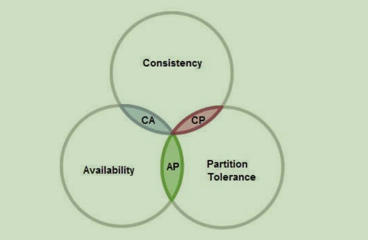

## **2. Partition tolerance** 

先看 Partition tolerance，中文叫做"分区容错"。 大多数分布式系统都分布在多个子网络。每个子网络就叫做一个区（partition）。 

分区容错的意思是，区间通信可能失败。比如，一台服务器放在中国，另一台服 务器放在美国，这就是两个区，它们之间可能无法通信。

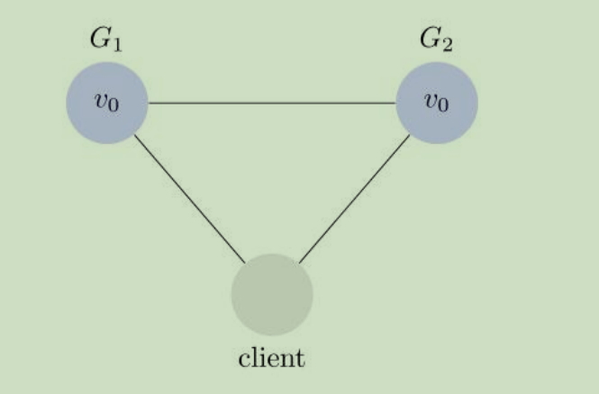

上图中，G1 和 G2 是两台跨区的服务器。G1 向 G2 发送一条消息，G2 可能无法收到。系统设计的时候，必须考虑到这种情况。一般来说，分区容错无法避免，因此可以认为 CAP 的 P 总是存在的。即永远可能存在分区容错这个问题

## **3. Consistency** 

Consistency 中文叫做"一致性"。意思是，写操作之后的读操作，必须返回该值。 举例来说，某条记录是 v0，用户向 G1 发起一个写操作，将其改为 v1。

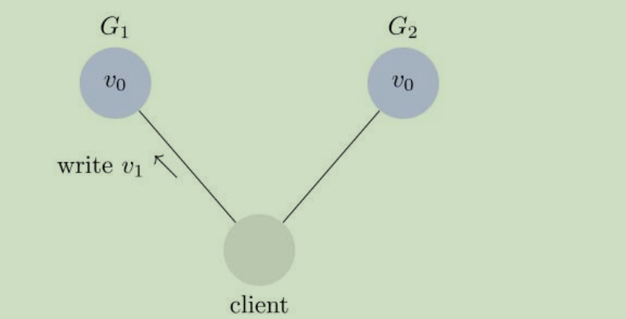

接下来，用户的读操作就会得到 v1。这就叫一致性。

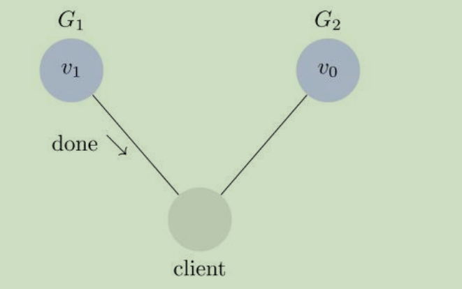

问题是，用户有可能向 G2 发起读操作，由于 G2 的值没有发生变化，因此返回的是 v0。G1 和 G2 读操作的结果不一致，这就不满足一致性了。

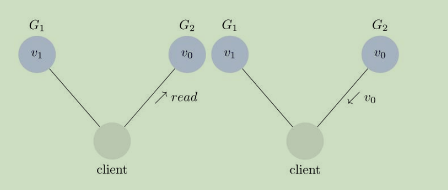

为了让 G2 也能变为 v1，就要在 G1 写操作的时候，让 G1 向 G2 发送一条消息，要求 G2 也改成 v1。

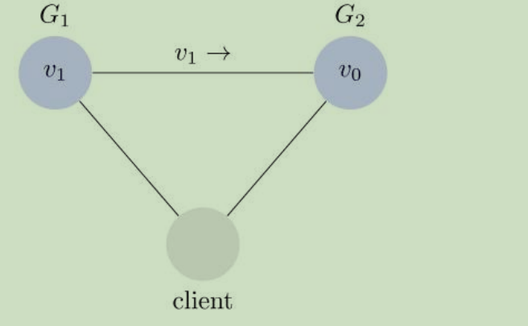

这样的话，用户向 G2 发起读操作，也能得到 v1。

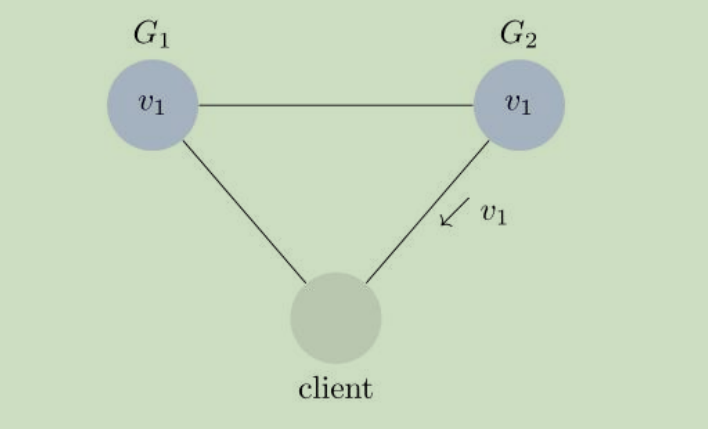

## **4. Availability** 

Availability 中文叫做"可用性"，意思是只要收到用户的请求，服务器就必须 给出回应。 用户可以选择向 G1 或 G2 发起读操作。不管是哪台服务器，只要收到请求，就必须告诉用户，到底是 v0 还是 v1，否则就不满足可用性。

# 九、Kafka中的CAP机制

kafka 是一个分布式的消息队列系统，既然是一个分布式的系统，那么就一定满足 CAP 定律，那么在 kafka 当中是如何遵循 CAP 定律的呢？kafka 满足 CAP 定律当中的哪两个呢？

**kafka 满足的是 CAP 定律当中的 CA，其中 Partition tolerance 通过的是一定的机制尽量的保证分区容错性**。 

**其中 C 表示的是数据一致性。A 表示数据可用性**。

kafka 首先将数据写入到不同的分区里面去，每个分区又可能有好多个副本，数据首先写入到 leader 分区里面去，读写的操作都是与 leader 分区进行通信，保证了数据的一致性原则，也就是满足了 Consistency 原则。然后 kafka 通过分区 副本机制，来保证了 kafka 当中数据的可用性。但是也存在另外一个问题，就是副本分区当中的数据与 leader 当中的数据存在差别的问题如何解决，这个就是 Partition tolerance 的问题。

**kafka 为了解决 Partition tolerance 的问题，使用了 ISR 的同步策略，来尽最大可能减少 Partition tolerance 的问题**。

每个 leader 会维护一个 ISR（a set of in-sync replicas，基本同步）列表。

ISR 列表主要的作用就是决定哪些副本分区是可用的，也就是说可以将 leader 分区里面的数据同步到副本分区里面去，决定一个副本分区是否可用的条件有两个：

- replica.lag.time.max.ms=10000 副本分区与主分区心跳时间延迟 

- replica.lag.max.messages=4000 副本分区与主分区消息同步最大差

produce 请求被认为完成时的确认值：request.required.acks=0。 

- ack=0：producer 不等待 broker 同步完成的确认，继续发送下一条(批) 信息。 

- ack=1（默认）：producer 要等待 leader 成功收到数据并得到确认，才发送下一条 message。 

- ack=-1：producer 得到 follwer 确认，才发送下一条数据。


# 十 、Kafka监控运维

在开发工作中，消费在 Kafka 集群中消息，数据变化是我们关注的问题，当业务前提不复杂时，我们可以使用 Kafka 命令提供带有 Zookeeper 客户端工具的工具，可以轻松完成我们的工作。随着业务的复杂性，增加 Group 和 Topic，那么 

我们使用 Kafka 提供命令工具，已经感到无能为力，那么 Kafka 监控系统目前尤为重要，我们需要观察 消费者应用的细节。

## **1. kafka-eagle 概述**

为了简化开发者和服务工程师维护 Kafka 集群的工作有一个监控管理工具，叫做 Kafka-eagle。这个管理工具可以很容易地发现分布在集群中的哪些 topic 分布不均匀，或者是分区在整个集群分布不均匀的的情况。它支持管理多个集群、选择副本、副本重新分配以及创建 Topic。同时，这个管理工具也是一个非常好的可以快速浏览这个集群的工具，

## **2. 环境和安装**

**1. 环境要求** 

需要安装 jdk，启动 zk 以及 kafka 的服务


**2. 安装步骤** 

1. 下载源码包 

kafka-eagle 官网： http://download.kafka-eagle.org/ 

我们可以从官网上面直接下载最细的安装包即可 kafka-eagle-bin-1.3.2.tar.gz 这个版本即可 

代码托管地址： 

https://github.com/smartloli/kafka-eagle/releases 

2. 解压 

这里我们选择将 kafak-eagle 安装在第三台。 

直接将 kafka-eagle 安装包上传到 node03 服务器的/export/softwares 路径下， 然后进行解压 node03 服务器执行一下命令进行解压。 

3. 准备数据库 

kafka-eagle 需要使用一个数据库来保存一些元数据信息，我们这里直接使用 msyql 数据库来保存即可，在 node03 服务器执行以下命令创建一个 mysql 数据 库即可。 

进入 mysql 客户端: 

```sql
create database eagle;
```

4. 修改 kafak-eagle 配置文件 

执行以下命令修改 kafak-eagle 配置文件: 

vim system-config.properties 

修改为如下： 

```sh
kafka.eagle.zk.cluster.alias=cluster1,cluster2 

cluster1.zk.list=node01:2181,node02:2181,node03:2181 

cluster2.zk.list=node01:2181,node02:2181,node03:2181 

kafka.eagle.driver=com.mysql.jdbc.Driver 

kafka.eagle.url=jdbc:mysql://node03:3306/eagle 

kafka.eagle.username=root 

kafka.eagle.password=123456 
```

5. 配置环境变量 

kafka-eagle 必须配置环境变量，node03 服务器执行以下命令来进行配置环境变量: vim /etc/profile： 

```shell
export KE_HOME=/opt//kafka-eagle-bin-1.3.2/kafka-eagle-web-1.3.2 
export PATH=:$KE_HOME/bin:$PATH 
```

修改立即生效，执行: source /etc/profile 

6. 启动 kafka-eagle 

执行以下界面启动 kafka-eagle： 

```sh
cd kafka-eagle-web-1.3.2/bin 
chmod u+x ke.sh 
./ke.sh start 
```

7. 主界面 

访问 kafka-eagle 

http://node03:8048/ke/account/signin?/ke/ 

用户名：admin 

密码：123456

# 十一、Kafka大厂面试题

**1. 为什么要使用 kafka？** 

1. 缓冲和削峰：上游数据时有突发流量，下游可能扛不住，或者下游没有足够多的机器来保证冗余，kafka 在中间可以起到一个缓冲的作用，把消息暂存在 kafka 中，下游服务就可以按照自己的节奏进行慢慢处理。 

2. 解耦和扩展性：项目开始的时候，并不能确定具体需求。消息队列可以作为一个接口层，解耦重要的业务流程。只需要遵守约定，针对数据编程即可获取扩展能力。 

3. 冗余：可以采用一对多的方式，一个生产者发布消息，可以被多个订阅 topic 的服务消费到，供多个毫无关联的业务使用。

4. 健壮性：消息队列可以堆积请求，所以消费端业务即使短时间死掉，也不会影响主要业务的正常进行。 

5. 异步通信：很多时候，用户不想也不需要立即处理消息。消息队列提供了异步处理机制，允许用户把一个消息放入队列，但并不立即处理它。想向队列中放入多少消息就放多少，然后在需要的时候再去处理它们。

**2. Kafka 消费过的消息如何再消费？** 

kafka 消费消息的 offset 是定义在 zookeeper 中的， 如果想重复消费 kafka 的消息，可以在 redis 中自己记录 offset 的 checkpoint 点（n 个），当想重复消费消息时，通过读取 redis 中的 checkpoint 点进行 zookeeper 的 offset 重设， 这样就可以达到重复消费消息的目的了 

**3. kafka 的数据是放在磁盘上还是内存上，为什么速度会快？** 

kafka 使用的是磁盘存储。 

速度快是因为： 

1. 顺序写入：因为硬盘是机械结构，每次读写都会寻址->写入，其中寻址是 一个“机械动作”，它是耗时的。所以硬盘 “讨厌”随机 I/O， 喜欢顺 序 I/O。为了提高读写硬盘的速度，Kafka 就是使用顺序 I/O。 

2. Memory Mapped Files（内存映射文件）：64 位操作系统中一般可以表示 20G 的数据文件，它的工作原理是直接利用操作系统的 Page 来实现文件到物理内存的直接映射。完成映射之后你对物理内存的操作会被同步到硬盘上。 

3. Kafka 高效文件存储设计： Kafka 把 topic 中一个 parition 大文件分成多个小文件段，通过多个小文件段，就容易定期清除或删除已经消费完文件，减少磁盘占用。通过索引信息可以快速定位 message 和确定 response 的 大 小。通过 index 元数据全部映射到 memory（内存映射文件）， 可以避免 segment file 的 IO 磁盘操作。通过索引文件稀疏存储，可以大幅降低 index 文件元数据占用空间大小。 

**注**：

1. Kafka解决查询效率的手段之一是将数据文件分段，比如有100条Message， 它们的 offset 是从 0 到 99。假设将数据文件分成 5 段，第一段为 0-19， 第二段为 20-39，以此类推，每段放在一个单独的数据文件里面，数据文件以该段中小的 offset 命名。这样在查找指定 offset 的 Message 的时候，用二分查找就可以定位到该 Message 在哪个段中。 

2. 为数据文件建 索引数据文件分段 使得可以在一个较小的数据文件中查找对应 offset 的 Message 了，但是这依然需要顺序扫描才能找到对应offset 的 Message。 为了进一步提高查找的效率，Kafka 为每个分段后的数据文件建立了索引文件，文件名与数据文件的名字是一样的，只是文件扩展名为.index。 

**4. Kafka 数据怎么保障不丢失？** 

分三个点说，一个是生产者端，一个消费者端，一个 broker 端。 

1. **生产者数据的不丢失** 

kafka 的 ack 机制：在 kafka 发送数据的时候，每次发送消息都会有一个确认反馈机制，确保消息正常的能够被收到，其中状态有 0，1，-1。 

如果是同步模式： 

ack 设置为 0，风险很大，一般不建议设置为 0。即使设置为 1，也会随着 leader 宕机丢失数据。所以如果要严格保证生产端数据不丢失，可设置为-1。 

如果是异步模式： 

也会考虑 ack 的状态，除此之外，异步模式下的有个 buffer，通过 buffer 来进行控制数据的发送，有两个值来进行控制，时间阈值与消息的数量阈值，如果 buffer 满了数据还没有发送出去，有个选项是配置是否立即清空 buffer。可以设置为-1，永久阻塞，也就数据不再生产。异步模式下，即使设置为-1。也可能因为程序员的不科学操作，操作数据丢失，比如 kill -9，但这是特别的例外情况。

注：

ack=0：producer 不等待 broker 同步完成的确认，继续发送下一条(批)信息。 

ack=1（默认）：producer 要等待 leader 成功收到数据并得到确认，才发送下一条 message。 

ack=-1：producer 得到 follwer 确认，才发送下一条数据。 

2. **消费者数据的不丢失** 

通过 offset commit 来保证数据的不丢失，

kafka 自己记录了每次消费的 offset 数值，下次继续消费的时候，会接着上次的 offset 进行消费。而 offset 的信息在 kafka0.8 版本之前保存在 zookeeper 中，在 0.8 版本之后保存到 topic 中，即使消费者在运行过程中挂掉了，再次启动的时候会找到 offset的值，找到之前消费消息的位置，接着消费，由于 offset 的信息写入的时候并不是每条消息消费完成后都写入的，所以这种情况有可能会造成重复消费，但是不会丢失消息。 

唯一例外的情况是，我们在程序中给原本做不同功能的两个 consumer 组设置 KafkaSpoutConfig.bulider.setGroupid 的时候设置成了一样的 groupid，这种情况会导致这两个组共享同一份数据，就会产生组 A 消费 partition1， partition2 中的消息，组 B 消费 partition3 的消息，这样每个组消费的消息都会丢失，都是不完整的。 为了保证每个组都独享一份消息数据，groupid 一定不要重复才行。 

3. **kafka 集群中的 broker 的数据不丢失** 

每个 broker 中的 partition 我们一般都会设置有 replication（副本）的个数， 生产者写入的时候首先根据分发策略（有 partition 按 partition，有 key 按 key， 都没有轮询）写入到 leader 中，follower（副本）再跟 leader 同步数据，这样 有了备份，也可以保证消息数据的不丢失。 

**5. 采集数据为什么选择 kafka？** 

采集层 主要可以使用 Flume, Kafka 等技术。 

Flume：Flume 是管道流方式，提供了很多的默认实现，让用户通过参数部署， 及扩展 API. 

Kafka：Kafka 是一个可持久化的分布式的消息队列。 Kafka 是一个非常通用的系统。你可以有许多生产者和很多的消费者共享多个主题 Topics。 相比之下,Flume 是一个专用工具被设计为旨在往 HDFS，HBase 发送数据。它对 

HDFS 有特殊的优化，并且集成了 Hadoop 的安全特性。 所以，Cloudera 建议如果数据被多个系统消费的话，使用 kafka；如果数据被设计给 Hadoop 使用，使用 Flume。 

**6. kafka 重启是否会导致数据丢失？** 

1. kafka 是将数据写到磁盘的，一般数据不会丢失。 

2. 但是在重启 kafka 过程中，如果有消费者消费消息，那么 kafka 如果来不及提交 offset，可能会造成数据的不准确（丢失或者重复消费）。 

**7. kafka 宕机了如何解决？** 

1. 先考虑业务是否受到影响 

kafka 宕机了，首先我们考虑的问题应该是所提供的服务是否因为宕机的机器而受到影响，如果服务提供没问题，如果实现做好了集群的容灾机制，那么这块就不用担心了。 

2. 节点排错与恢复 

想要恢复集群的节点，主要的步骤就是通过日志分析来查看节点宕机的原因，从而解决，重新恢复节点。 

**8. 为什么 Kafka 不支持读写分离？** 

在 Kafka 中，生产者写入消息、消费者读取消息的操作都是与 leader 副本进行交互的，从而实现的是一种**主写主读**的生产消费模型。 Kafka 并不支持**主写从读**，因为主写从读有 2 个很明显的缺点: 

1. 数据一致性问题：数据从主节点转到从节点必然会有一个延时的时间窗口， 这个时间 窗口会导致主从节点之间的数据不一致。某一时刻，在主节点和从节点中 A 数据的值都为 X， 之后将主节点中 A 的值修改为 Y，那么在这个变更通知到从节点之前，应用读取从节点中的 A 数据的值并不为最新的 Y，由此便产生了数据不一致的问题。 

2. 延时问题：类似 Redis 这种组件，数据从写入主节点到同步至从节点中的过程需要经历 网络→主节点内存→网络→从节点内存 这几个阶段，整个过程会耗费一定的时间。而在 Kafka 中，主从同步会比 Redis 更加耗时，它需要经历 网络→主节点内存→主节点磁盘→网络→从节 点内存→ 从节点磁盘 这几个阶段。对延时敏感的应用而言，主写从读的功能并不太适用。 

而 kafka 的**主写主读**的优点就很多了： 

1. 可以简化代码的实现逻辑，减少出错的可能; 

2. 将负载粒度细化均摊，与主写从读相比，不仅负载效能更好，而且对用户 可控; 

3. 没有延时的影响; 

4. 在副本稳定的情况下，不会出现数据不一致的情况。 

**9. kafka 数据分区和消费者的关系？** 

每个分区只能由同一个消费组内的一个消费者(consumer)来消费，可以由不同的消费组的消费者来消费，同组的消费者则起到并发的效果。 

**10. kafka 的数据 offset 读取流程** 

1. 连接 ZK 集群，从 ZK 中拿到对应 topic 的 partition 信息和 partition 的 Leader 的相关信息 

2. 连接到对应 Leader 对应的 broker 

3. consumer 将⾃自⼰己保存的 offset 发送给 Leader 

4. Leader 根据 offset 等信息定位到 segment（索引⽂文件和⽇日志⽂文件） 

5. 根据索引⽂文件中的内容，定位到⽇日志⽂文件中该偏移量量对应的开始位置读取相应⻓长度的数据并返回给 consumer 

**11. kafka 内部如何保证顺序，结合外部组件如何保证消费者的顺序？** 

kafka 只能保证 partition 内是有序的，但是 partition 间的有序是没办法的。 爱奇艺的搜索架构，是从业务上把需要有序的打到同⼀个 partition。 

**12. Kafka 消息数据积压，Kafka 消费能力不足怎么处理？** 

1. 如果是 Kafka 消费能力不足，则可以考虑增加 Topic 的分区数，并且同时提升消费组的消费者数量，消费者数=分区数。（两者缺一不可） 

2. 如果是下游的数据处理不及时：提高每批次拉取的数量。批次拉取数据过少（拉取数据/处理时间<生产速度），使处理的数据小于生产的数据，也会造成数据积压。 

**13. Kafka 单条日志传输大小** 

kafka 对于消息体的大小默认为单条最大值是 1M 但是在我们应用场景中, 常常会出现一条消息大于 1M，如果不对 kafka 进行配置。则会出现生产者无法将消息推送到 kafka 或消费者无法去消费 kafka 里面的数据, 这时我们就要对 kafka 进行以下配置：server.properties 

replica.fetch.max.bytes: 1048576 broker 可复制的消息的最大字节数, 默认为 1M 

message.max.bytes: 1000012 kafka 会接收单个消息 size 的最大限制， 默认为 1M 左右 

**注意：message.max.bytes 必须小于等于 replica.fetch.max.bytes，否则就会导致 replica 之间数据同步失败。**


# **最后**

第一时间获取最新大数据技术，尽在公众号：**五分钟学大数据** 

搜索公众号：**五分钟学大数据**，学更多大数据技术！ 

