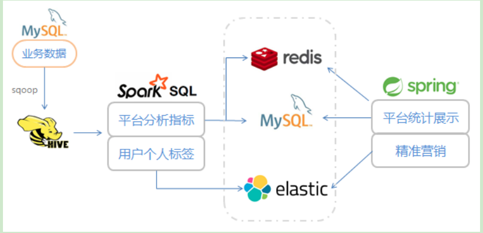
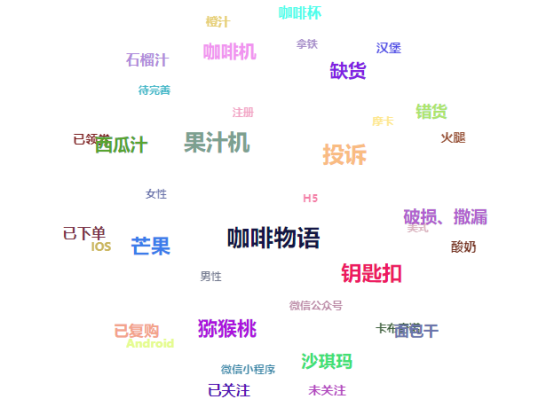
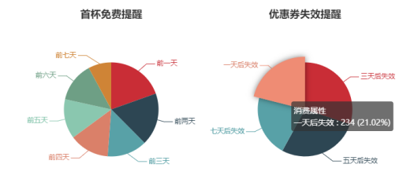
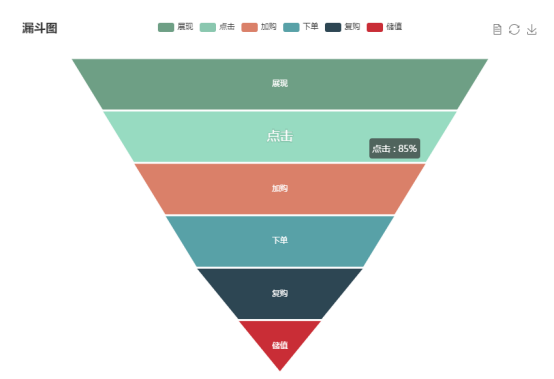
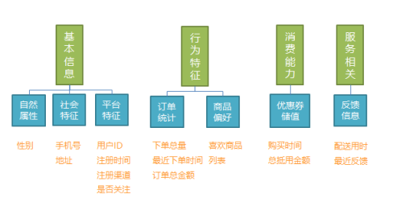

尚硅谷大数据技术之电商用户画像

# 项目整体介绍

电商平台系统上线运行一段时间后，可以收集到大量的用户行为数据；利用大数据技术进行深入挖掘和分析，可以得到感兴趣的商业指标。而随着大数据技术的深入研究与应用，简单的统计指标已经不能满足业务发展的需求了。

企业的关注点，日益聚焦在、如何利用大数据，来为精细化运营和精准营销服务。而要做精细化运营，首先要建立本企业的用户画像。

## 1.1 数据源分析

项目所用到的数据源，就是业务系统中收集的数据，保存在MySQL的表中。

主要有以下这些表：

-   用户信息表（t_member）

-   用户地址表（t_member_addr）

-   商品信息表（t_commodity）

-   商品类别信息表（t_commodity_cate）

-   订单表（t_order）

-   订单商品表（t_order_commodity）

-   优惠券表（t_coupon）

-   用户优惠券表（t_coupon_member）

-   订单优惠券表（t_coupon_order）

-   快递表（t_delivery）

-   反馈表（t_feedback）

-   商店表（t_shop）

-   商家订单表（t_shop_order，订单对于卖家也有记录）

-   后台用户表（t_user，员工表）

这些数据内容，主要可以分为：用户信息，商品信息，订单信息，运营相关信息，服务相关信息五大类，我们后续可以根据这个标准做标签建模。

## 1.2 项目架构

我们将数据用sqoop从MySQL中导出到Hive，然后使用spark作为分析引擎，用spark SQL对定义的指标进行计算，得到的结果写入外部存储系统。

写入的结果按照用途，主要分成两类：一类是平台的统计指标，写入redis或者MySQL，做图表展示，用于市场分析决策；另一类则是每个用户的具体标签，写入ES，方便进行复杂查询和用户筛选。



## 1.3 数据展示和应用

得到的两类计算结果，分别用于展示和精准营销。

-   平台统计指标展示

图表形式展现（echarts.js）；统计结果数据写入redis（或mysql）；后台应用服务获取数据，传给前端进行页面绘制。

-   用户标签信息应用

全部标签在页面上分类显示；构建后台应用服务，点选标签进行圈人；生成对应的用户列表，用于精准营销推送信息。

# 第二章 环境配置

## 2.1 安装Hadoop（略）

## 2.2 安装Hive

### 2.2.1 基本配置

1）下载解压

```sh
sudo tar xvfz apache-hive-2.3.7-bin.tar.gz -C /usr/local/lib/
sudo chown -R ubuntu:ubuntu apache-hive-2.3.7-bin/
```

2）添加环境变量

```sh
vi ~/.bashrc
export HIVE_HOME=/usr/local/apache-hive-2.3.6-bin
export PATH=$PATH:$HIVE_HOME/bin

source ~/.bashrc
```

3）定义仓库目录

```sh
hdfs dfs -mkdir -p /user/ubuntu/warehouse
```

修改读写权限：

```sh
hdfs dfs -chmod 777 /user/ubuntu/warehouse
```

4）配置文件

新建一个hive-site.xml：

```sh
vi conf/hive-site.xml
```

```xml
<?xml version="1.0" encoding="UTF-8" standalone="no"?>
<?xml-stylesheet type="text/xsl" href="configuration.xsl"?>
<!--
Licensed to the Apache Software Foundation (ASF) under one or more
contributor license agreements. See the NOTICE file distributed with
this work for additional information regarding copyright ownership.
The ASF licenses this file to You under the Apache License, Version 2.0
(the "License"); you may not use this file except in compliance with
the License. You may obtain a copy of the License at

http://www.apache.org/licenses/LICENSE-2.0

Unless required by applicable law or agreed to in writing, software
distributed under the License is distributed on an "AS IS" BASIS,
WITHOUT WARRANTIES OR CONDITIONS OF ANY KIND, either express or implied.
See the License for the specific language governing permissions and
limitations under the License.
-->
<configuration>
        <property>
	        <name>javax.jdo.option.ConnectionURL</name>
	        <value>jdbc:mysql://localhost:3306/metastore?createDatabaseIfNotExist=true</value>
	        <description>JDBC connect string for a JDBC metastore.
To use SSL to encrypt/authenticate the connection, provide database-specific SSL flag in the connection URL. For example, jdbc:postgresql://myhost/db?ssl=true for postgres database.
     	   </description>
 	   </property>
    
 	   <property>
    	    <name>hive.metastore.warehouse.dir</name>
     	   	<value>/user/ubuntu/warehouse</value>
   	     	<description>location of default database for the warehouse</description>
	</property>


	<property>
		<name>hive.metastore.uris</name>
		<value>thrift://localhost:9083</value>
		<description>Thrift URI for the remote metastore. Used by metastore client to connect to remote metastore.</description>
	</property>


	<property>
		<name>javax.jdo.option.ConnectionDriverName</name>
		<value>com.mysql.jdbc.Driver</value>
		<description>Driver class name for a JDBC metastore</description>
	</property>


	<property>
		<name>javax.jdo.option.ConnectionUserName</name>
		<value>root</value>
	</property>
	<property>
		<name>javax.jdo.option.ConnectionPassword</name>
		<value>123456</value>
	</property>


	<property>
		<name>javax.jdo.PersistenceManagerFactoryClass</name>
		<value>org.datanucleus.api.jdo.JDOPersistenceManagerFactory</value>
		<description>class implementing the jdo persistence</description>
	</property>
</configuration>
```


### 2.2.2 初始化metastore

```sh
hive/bin/schematool -dbType mysql -initSchema root 123456
```


### 2.2.3 启动hive元存储thrift服务器

```sh
hive --service metastore
```


### 2.2.4 创建项目数据的数据库

进入hive客户端控制台，创建一个叫做ecommerce的数据库：

```sh
hive

create database ecommerce;
```


# 第三章 数据准备

## 3.1 在mysql中创建生产表

实际生产环境中，我们的表一般都是放在mysql中的，所以需要先模拟创建生产表。

### 3.1.1 连接mysql

```sh
mysql -u root -p
```


### 3.1.2 创建数据库 ecommerce

```sql
create database ecommerce charset=utf8;
```


### 3.1.3 执行写好的创建表的ddl

```sql
source desktop/files/ddl/i_member.sql;
source desktop/files/ddl/i_commodity.sql;
source desktop/files/ddl/i_order.sql;
source desktop/files/ddl/i_marketing.sql;
source desktop/files/ddl/i_operation.sql;
```

## 3.2 配置sqoop做数据迁移

### 3.2.1 解压sqoop安装包

```sh
tar zxvf sqoop-1.4.7.bin__hadoop-2.6.0.tar.gz
```


### 3.2.2 添加mysql的连接器jar包

```sh
将mysql-connector-java-5.1.28-bin.jar拷贝到sqoop/lib下面：

cp mysql-connector-java-5.1.28-bin.jar ./lib/

另外注意，还应该把hive-site.xml拷贝到sqoop/conf下面。
```


### 3.2.3 配置文件sqoop-env.sh

修改配置文件，加入hive的环境变量：

```sh
cd /opt/sqoop/conf

mv sqoop-env-template.sh sqoop-env.sh

vim sqoop-env.sh

export HIVE_HOME= /usr/local/lib/apache-hive-2.3.7-bin
```


### 3.2.4 用sqoop将数据从mysql导入hive

1）进入hive

```hive
hive
```


2）建库 ecommerce（如果之前没有建）

```hql
create database ecommerce;
```


3）创建导入数据的脚本datamigrate.sh

```sh
#!/bin/bash
# 定义一个函数，执行sqoop命令，所以执行脚本应该在sqoop/bin下面
sq(){
./sqoop import 
--connect jdbc:mysql://localhost:3306/ecommerce 
--username root 
--password 123456 
--table $1 
--num-mappers 1 
--hive-import 
--fields-terminated-by "t" 
--hive-overwrite 
--hive-database ecommerce 
--hive-table $1
}

sq t_commodity
sq t_commodity_cate
sq t_coupon
sq t_coupon_member
sq t_coupon_order
sq t_delivery
sq t_feedback
sq t_member
sq t_member_addr
sq t_order
sq t_order_commodity
sq t_shop
sq t_shop_order
sq t_user
```

注意里面到mysql的连接，localhost改成自己需要的主机名，用户名密码也要改成自己的配置。

运行脚本之后，进入hive，可以看到ecommerce下已经有所有的表了。

# 第四章 数据处理

## 4.1 创建项目

打开IDE，创建一个 java的maven 项目：EcommerceUserProfile。在src/main/java下新建package：com.atguigu.userprofile，下面包含这样几个package：

-   utils：工具包

-   etl：对hive中数据进行ETL的spark程序

另外，还会有前后端业务相关的代码，我们会在后面定义。

## 4.2 引入依赖和插件

pom文件配置如下：

```xml
<!--定义版本信息-->
<properties>
	<java.version>1.8</java.version>
	<spark.version>2.1.0</spark.version>
	<scala.version>2.11</scala.version>
	<springboot.version>2.2.0.RELEASE</springboot.version>
	<elasticsearch.version>6.8.5</elasticsearch.version>
	<lombok.version>1.18.10</lombok.version>
	<fastjson.version>1.2.59</fastjson.version>
</properties>

<dependencies>
	<!--spring boot 相关依赖-->
	<dependency>
		<groupId>org.springframework.boot</groupId>
		<artifactId>spring-boot-starter-web</artifactId>
		<version>${springboot.version}</version>
	</dependency>
	<dependency>
		<groupId>org.springframework.boot</groupId>
		<artifactId>spring-boot-starter-thymeleaf</artifactId>
		<version>${springboot.version}</version>
	</dependency>
	<dependency>
		<groupId>org.springframework.boot</groupId>
		<artifactId>spring-boot-starter-data-elasticsearch</artifactId>
		<version>${springboot.version}</version>
	</dependency>
	<dependency>
		<groupId>org.springframework.boot</groupId>
		<artifactId>spring-boot-devtools</artifactId>
		<scope>runtime</scope>
		<optional>true</optional>
		<version>${springboot.version}</version>
	</dependency>

	<!--spark 相关依赖，需要core、sql和hive-->
	<dependency>
		<groupId>org.apache.spark</groupId>
		<artifactId>spark-core_${scala.version}</artifactId>
		<version>${spark.version}</version>
	</dependency>

	<dependency>
		<groupId>org.apache.spark</groupId>
		<artifactId>spark-sql_${scala.version}</artifactId>
		<version>${spark.version}</version>
	</dependency>
	<dependency>
		<groupId>org.apache.spark</groupId>
		<artifactId>spark-hive_${scala.version}</artifactId>
		<version>${spark.version}</version>
	</dependency>

	<dependency>
		<groupId>org.projectlombok</groupId>
		<artifactId>lombok</artifactId>
		<optional>true</optional>
		<version>${lombok.version}</version>
	</dependency>

	<dependency>
		<groupId>com.alibaba</groupId>
		<artifactId>fastjson</artifactId>
		<version>${fastjson.version}</version>
	</dependency>


	<dependency>
		<groupId>org.elasticsearch</groupId>
		<artifactId>elasticsearch-hadoop</artifactId>
		<version>${elasticsearch.version}</version>
	</dependency>
	<dependency>
		<groupId>org.elasticsearch</groupId>
		<artifactId>elasticsearch</artifactId>
		<version>${elasticsearch.version}</version>
	</dependency>
	<!-- Java High Level REST Client -->
	<dependency>
		<groupId>org.elasticsearch.client</groupId>
		<artifactId>elasticsearch-rest-high-level-client</artifactId>
		<version>${elasticsearch.version}</version>
	</dependency>
</dependencies>

<profiles>
	<!--开发环境-->
	<profile>
		<id>dev</id>
		<properties>
			<build.profile.id>dev</build.profile.id>
		</properties>
		<activation>
			<activeByDefault>true</activeByDefault>
		</activation>
	</profile>
	<!--生产环境-->
	<profile>
		<id>prod</id>
		<properties>
			<build.profile.id>prod</build.profile.id>
		</properties>
	</profile>
</profiles>

<build>
	<plugins>
		<plugin>
			<groupId>org.springframework.boot</groupId>
			<artifactId>spring-boot-maven-plugin</artifactId>
		</plugin>

		<plugin>
			<groupId>org.apache.maven.plugins</groupId>
			<artifactId>maven-compiler-plugin</artifactId>
			<version>3.1</version>
			<configuration>
				<source>1.8</source>
				<target>1.8</target>
			</configuration>
		</plugin>
	</plugins>

<!--用resource定义打包时的资源文件-->
	<resources>
		<resource>
			<directory>src/main/resources</directory>
			<filtering>true</filtering>
			<excludes>
				<exclude>application-.properties</exclude>
			</excludes>
        </resource>
        <resource>
			<directory>src/main/resources</directory>
			<filtering>false</filtering>
			<includes>
				<include>application-${build.profile.id}.properties</include>
			</includes>
		</resource>
	</resources>
</build>
```


## 4.3 创建通用的工具类

在utils下新建一个SparkUtils类，专门用来定义一些通用的spark相关的操作。

```java
public class SparkUtils {
	// 定义会话池
	private static ThreadLocal<SparkSession> sessionPool = new ThreadLocal<>();
	public static SparkSession initSession() {
		if (sessionPool.get() != null) {
			return sessionPool.get();
		}
	SparkSession session = SparkSession.builder().appName("etl")
		.master("local[]")
		.config("es.nodes", "localhost")
		.config("es.port", "9200")
		.config("es.index.auto.create", "false") 
		.enableHiveSupport()
		.getOrCreate();
	sessionPool.set(session);
	return session;
	}
}
```

另外，开始写业务逻辑之前，首先需要把hive-site.xml复制到resources下面，本地运行，需要有hive的相关配置信息。这里需要注意修改两个地方：hive.metastore.warehouse.dir和hive.metastore.uris。

## 4.4 平台用户统计指标

### 4.4.1 用户信息的提取（饼图）

我们关心的用户信息的分布情况，主要有性别、渠道、是否订阅（关注公众号）、热度。

这些数据，应该就是：当前有多少男性用户、多少女性用户、多少安卓用户、多少ios用户...全部都是统计一个count值。


最终，我们应该把这些数据包在一起，供前端页面来读取，就可以画出上面的饼图了。

在com.atguigu.userprofile.etl下新建一个类MemberEtl，开始写代码。

```java
public class MemberEtl {
	public static void main(String[] args) {
		SparkSession session = SparkUtils.initSession();

		// 写sql查询数据
		List<MemberSex> memberSexes = memberSexEtl(session);
		List<MemberChannel> memberChannels = memberChannelEtl(session);
		List<MemberMpSub> memberMpSubs = memberMpSubEtl(session);
		MemberHeat memberHeat = memberHeatEtl(session);

		// 拼成需要的结果，memberVo代表整个页面，分别生成该页面中的4张饼图
		MemberVo memberVo = new MemberVo();
		memberVo.setMemberSexes(memberSexes);
		memberVo.setMemberChannels(memberChannels);
		memberVo.setMemberMpSubs(memberMpSubs);
		memberVo.setMemberHeat(memberHeat);

		//打印到控制台输出
		System.out.println("===========" + JSON.toJSONString(memberVo));
	}

	public static List<MemberSex> memberSexEtl(SparkSession session) {
		// 先用sql得到每个性别的count统计数据
		Dataset<Row> dataset = session.sql("select sex as memberSex, count(id) as sexCount " +
" from ecommerce.t_member group by sex");
		//先将Dataset转换成list
		List<String> list = dataset.toJSON().collectAsList();
		// 将list转成流，进行每一行数据的遍历，对每一个元素依次map成MemberSex，收集起来
		List<MemberSex> result = list.stream().map( str -> JSON.parseObject(str,MemberSex.class))
            .collect(Collectors.toList());
        return result;
    }

	public static List<MemberChannel> memberChannelEtl(SparkSession session) {
		//channel的实现和性别统计差不多
		Dataset<Row> dataset = session.sql("select member_channel as memberChannel, count(id) as channelCount from ecommerce.t_member group by member_channel");
		List<String> list = dataset.toJSON().collectAsList();
		List<MemberChannel> result = list.stream().map(str -> JSON.parseObject(str,MemberChannel.class)).collect(Collectors.toList());
		return result;
	}

	public static List<MemberMpSub> memberMpSubEtl(SparkSession session) {
		//平台关注分布统计，为真则统计或者不统计
		Dataset<Row> sub = session.sql(
	"select count(if(mp_open_id !='null',true,null)) as subCount, " +
	" count(if(mp_open_id ='null',true,null)) as unSubCount " +
	" from ecommerce.t_member");

		List<String> list = sub.toJSON().collectAsList();
		List<MemberMpSub> result = list.stream()
			.map(str -> JSON.parseObject(str, MemberMpSub.class))
			.collect(Collectors.toList());
		return result;
	}

	public static MemberHeat memberHeatEtl(SparkSession session) {
		// reg , complete从用户表中提取  
		//平台用户热度分布统计
		Dataset<Row> reg_complete = session.sql(
			"select count(if(phone='null',true,null)) as reg," +
			" count(if(phone !='null',true,null)) as complete " +
			" from ecommerce.t_member");
		//order , orderAgain从订单表提取
		Dataset<Row> order_again = session.sql(
			"select count(if(t.orderCount =1,true,null)) as order," +
			"count(if(t.orderCount >=2,true,null)) as orderAgain from " +
			"(select count(order_id) as orderCount,member_id from ecommerce.t_order group by member_id) as t");
		//coupon从t_coupon_member表提取，对member_id进行去重，然后count
		Dataset<Row> coupon = session.sql("select count(distinct member_id) as coupon from ecommerce.t_coupon_member ");

		// 最终，将三张表（注册、复购、优惠券）连在一起
		Dataset<Row> heat = coupon.crossJoin(reg_complete).crossJoin(order_again);
		List<String> list = heat.toJSON().collectAsList();
		List<MemberHeat> result = list.stream()
			.map(str -> JSON.parseObject(str, MemberHeat.class))
			.collect(Collectors.toList());

		// 只有一行数据，获取后返回
		return result.get(0);
	}

// 想要展示饼图的数据信息， MemberVo这个类是包含4个饼图的页面，每个属性代表一个饼图
@Data
static class MemberVo{
	private List<MemberSex> memberSexes; // 性别统计信息
	private List<MemberChannel> memberChannels; // 渠道来源统计信息
	private List<MemberMpSub> memberMpSubs; // 用户是否关注媒体平台
	private MemberHeat memberHeat; // 用户热度统计
}
// 分别定义每个元素类，每个元素对象代表了一张饼图中的一小块
@Data
static class MemberSex {
	private Integer memberSex;//性别编号
	private Integer sexCount;//当前性别的count数量
}
@Data
static class MemberChannel {
	private Integer memberChannel;//渠道编号
	private Integer channelCount;//数量
}
@Data
static class MemberMpSub {
	private Integer subCount;//已关注的用户统计数
	private Integer unSubCount;//未关注的用户统计数
}
@Data
static class MemberHeat {
	private Integer reg; // 只注册，未填写手机号的用户统计数
	private Integer complete; // 完善了信息，填了手机号的用户统计数
	private Integer order; // 下过订单的用户统计数
	private Integer orderAgain; // 多次下单，复购的用户统计数
	private Integer coupon; // 购买过优惠券，储值的用户统计数
    }
}
```


### 4.4.2 热词提取（词云）

所谓词云，其实就是统计关键词的频率。

只要是用户评价、商品类别之类的文本信息，我们都可以按空格分词，然后统计每个词出现的次数------**就相当于是一个word count，然后按照count数量降序排列就可以了**。
**先将词进行map拆分，再用reduce进行统计word count就解决啦**



在com.atguigu.userprofile.etl下新建一个类HotWordEtl，开始写代码。

由于没有现成的数据，这里用了搜狗提供的一个样例语料库，上传到hdfs（也可以添加到resource）。

```sh
hdfs dfs -mkdir /data
hdfs dfs -put /mnt/c/Users/wushengran/Desktop/files/data/SogouQ.sample.txt /data
```

整体代码如下：
 
```java
public static void main(String[] args) {
	// 为了方便操作数据，首先创建一个jsc：
	SparkConf sc = new SparkConf()
		.setAppName("hot word etl")
		.setMaster("local[]");
	JavaSparkContext jsc = new JavaSparkContext(sc);
	// 1.首先从hdfs上读取数据
	System.setProperty("HADOOP_USER_NAME", "ubuntu");
	// 用jsc读取hdfs文件，转成java rdd
	JavaRDD<String> linesRdd = jsc.textFile("hdfs://192.168.99.170:9000/data/SogouQ.sample.txt");
	//2.mapToPair得到二元组，准备word count,实现了map
	JavaPairRDD<String, Integer> pairRDD = linesRdd.mapToPair(new PairFunction<String, String,Integer>() {
        	@Override
        	public Tuple2<String, Integer> call(String s) throws Exception {
            	// 以制表符分隔，取第三个字段
            	String word = s.split("t")[2];//按照制表符分隔
            	return new Tuple2<>(word, 1);//这里是word,计数是1，标准的map数据对格式
        	}
	});
    	// 3.以word作为key，分组聚合，实现reduce
        JavaPairRDD<String, Integer> countRdd = pairRDD.reduceByKey(new Function2<Integer, Integer, Integer>() {
        	@Override
        	public Integer call(Integer v1, Integer v2) throws Exception {
            		return v1 + v2;//将计数聚合起来
        	}
   	 });
    	// 4.元素String,Integer互换位置,方便用Integer作为首位进行降序排列
	JavaPairRDD<Integer, String> swapedRdd = countRdd.mapToPair(new PairFunction<Tuple2<String, Integer>, Integer, String>() {
        	@Override
		public Tuple2<Integer, String> call(Tuple2<String, Integer> stringIntegerTuple2) throws Exception {
			return stringIntegerTuple2.swap();
		}
	});

	// 5.按照count（Integer）值降序排序
	JavaPairRDD<Integer, String> sortedRdd = swapedRdd.sortByKey(false);
	// 6.再互换位置回到之前的状态
	JavaPairRDD<String, Integer> resultRdd = sortedRdd.mapToPair(new PairFunction<Tuple2<Integer, String>, String, Integer>() {
		@Override
		public Tuple2<String, Integer> call(Tuple2<Integer, String> integerStringTuple2) throws Exception {
			return integerStringTuple2.swap();
		}
	});
    	// 7.取前10个热词输出
    	List<Tuple2<String, Integer>> hotWordCounts = resultRdd.take(10);
    	// 8.打印输出
    	for (Tuple2<String, Integer> hotWordCount: hotWordCounts) {
		System.out.println(hotWordCount._1 + " === count " + hotWordCount._2);
    	}
}
```


### 4.4.3 平台近期数据增量（折线图）

我们还可以统计平台用户数据的增长，主要就是注册量和订单量。我们定义几个要展示的统计指标：（只统计展示近七天的数据）

-   近七天的、每天新增注册人数（每天增量）；

-   近七天的、截至每天的总用户人数（每天总量）；

-   近七天的、截至每天的总订单数（每天总量）；

-   近七天的、截至每天的总订单流水金额数量（每天总量）


在etl下新建一个GrowthEtl类，代码如下：

```java
public class GrowthEtl {
	public static void main(String[] args) {
		SparkSession session = SparkUtils.initSession();
		//自定义方法，提取每天的数据，作为List返回
		List<GrowthLineVo> growthLineVo = growthEtl(session);
		//打印输出
		System.out.println(growthLineVo);
	}

	private static List<GrowthLineVo> growthEtl(SparkSession session) {
		// 指定"当前日期"是2019.11.30，这是数据决定的
		LocalDate now = LocalDate.of(2019, Month.NOVEMBER, 30);
		Date nowDay = Date.from(now.atStartOfDay(ZoneId.systemDefault()).toInstant());
		Date sevenDayBefore = DateUtil.addDay(nowDay, -7);

		// 近七天注册人数统计
		String memberSql = "select date_format(create_time,'yyyy-MM-dd') as day," +
			" count(id) as regCount, max(id) as memberCount " +
			" from ecommerce.t_member where create_time >='%s' " +
			" group by date_format(create_time,'yyyy-MM-dd') order by day";

		memberSql = String.format(memberSql,
                            DateUtil.DateToString(sevenDayBefore,DateStyle.YYYY_MM_DD_HH_MM_SS));
		Dataset<Row> memberDs = session.sql(memberSql);

		// 近七天订单和流水统计
		String orderSql = "select date_format(create_time,'yyyy-MM-dd') as day," +
			" max(order_id) orderCount, sum(origin_price) as gmv" +
			" from ecommerce.t_order where create_time >='%s' " +
			"group by date_format(create_time,'yyyy-MM-dd') order by day";

		orderSql = String.format(orderSql, DateUtil.DateToString(sevenDayBefore, DateStyle.YYYY_MM_DD_HH_MM_SS));
		Dataset<Row> orderDs = session.sql(orderSql);

		// 联接查询，按照day内连接
		Dataset<Tuple2<Row, Row>> tuple2Dataset = memberDs.joinWith(orderDs, memberDs.col("day").equalTo(orderDs.col("day")), "inner");

		List<Tuple2<Row, Row>> tuple2s = tuple2Dataset.collectAsList();
		List<GrowthLineVo> vos = new ArrayList<>();

		// 遍历二元组List，包装 GrowthLineVo
		for (Tuple2<Row, Row> tuple2 : tuple2s) {
			Row row1 = tuple2._1(); // memberSql结果
			Row row2 = tuple2._2(); // orderSql结果

			JSONObject obj = new JSONObject();

			StructType schema = row1.schema();
			String[] strings = schema.fieldNames();
			for (String string : strings) {
				Object as = row1.getAs(string);
				obj.put(string, as);
			}

			schema = row2.schema();
			strings = schema.fieldNames();
			for (String string : strings) {
				Object as = row2.getAs(string);
                obj.put(string, as); 
            }

			GrowthLineVo growthLineVo = obj.toJavaObject(GrowthLineVo.class);
			vos.add(growthLineVo);
		}

		// 七天前，再之前的订单流水总和（GMV）
		String preGmvSql = "select sum(origin_price) as totalGmv from ecommerce.t_order where create_time <'%s'";
		preGmvSql = String.format(preGmvSql, DateUtil.DateToString(sevenDayBefore, DateStyle.YYYY_MM_DD_HH_MM_SS));
		Dataset<Row> gmvDs = session.sql(preGmvSql);

		double previousGmv = gmvDs.collectAsList().get(0).getDouble(0);
		BigDecimal preGmv = BigDecimal.valueOf(previousGmv);


		// 之前每天的增量gmv取出，依次叠加，得到总和
		List<BigDecimal> totalGmvList = new ArrayList<>();

		for (int i = 0; i < vos.size(); i++) {
			GrowthLineVo growthLineVo = vos.get(i);
			BigDecimal gmv = growthLineVo.getGmv();

			BigDecimal temp = gmv.add(preGmv);

			for (int j = 0; j < i; j++) {
				GrowthLineVo prev = vos.get(j);
				temp = temp.add(prev.getGmv());
			}

			totalGmvList.add(temp);
		}

		// 遍历总量gmv的List，更新vos里面gmv的值
		for (int i = 0; i < totalGmvList.size(); i++) {
			GrowthLineVo lineVo = vos.get(i);
			lineVo.setGmv(totalGmvList.get(i));
		}

		return vos;
	}
	@Data
	static class GrowthLineVo {
	// 每天新增注册数、总用户数、总订单数、总流水GMV
		private String day;
		private Integer regCount;
		private Integer memberCount;
		private Integer orderCount;
		private BigDecimal gmv;
	}
}
```


### 4.4.4 平台近期周环比统计（柱状图）

所谓周环比，week on week，就是比较两周的数据，最近一周跟上周相比；而且为了图像更清楚，我们可以对两周的数据，再做一个同比显示：每一天都跟上周的这一天比（周一跟周一比，周二跟周二比），看增长多少。


我们准备统计注册数量（regs）和订单数量（orders）的周环比增长。

在etl下新建一个WowEtl类，代码如下：

```java
public class WowEtl {
	public static void main(String[] args) {

		SparkSession session = SparkUtils.initSession();

		// 查询近一周的reg和order的数量
		List<RegVo> regVos = regWeekCount(session);
		List<OrderVo> orderVos = orderWeekCount(session);

		System.out.println("======" + regVos);
		System.out.println("======" + orderVos);
	}

	public static List<RegVo> regWeekCount(SparkSession session) {

		LocalDate now = LocalDate.of(2019, Month.NOVEMBER, 30);
		Date nowDay = Date.from(now.atStartOfDay(ZoneId.systemDefault()).toInstant());
		Date lastTwoWeekFirstDay = DateUtil.addDay(nowDay, -14);

		String sql = "select date_format(create_time,'yyyy-MM-dd') as day," +
			" count(id) as regCount from ecommerce.t_member " +
			" where create_time >='%s' and create_time < '%s' " +
			" group by date_format(create_time,'yyyy-MM-dd')";
		sql = String.format(sql,
DateUtil.DateToString(lastTwoWeekFirstDay, DateStyle.YYYY_MM_DD_HH_MM_SS),
DateUtil.DateToString(nowDay, DateStyle.YYYY_MM_DD_HH_MM_SS));
		Dataset<Row> dataset = session.sql(sql);
		List<String> list = dataset.toJSON().collectAsList();
		List<RegVo> result = list.stream()
			.map(str -> JSON.parseObject(str, RegVo.class))
			.collect(Collectors.toList());
		return result;
	}

	public static List<OrderVo> orderWeekCount(SparkSession session) {
		LocalDate now = LocalDate.of(2019, Month.NOVEMBER, 30);
		Date nowDay = Date.from(now.atStartOfDay(ZoneId.systemDefault()).toInstant());
		Date lastTwoWeekFirstDay = DateUtil.addDay(nowDay, -14);

		String sql = "select date_format(create_time,'yyyy-MM-dd') as day," +
			" count(order_id) as orderCount from ecommerce.t_order " +
			" where create_time >='%s' and create_time < '%s' " +
			" group by date_format(create_time,'yyyy-MM-dd')";
		sql = String.format(sql,
				DateUtil.DateToString(lastTwoWeekFirstDay, DateStyle.YYYY_MM_DD_HH_MM_SS),
				DateUtil.DateToString(nowDay, DateStyle.YYYY_MM_DD_HH_MM_SS));
		Dataset<Row> dataset = session.sql(sql);
		List<String> list = dataset.toJSON().collectAsList();
		List<OrderVo> result = list.stream()
				.map(str -> JSON.parseObject(str, OrderVo.class))
				.collect(Collectors.toList());
		return result;
	}

	@Data
	static class RegVo {
		private String day;
	private Integer regCount;
	}

	@Data
	static class OrderVo {
		private String day;
		private Integer orderCount;
	}
}
```


### 4.4.5 营销提醒统计（饼图）

营销提醒，主要是优惠券过期提醒，主要分两类：首单免费优惠券（coupon_id为1），以及一般的抵扣优惠券（代金券，coupon_id不为1）。

我们可以将所有优惠券，按照失效时间统计出来，以便考虑优惠券的使用情况，快速调整营销策略。



我们这里的业务定义，优惠券都是7天有效期。

在etl下新建一个RemindEtl类，代码如下：

```java
public class RemindEtl {
	public static void main(String[] args) {
		SparkSession session = SparkUtils.initSession();

		// 查询近一周优惠券的数量
		List<FreeRemindVo> freeVos = freeRemindCount(session);
		List<CouponRemindVo> couponVos = couponRemindCount(session);

		System.out.println("======" + freeVos);
		System.out.println("======" + couponVos);
	}

	public static List<FreeRemindVo> freeRemindCount(SparkSession session){
		LocalDate now = LocalDate.of(2019, Month.NOVEMBER, 30);
		Date nowDay = Date.from(now.atStartOfDay(ZoneId.systemDefault()).toInstant());
		Date sevenDayBefore = DateUtil.addDay(nowDay, -7);

		String sql ="select date_format(create_time,'yyyy-MM-dd') as day, " +
			" count(member_id) as freeCount " +
			" from ecommerce.t_coupon_member where coupon_id = 1 " +
			" and coupon_channel = 2 and create_time >= '%s' " +
			" group by date_format(create_time,'yyyy-MM-dd')";

		sql = String.format(sql,
		DateUtil.DateToString(sevenDayBefore, DateStyle.YYYY_MM_DD_HH_MM_SS));
		Dataset<Row> dataset = session.sql(sql);

		List<String> list = dataset.toJSON().collectAsList();
		List<FreeRemindVo> result = list.stream()
			.map(str -> JSON.parseObject(str, FreeRemindVo.class))
			.collect(Collectors.toList());
		return result;

	}

	public static List<CouponRemindVo> couponRemindCount(SparkSession session){
		LocalDate now = LocalDate.of(2019, Month.NOVEMBER, 30);
		Date nowDay = Date.from(now.atStartOfDay(ZoneId.systemDefault()).toInstant());
		Date sevenDayBefore = DateUtil.addDay(nowDay, -7);

		String sql ="select date_format(create_time,'yyyy-MM-dd') as day, " +
			" count(member_id) as couponCount " +
			" from ecommerce.t_coupon_member where coupon_id != 1 " +
			" and create_time >= '%s' " +
			" group by date_format(create_time,'yyyy-MM-dd')";

		sql = String.format(sql,
		DateUtil.DateToString(sevenDayBefore, DateStyle.YYYY_MM_DD_HH_MM_SS));
		Dataset<Row> dataset = session.sql(sql);

		List<String> list = dataset.toJSON().collectAsList();
		List<CouponRemindVo> result = list.stream()
			.map(str -> JSON.parseObject(str, CouponRemindVo.class))
			.collect(Collectors.toList());
		return result;

	}

	@Data
	static class FreeRemindVo {
		private String day;
		private Integer freeCount;
	}

	@Data
	static class CouponRemindVo {
		private String day;
		private Integer couponCount;
	}
}
```


### 4.4.6 用户行为转化率分析（漏斗图）

在一个电商平台上，用户可以有不同的业务行为：

页面展现 -> 点击 -> 加购物车 -> 下单 -> 复购 -> 充值（购买优惠券）

对于用户的一些行为，我们是希望做沉降分析的，考察用户每一步行为的转化率。这就可以画出一个"漏斗图"：



在etl下新建一个ConversionEtl类，代码如下：

```java
public class ConversionEtl {
	public static void main(String[] args) {
		SparkSession session = SparkUtils.initSession();

		ConversionVo conversionVo = conversionBehaviorCount(session);
		System.out.println(conversionVo);
	}

	public static ConversionVo conversionBehaviorCount(SparkSession session){
		// 查询下过订单的用户
		Dataset<Row> orderMember = session.sql("select distinct(member_id) from ecommerce.t_order where order_status=2");
        // 将购买次数超过 1 次的用户查出来
		Dataset<Row> orderAgainMember = session.sql("select t.member_id as member_id " +
			" from (select count(order_id) as orderCount," +
			" member_id from ecommerce.t_order " +
			" where order_status=2 group by member_id) as t " +
			" where t.orderCount>1");

		// 查询充值过的用户
		Dataset<Row> charge = session.sql("select distinct(member_id) as member_id " +
			"from ecommerce.t_coupon_member where coupon_channel = 1");

		Dataset<Row> join = charge.join(orderAgainMember,orderAgainMember.col("member_id").equalTo(charge.col("member_id")),
		"inner");

		// 统计各层级的数量
		long order = orderMember.count();
		long orderAgain = orderAgainMember.count();
		long chargeCoupon = join.count();

		// 包装成VO
		ConversionVo vo = new ConversionVo();
		vo.setPresent(1000L); // 目前数据中没有，直接给定值
		vo.setClick(800L);
		vo.setAddCart(600L);
		vo.setOrder(order);
		vo.setOrderAgain(orderAgain);
		vo.setChargeCoupon(chargeCoupon);

		return vo;
	}

	@Data
	static class ConversionVo{
		private Long present; 
		private Long click;
		private Long addCart;
		private Long order;
		private Long orderAgain;
		private Long chargeCoupon;
	}
}
```


## 4.5 用户标签系统（用户画像建模）

现在电商行业竞争越来越激烈，只有泛泛的数据统计是不够的。很多大厂都开始向着所谓"精准营销""个性化推荐"这些领域来发力。而精准营销的基础，就是要给用户打上各种各样、丰富而且不同的标签。

所以我们接下来做的就是，用sql把用户标签提取出来，而得到的标签结果要写入es，供业务系统读取查询。

### 4.5.1 用户标签定义

我们希望提取的用户标签，有这么几部分：

-   用户个人信息（从member表中提取）

-   用户业务行为信息（从order和t_order_commodity中提取）

-   用户市场营销信息（优惠券相关，从t_coupon_member中提取）

-   用户服务信息（从快递表和反馈表，t_delivery和t_feedback中提取）

 

具体定义字段如下：

-   个人信息

> memberId, phone, sex, channel, subOpenId, address, regTime

-   购买行为特征(及兴趣爱好)

> orderTime, orderCount, favGoods, orderMoney

-   消费能力（及过期提醒）

> freeCouponTime, couponTimes, chargeMoney

-   反馈行为（为了提升效率）

> overTime, feedback

### 4.5.2 在ES中创建mapping

在ES中首先新建一个tag索引，用来保存我们所有的数据：PUT tag

然后在索引中新建映射（mapping）：

```json
PUT /tag/_doc/_mapping?pretty

{
	"_doc": {
		"properties": {
			"memberId": { "type": "text", "fields": { "keyword": { "type": "keyword" } } },
			"phone": { "type": "text", "fields": { "keyword": { "type": "keyword" } } },
			"sex": { "type": "text", "fields": { "keyword": { "type": "keyword" } } },
			"channel": { "type": "text", "fields": { "keyword": { "type": "keyword" } } },
			"subOpenId": { "type": "text", "fields": { "keyword": { "type": "keyword" } } },
			"address": { "type": "text" },
			"regTime": { "type": "date" },
			"orderCount": { "type": "long" },
			"orderTime": { "type": "date" },
			"orderMoney": { "type": "float" },
			"favGoods": { "type": "text", "fields": { "keyword": { "type": "keyword" } } },
			"freeCouponTime": { "type": "date" },
			"couponTimes": { "type": "date" },
			"chargeMoney": { "type": "double" },
			"overTime": { "type": "long" },
			"feedBack": { "type": "long" }
		}
	}
}
```


### 4.5.3 提取用户标签数据写入ES

在etl下新建一个类UserTagEtl，代码如下：

```java
public class UserTagEtl {

	public static void main(String[] args) {
		SparkSession session = SparkUtils.initSession();
		etl(session);
	}

	// 提取用户标签
	private static void etl(SparkSession session) {
		// 提取用户基本信息标签
		Dataset<Row> memberBase = session.sql(
			"select id as memberId,phone, sex,member_channel as channel, mp_open_id as subOpenId," +
			" address_default_id as address, date_format(create_time,'yyyy-MM-dd') as regTime" +
			" from ecommerce.t_member");

		// 提取用户购买行为特征
		Dataset<Row> orderBehavior = session.sql(
			"select o.member_id as memberId," +
			" count(o.order_id) as orderCount," +
			" date_format(max(o.create_time),'yyyy-MM-dd') as orderTime," +
			" sum(o.pay_price) as orderMoney, " +
			" collect_list(DISTINCT oc.commodity_id) as favGoods " +
			" from ecommerce.t_order as o left join ecommerce.t_order_commodity as oc" +
			" on o.order_id = oc.order_id group by o.member_id");

		// 提取用户购买能力标签
		Dataset<Row> freeCoupon = session.sql(
			"select member_id as memberId, " +
			" date_format(create_time,'yyyy-MM-dd') as freeCouponTime " +
			" from ecommerce.t_coupon_member where coupon_id = 1");

		// 多次购买购物券的时间
		Dataset<Row> couponTimes = session.sql(
			"select member_id as memberId," +
			" collect_list(date_format(create_time,'yyyy-MM-dd')) as couponTimes" +
			" from ecommerce.t_coupon_member where coupon_id !=1 group by member_id");

		// 买购物券总的花费金额
		Dataset<Row> chargeMoney = session.sql(
			"select cm.member_id as memberId , sum(c.coupon_price/2) as chargeMoney " +
			" from ecommerce.t_coupon_member as cm left join ecommerce.t_coupon as c " +
			" on cm.coupon_id = c.id where cm.coupon_channel != 1 group by cm.member_id");

		// 用户对服务的反馈行为特征
		Dataset<Row> overTime = session.sql(
			"select (to_unix_timestamp(max(arrive_time)) - to_unix_timestamp(max(pick_time))) " +
			" as overTime, member_id as memberId " +
			" from ecommerce.t_delivery group by member_id");

		// 最近一次用户反馈
		Dataset<Row> feedback = session.sql("select fb.feedback_type as feedback,fb.member_id as memberId" +
			" from ecommerce.t_feedback as fb " +
			" right join (select max(id) as fid,member_id as memberId " +
			" from ecommerce.t_feedback group by member_id) as t " +
			" on fb.id = t.fid");

		// 将这些结果注册成表，全部按照id连接起来，合并出想要的信息，写入es中
		memberBase.registerTempTable("memberBase");
		orderBehavior.registerTempTable("orderBehavior");
		freeCoupon.registerTempTable("freeCoupon");
		couponTimes.registerTempTable("couponTimes");
		chargeMoney.registerTempTable("chargeMoney");
		overTime.registerTempTable("overTime");
		feedback.registerTempTable("feedback");

		Dataset<Row> result = session.sql("select m.*,o.orderCount,o.orderTime,o.orderMoney,o.favGoods," +
			" fb.freeCouponTime,ct.couponTimes, cm.chargeMoney,ot.overTime,f.feedBack" +
			" from memberBase as m " +
			" left join orderBehavior as o on m.memberId = o.memberId " +
			" left join freeCoupon as fb on m.memberId = fb.memberId " +
			" left join couponTimes as ct on m.memberId = ct.memberId " +
			" left join chargeMoney as cm on m.memberId = cm.memberId " +
			" left join overTime as ot on m.memberId = ot.memberId " +
			" left join feedback as f on m.memberId = f.memberId ");
		JavaEsSparkSQL.saveToEs(result,"/usertag/_doc");
	}

	// 定义用户标签的VO
	@Data
	public static class MemberTag implements Serializable {
		// 用户基本信息
		private String memberId;
		private String phone;
		private String sex;
		private String channel;
		private String subOpenId;
		private String address;
		private String regTime;

		// 用户业务行为特征
		private Long orderCount;
		private String orderTime;
		private Double orderMoney;
		private List<String> favGoods;

		// 用户购买能力
		private String freeCouponTime; // 首单免费时间
		private List<String> couponTimes; // 多次购买时间
		private Double chargeMoney; // 购买花费金额

		// 用户反馈行为特征
		private Integer overTime;
		private Integer feedBack;
	}
}
```


# 第五章 数据展示

我们最终，需要把集中统计类的标签，和用户个人标签整合起来，在页面做一个展示。

**统计类的指标**很简单，只要写入redis，由前端页面读出，应用echarts.js这样的显示工具把它画出来就可以了，**即前面的饼图和折线图那些**。

而**用户个人标签**，我们主要是供运营客服人员圈人使用，所以相当于还有一个后台管理系统。运营人员在页面上点选标签，发送请求到后台，后端服务就从es中取数，返回前端显示。
即点击标签后会从es中查询返回该标签下的用户名单，给到运营人员实现精准营销

## 5.1 配置文件

### 5.1.1 应用相关

application.properties里面设置spring.profiles.active，主要是用来区分不同环境下的配置：dev和prod。

所以具体不同环境的配置文件，就是application-dev.properties和application-prod.properties。

### 5.1.2 日志相关

在properties文件中有logging.config，这指定了当前具体的日志配置文件，是logback.xml。

更改日志级别，可以在applicaition.properties中添加：

```sh
logging.level.root=warn
```


## 5.2 前端代码

### 5.2.1 Js和Css

前端用到的组件，主要是Vue.js，其中还用到了echarts.js做更漂亮的图表展示。

js和css代码放在resouces/static下面，可以直接拷贝进来。

### 5.2.2 Html模板

我们用到了Thymeleaf，这是SpringBoot官方推荐的模板引擎。

定义的模板文件，放在resouces/templates下面，可以直接拷贝进来。我们定义了两个模板，分别对应两个页面：一个index是访问主页，也就是统计信息大屏展示；另一个是tags，标签页面，类似于控制后台，可以点选标签进行圈人。

## 5.3 后端业务代码

我们的业务代码的主要目的是，实现按照某些条件圈人的功能。

首先，在src/main/java下创建一个新的package：com.atguigu.userprofile.app，专门用来放后台相关逻辑代码。

下面分几个package：

-   controller

这是java web项目的核心部分，用来响应前端发来的请求，并经过处理后包装好response返回给前端；

-   service

这是服务层，后端的控制器处理的过程，核心就是调用后台的服务，得到想要的结果；

-   support

用来放支持类，比如一些特定的数据结构，或者对es的连接操作，等等。

### 5.3.1 入口代码

直接在app下新建类：UserFilterByTagApplication.java，这是样板代码，应用主入口。

```java
package com.atguigu.userprofile.app;

// spring boot 主程序入口
@SpringBootApplication
public class UserFilterByTagApplication {
	public static void main(String[] args) {
		SpringApplication.run(UserFilterByTagApplication.class, args);
	}
}
```


### 5.3.2 支持代码

在app/support下新建类：

1）es查询标签操作数据的类（EsQueryTag）

这是一个定义好的类，专门用于定义es查询操作的字段，也就是这对标签的查询条件，包括name、value和type。

```java
@Data
public class EsQueryTag {
	private String name; // 标签名称
	private String value; // 查询限定的值
	private String type; // 查询类型
}
```


2）es配置类（ESConfig）

要处理es相关操作，自然有es相关的连接配置。我们可以在support下新建一个ESConfig.java，专门定义es的连接。

```java
@Configuration
public class ESConfig {
	private Logger logger = LoggerFactory.getLogger(ESConfig.class);

	private static final int ADDRESS_LENGTH = 2;
	private static final String HTTP_SCHEME = "http";


	@Value("${elasticsearch.ip}")
	String[] ipAddress;


	@Bean(name = "highLevelClient")
	public RestHighLevelClient highLevelClient(@Autowired RestClientBuilder restClientBuilder) {
		restClientBuilder.setMaxRetryTimeoutMillis(60000); // 超时1min
		return new RestHighLevelClient(restClientBuilder);
	}


	@Bean
	public RestClientBuilder restClientBuilder() {

		// 从配置参数里，提取ip和port，包装成HttpHost的列表
		HttpHost[] hosts = Arrays.stream(ipAddress)
			.map(this::makeHttpHost)
			.filter(Objects::nonNull)
			.toArray(HttpHost[]::new);

		logger.info("ES hosts:{}", Arrays.toString(hosts));

		return RestClient.builder(hosts);
	}


	private HttpHost makeHttpHost(String s) {
		String[] address = s.split(":");
		if (address.length == ADDRESS_LENGTH) {
			String ip = address[0];
			int port = Integer.parseInt(address[1]);
			return new HttpHost(ip, port, HTTP_SCHEME);
		} else {
			return null;
		}
	}
}
```


### 5.3.3 Controller（处理网络请求）

前端发来了请求，需要由控制器Controller来响应，定义对应的业务操作和返回。

1） 页面控制器（PageController）

这是后台的主控制器，对页面请求分配路由，由于用了thymeleaf模板，所以可以直接返回一个字符串：tags就表示用tags.html；index就表示用index.html。

我们在resources下创建templates目录，将index.html和tags.html放入；把static目录也创建出来，把js和css拷进去。

代码如下：

```java
@Controller
@Slf4j
public class PageController {

	// 首先是对根路径的处理，加载index.html页面，即更具url返回对应的html页面
	@RequestMapping("/")
	public String index() {
		return "index";
	}
	// 对于点选标签圈人的后台管理功能，另设一个地址/tags，加载tags.html
	@RequestMapping("/tags")
	public String tags(){
		return "tags";
	}
}
```


2）响应es查询请求的控制器（EsQueryController）

用来处理es相关操作的请求。定义的请求路径为/gen，这应该是一个POST请求，用来下载圈好的用户和手机号，页面点击"生成报告"，就可以直接从es生成报告。

```java
@Controller
public class EsQueryController {

	@Autowired
	EsQueryService service;

	// 需要提交表单，POST请求
	@RequestMapping("/gen")
	public void genAndDown(HttpServletResponse response, @RequestBody String data) {
		JSONObject object = JSON.parseObject(data);
		JSONArray selectedTags = object.getJSONArray("selectedTags");
		List<EsQueryTag> list = selectedTags.toJavaList(EsQueryTag.class);

		// 调用服务，按照查询限制提取出对应的用户信息
		List<UserTagEtl.MemberTag> tags = service.buildQuery(list);

		// 自定义方法，将所有用户信息拼在一起写入文件
		String content = toContent(tags);
		String fileName = "member.txt";


		response.setContentType("application/octet-stream");
		try {
			response.setHeader("Content-Disposition", "attachment; filename=" + URLEncoder.encode(fileName, "UTF-8"));
		} catch (UnsupportedEncodingException e) {
			e.printStackTrace();
		}
		try {
			ServletOutputStream sos = response.getOutputStream();
			BufferedOutputStream bos = new BufferedOutputStream(sos);
			bos.write(content.getBytes("UTF-8"));
			bos.flush(); // 直接将缓冲池中数据刷出，默认是要填满才发
			bos.close();
			sos.close();
		} catch (IOException e) {
			e.printStackTrace();
		}
	}


	private String toContent(List<UserTagEtl.MemberTag> tags) {
		StringBuilder sb = new StringBuilder();
		for (UserTagEtl.MemberTag tag : tags) {
			sb.append("[" + tag.getMemberId() + "," + tag.getPhone() + "]rn");
		}
		return sb.toString();
	}
}
```


### 5.3.4 Service（核心服务）

EsQueryService里面主要就是构建es的查询请求。代码如下：

```java
@Service
public class EsQueryService {
	@Resource(name = "highLevelClient")
	RestHighLevelClient highLevelClient;


	public List<UserTagEtl.MemberTag> buildQuery(List<EsQueryTag> tags) {
		SearchRequest request = new SearchRequest();

		request.indices("usertag");
		request.types("_doc");


		SearchSourceBuilder builder = new SearchSourceBuilder();
		request.source(builder);
		String[] includes = {"memberId", "phone"};
		builder.fetchSource(includes, null);
		builder.from(0); // 查询结果，从0开始
		builder.size(1000); // 大小为1000，相当于 limit 1000

		BoolQueryBuilder boolQueryBuilder = QueryBuilders.boolQuery();
		builder.query(boolQueryBuilder);
		List<QueryBuilder> should = boolQueryBuilder.should();
		List<QueryBuilder> mustNot = boolQueryBuilder.mustNot();
		List<QueryBuilder> must = boolQueryBuilder.must();

		// 遍历查询条件参数，判断是哪一类
		for (EsQueryTag tag : tags) {
			String name = tag.getName();
			String value = tag.getValue();
			String type = tag.getType();


			if (type.equals("match")) {
				should.add(QueryBuilders.matchQuery(name, value));
			}
			if (type.equals("notMatch")) {
				mustNot.add(QueryBuilders.matchQuery(name, value));
			}
			if (type.equals("rangeBoth")) {
				String[] split = value.split("-");
				String v1 = split[0];
				String v2 = split[1];

				should.add(QueryBuilders.rangeQuery(name).lte(v2).gte(v1));
			}
			if (type.equals("rangeGte")) {
				should.add(QueryBuilders.rangeQuery(name).gte(value));
			}
			if (type.equals("rangeLte")) {
				should.add(QueryBuilders.rangeQuery(name).lte(value));
			}
			if (type.equals("exists")) {
				should.add(QueryBuilders.existsQuery(name));
			}
		}

		RequestOptions options = RequestOptions.DEFAULT;
		List<UserTagEtl.MemberTag> memberTags = new ArrayList<>();
		try {
			SearchResponse search = highLevelClient.search(request, options);
			SearchHits hits = search.getHits();
			Iterator<SearchHit> iterator = hits.iterator();
			while (iterator.hasNext()) {
				SearchHit hit = iterator.next();
				String sourceAsString = hit.getSourceAsString();
				UserTagEtl.MemberTag memberTag = JSON.parseObject(sourceAsString, UserTagEtl.MemberTag.class);
				memberTags.add(memberTag);
			}
			return memberTags;
		} catch (IOException e) {
			e.printStackTrace();
		}
		return null;
	}
}
```


## 5.4 运行测试

由于我们引入spring-boot的maven-plugin插件，所以可以直接在开发环境启动web server：双击 Maven Plugins -> spring boot -> spring boot -- run启动。

访问localhost:8080可以查看统计信息；

访问localhost:8080/tags，进入圈人后台，点选一些标签，然后点击"生成"按钮，看是否有文件下载。
