# Spark

## 1、⼀段Spark代码中哪些部分在Driver端执⾏，哪些部分在Worker端执⾏

 Driver Program是⽤户编写的提交给Spark集群执⾏的application，它包含两部分

作为驱动： Driver与Master、Worker协作完成application进程的启动、DAG划分、计算任务封装、计算任务分发到各个计算节点(Worker)、计算资源的分配等。

计算逻辑本身：计算任务在Worker执⾏时，执⾏计算逻辑完成application的计算任务。

**⼀般来说transformation算⼦均是在worker上执⾏的，其他类型的代码在driver端执⾏。**

## 2、Spark的⼏种部署⽅式

⽬前，除了local模式为本地调试模式以为， Spark⽀持三种分布式部署⽅式，分别是standalone、Spark on mesos和 Spark on YARN

**Standalone模式**

即独⽴模式，⾃带完整的服务，可单独部署到⼀个集群中，⽆需依赖任何其他资源管理系统。从⼀定程度上说，该模式是其他两种的基础。⽬前Spark在standalone模式下是没有任何单点故障问题的，这是借助Zookeeper实现的，思想类似于Hbase master单点故障解决⽅案。将Spark standalone与MapReduce⽐较，会发现它们两个在架构上是完全⼀致的：都是由master/slaves服务组成的，且起初master均存在单点故障，后来均通过Zookeeper解决（Apache MRv1的JobTracker仍存在单点问题，但CDH版本得到了解决）；各个节点上的资源被抽象成粗粒度的slot，有多少slot就能同时运⾏多少task。不同的是，MapReduce将slot分为map slot和reduce slot，它们分别只能供Map Task和Reduce Task使⽤，⽽不能共享，这是MapReduce资源利率低效的原因之⼀，⽽Spark则更优化⼀些，它不区分slot类型，只有⼀种slot，可以供各种类型的Task使⽤，这种⽅式可以提⾼资源利⽤率，但是不够灵活，不能为不同类型的Task定制slot资源。总之，这两种⽅式各有优缺点。

**Spark On YARN模式**

Spark on yarn 的⽀持两种模式：yarn-cluster：适⽤于⽣产环境；yarn-client：适⽤于交互、调试，希望⽴即看到app的输出

 yarn-cluster和yarn-client的区别在于yarn appMaster，每个yarn app实例有⼀个appMaster进程，是为app启动的第⼀个container；负责从ResourceManager请求资源，获取到资源后，告诉NodeManager为其启动container。yarn-cluster和yarn-client模式内部实现还是有很⼤的区别。如果你需要⽤于⽣产环境，那么请选择yarn-cluster；⽽如果你仅仅是Debug程序，可以选择yarn-client。

**Spark On Mesos模式**

 Spark运⾏在Mesos上会⽐运⾏在YARN上更加灵活，更加⾃然。⽬前在Spark On Mesos环境中，⽤户可选择两种调度模式之⼀运⾏⾃⼰的应⽤程序

粗粒度模式（Coarse-grained Mode）：每个应⽤程序的运⾏环境由⼀个Dirver和若⼲个Executor组成，其中，每个Executor占⽤若⼲资源，内部可运⾏多个Task（对应多少个"slot"）。应⽤程序的各个任务正式运⾏之前，需要将运⾏环境中的资源全部申请好，且运⾏过程中要⼀直占⽤这些资源，即使不⽤，最后程序运⾏结束后，回收这些资源。

细粒度模式（Fine-grained Mode）：鉴于粗粒度模式会造成⼤量资源浪费，Spark On Mesos还提供了另外⼀种调度模式：细粒度模式，这种模式类似于现在的云计算，思想是按需分配。与粗粒度模式⼀样，应⽤程序启动时，先会启动executor，但每个executor占⽤资源仅仅是⾃⼰运⾏所需的资源，不需要考虑将来要运⾏的任务，之后，mesos会为每个executor动态分配资源，每分配⼀些，便可以运⾏⼀个新任务，单个Task运⾏完之后可以⻢上释放对应的资源。

## 3、Spark 的运⾏架构


 Cluster Manager(Master)：在standalone模式中即为Master主节点，控制整个集群，监控worker。在 YARN模式中为资源管理器

Worker节点：从节点，负责控制计算节点，启动Executor或者Driver。

Driver：运⾏Application 的main()函数

Executor：执⾏器，是为某个Application运⾏在worker node上的⼀个进程

## 4、⼀个Spark程序的执⾏流程


 A -当 Driver 进程被启动之后，⾸先它将发送请求到Master节点上，进⾏Spark应⽤程序的注册

 B - Master在接受到Spark应⽤程序的注册申请之后，会发送给Worker，让其进⾏资源的调度和分配.

 C - Worker 在接受Master的请求之后，会为Spark应⽤程序启动Executor，来分配资源

 D - Executor启动分配资源好后，就会向Driver进⾏反注册，这是Driver已经知道哪些Executor为他服务了

 E -当Driver得到注册了Executor之后，就可以开始正式执⾏Spark应⽤程序了。⾸先第⼀步，就是创建初始RDD，读取数据源，再执⾏之后的⼀系列算⼦。HDFS⽂件内容被读取到多个worker节点上，形成内存中的分布式数据集，也就是初始RDD

 F - Driver就会根据 Job 任务任务中的算⼦形成对应的task，最后提交给 Executor，来分配给task进⾏计算的线程

 G - task就会去调⽤对应的任务数据来计算，并task会对调⽤过来的RDD的partition数据执⾏指定的算⼦操作，形成新的RDD的partition，这时⼀个⼤的循环就结束了

后续的RDD的partition数据⼜通过Driver形成新的⼀批task提交给Executor执⾏，循环这个操作，直到所有的算⼦结束

## 5、Spark2.0为什么放弃了Akka⽽⽤Netty

1. 很多Spark⽤户也使⽤Akka，但是由于Akka不同版本之间⽆法互相通信，这就要求⽤户必须使⽤跟Spark完全⼀样的Akka版本，导致⽤户⽆法升级Akka。

2. Spark的Akka配置是针对Spark⾃身来调优的，可能跟⽤户⾃⼰代码中的Akka配置冲突。

3. Spark⽤的Akka特性很少，这部分特性很容易⾃⼰实现。同时，这部分代码量相⽐Akka来说少很多，debug⽐较容易。如果遇到什么bug，也可以⾃⼰⻢上fix，不需要等Akka上游发布新版本。⽽且，Spark升级Akka本身⼜因为第⼀点会强制要求⽤户升级他们使⽤的Akka，对于某些⽤户来说是不现实的。

## 6、Spark的各种HA：master/worker/executor的HA 

### 6.1、Master异常

Spark可以在集群运⾏时启动⼀个或多个standby Master，当 Master 出现异常时，会根据规则启动某个standby master接管，在standlone模式下有如下⼏种配置

- ZOOKEEPER

集群数据持久化到zk中，当master出现异常时，zk通过选举机制选出新的master，新的master接管是需要从zk获取持久化信息

- FILESYSTEM

集群元数据信息持久化到本地⽂件系统，当master出现异常时，只需要在该机器上重新启动master，启动后新的master获取持久化信息并根据这些信息恢复集群状态

- CUSTOM

⾃定义恢复⽅式，对 standloneRecoveryModeFactory 抽象类进⾏实现并把该类配置到系统中，当master出现异常时，会根据⽤户⾃定义⾏为恢复集群

- None

不持久化集群的元数据，当 master出现异常时，新启动的Master 不进⾏恢复集群状态，⽽是直接接管集群

### 6.2、Worker异常

 Worker 以定时发送⼼跳给 Master，让 Master 知道 Worker 的实时状态，当worker出现超时时，Master 调⽤timeOutDeadWorker ⽅法进⾏处理，在处理时根据 Worker 运⾏的是 Executor 和 Driver 分别进⾏处理

- 如果是Executor， Master先把该 Worker 上运⾏的Executor 发送信息ExecutorUpdate给对应的Driver，告知Executor已经丢失，同时把这些Executor从其应⽤程序列表删除，另外，相关Executor的异常也需要处理

- 如果是Driver，则判断是否设置重新启动，如果需要，则调⽤Master.shedule⽅法进⾏调度，分配合适节点重启Driver，如果不需要重启，则删除该应⽤程序

### 6.3、Executor异常

1. Executor发⽣异常时由ExecutorRunner捕获该异常并发送ExecutorStateChanged信息给Worker

2. Worker接收到消息时，在Worker的 handleExecutorStateChanged ⽅法中，根据Executor状态进⾏信息更新，同时把Executor状态发送给Master

3. Master在接受Executor状态变化消息之后，如果发现其是异常退出，会尝试可⽤的Worker节点去启动Executor

## 7、Spark的内存管理机制

### 7.1、Spark的内存结构分为3⼤块:storage/execution/系统⾃留

**storage 内存**：⽤于缓存 RDD、展开 partition、存放 Direct Task Result、存放⼴播变量。在 Spark Streaming receiver 模式中，也⽤来存放每个 batch 的 blocks

**execution 内存**：⽤于 shuffle、join、sort、aggregation 中的缓存、buffer

**系统⾃留**:

在 Spark 运⾏过程中使⽤：⽐如序列化及反序列化使⽤的内存，各个对象、元数据、临时变量使⽤的内存，函数调⽤使⽤的堆栈等

作为误差缓冲：由于 storage 和 execution 中有很多内存的使⽤是估算的，存在误差。当 storage 或execution 内存使⽤超出其最⼤限制时，有这样⼀个安全的误差缓冲在可以⼤⼤减⼩ OOM 的概率

**1.6版本以前的问题**

旧⽅案最⼤的问题是 storage 和 execution 的内存⼤⼩都是固定的，不可改变，即使 execution 有⼤量的空闲内存且 storage 内存不⾜，storage 也⽆法使⽤ execution 的内存，只能进⾏ spill，反之亦然。所以，在很多情况下存在资源浪费

旧⽅案中，只有 execution 内存⽀持 off heap，storage 内存不⽀持 off heap

**新⽅案的改进**

新⽅案 storage 和 execution 内存可以互相借⽤，当⼀⽅内存不⾜可以向另⼀⽅借⽤内存，提⾼了整体的资源利⽤率

新⽅案中 execution 内存和 storage 内存均⽀持 off heap

## 8、Spark的 partitioner 都有哪些? 

Partitioner主要有两个实现类：HashPartitioner和RangePartitioner，HashPartitioner是⼤部分transformation的默认实现，sortBy、sortByKey使⽤RangePartitioner实现，也可以⾃定义Partitioner。

- **HashPartitioner**

 numPartitions⽅法返回传⼊的分区数，getPartition⽅法使⽤key的hashCode值对分区数取模得到PartitionId，写⼊到对应的bucket中。

- **RangePartitioner**

RangePartitioner是先根据所有partition中数据的分布情况，尽可能均匀地构造出重分区的分隔符，再将数据的key值根据分隔符进⾏重新分区

使⽤reservoir Sample⽅法对每个Partition进⾏分别抽样

对数据量⼤(⼤于sampleSizePerPartition)的分区进⾏重新抽样由权重信息计算出分区分隔符rangeBounds

由rangeBounds计算分区数和key的所属分区

## 9、Spark的shuffle介绍

### 9.1、Spark中的shuffle主要有3种: 

- **Hash Shuffle 2.0以后移除**

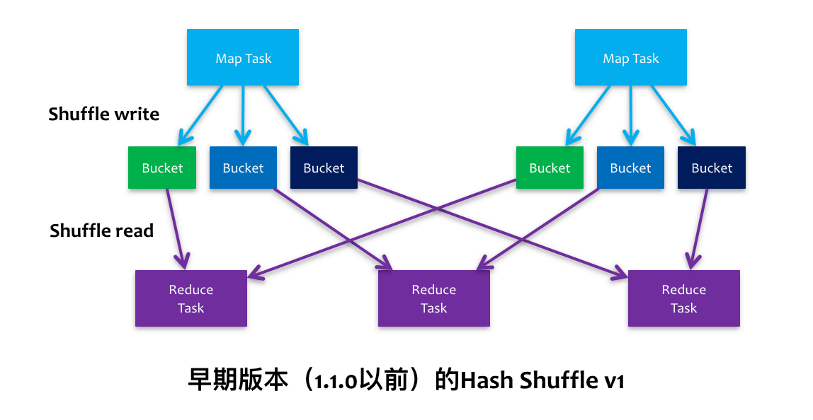

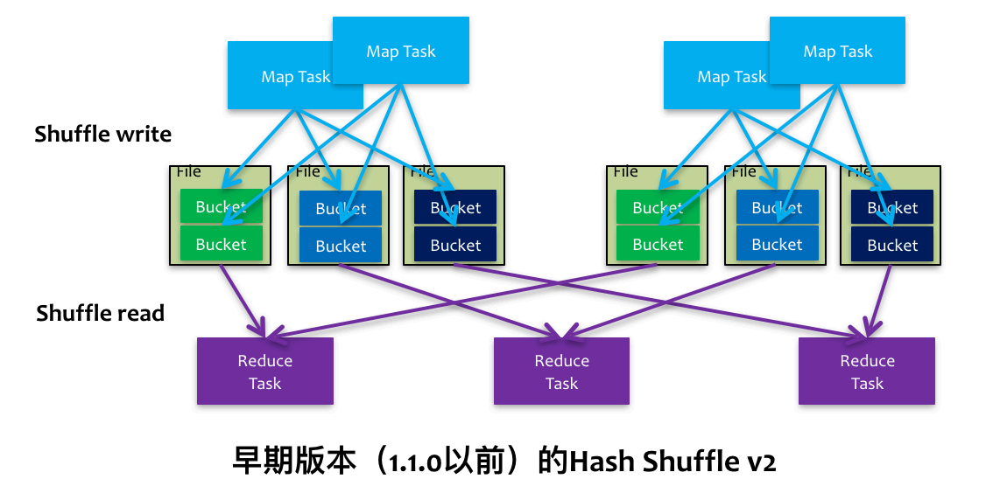

在map阶段(shuffle write)，每个map都会为下游stage的每个partition写⼀个临时⽂件，假如下游stage有1000个partition，那么每个map都会⽣成1000个临时⽂件，⼀般来说⼀个executor上会运⾏多个map task，这样下来，⼀个executor上会有⾮常多的临时⽂件，假如⼀个executor上运⾏M个map task，下游stage有N个partition，那么⼀个executor上会⽣成M\*N个⽂件。另⼀⽅⾯，如果⼀个executor上有K个core，那么executor同时可运⾏K个task，这样⼀来，就会同时申请K\*N个⽂件描述符，⼀旦partition数较多，势必会耗尽executor上的⽂件描述符，同时⽣成KN个write handler也会带来⼤量内存的消耗。

在reduce阶段(shuffle read)，每个reduce task都会拉取所有map对应的那部分partition数据，那么executor会打开所有临时⽂件准备⽹络传输，这⾥⼜涉及到⼤量⽂件描述符，另外，如果reduce阶段有combiner操作，那么它会把⽹络中拉到的数据保存在⼀个 HashMap 中进⾏合并操作，如果数据量较⼤，很容易引发OOM操作。

- **Sort Shuffle** 1.1开始(sort shuffle也经历过优化升级，详细⻅参考⽂章1)

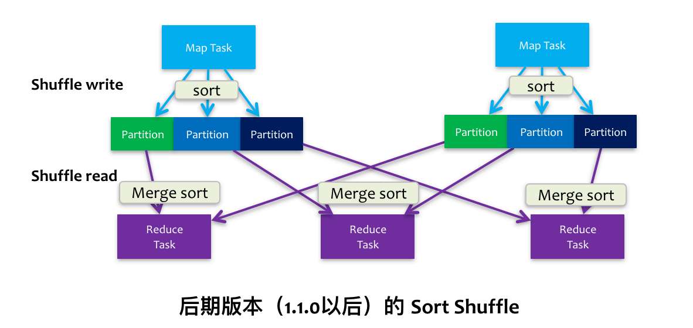

在map阶段(shuffle write)，会按照partition id以及key对记录进⾏排序，将所有partition的数据写在同⼀个⽂件中，该⽂件中的记录⾸先是按照partition id排序⼀个⼀个分区的顺序排列，每个partition内部是按照key进⾏排序存放，map task运⾏期间会顺序写每个partition的数据，并通过⼀个索引⽂件记录每个partition的⼤⼩和偏移量。这样⼀来，每个map task⼀次只开两个⽂件描述符，⼀个写数据，⼀个写索引，⼤⼤减轻了 Hash Shuffle⼤量⽂件描述符的问题，即使⼀个executor有K个core，那么最多⼀次性开K\*2个⽂件描述符。

在reduce阶段(shuffle read)，reduce task拉取数据做combine时不再是采⽤ HashMap ，⽽是采⽤ExternalAppendOnlyMap ，该数据结构在做combine时，如果内存不⾜，会刷写磁盘，很⼤程度的保证了鲁棒性，避免⼤数据情况下的OOM。

- **Unsafe Shuffle** 1.5开始，1.6与Sort shuffle合并

从Spark 1.5.0开始，Spark开始了钨丝计划(Tungsten)，⽬的是优化内存和CPU的使⽤，进⼀步提升Spark的性能。为此，引⼊Unsafe Shuffle，它的做法是将数据记录⽤⼆进制的⽅式存储，直接在序列化的⼆进制数据上sort⽽不是在java 对象上，这样⼀⽅⾯可以减少memory的使⽤和GC的开销，另⼀⽅⾯避免shuffle过程中频繁的序列化以及反序列化。在排序过程中，它提供cache-efficient sorter，使⽤⼀个8 bytes的指针，把排序转化成了⼀个指针数组的排序，极⼤的优化了排序性能。

现在2.1 分为三种writer，分为 BypassMergeSortShuffleWriter， SortShuffleWriter 和UnsafeShuffleWriter

**三种Writer的分类**

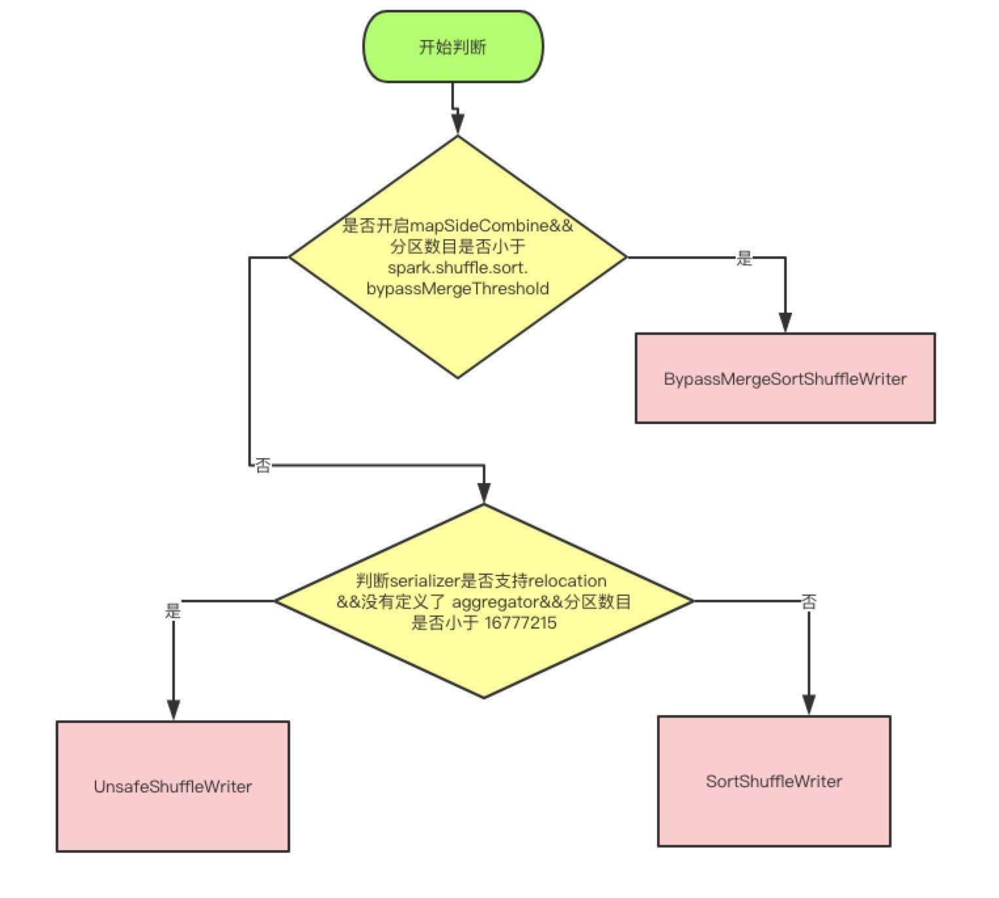

上⾯是使⽤哪种 writer 的判断依据，是否开启 mapSideCombine 这个判断，是因为有些算⼦会在 map 端先进⾏⼀次 combine，减少传输数据。因为 BypassMergeSortShuffleWriter 会临时输出Reducer个（分区数⽬）⼩⽂件，所以分区数必须要⼩于⼀个阀值，默认是⼩于200

 UnsafeShuffleWriter需要Serializer⽀持relocation，Serializer⽀持relocation：原始数据⾸先被序列化处理，并且再也不需要反序列，在其对应的元数据被排序后，需要Serializer⽀持relocation，在指定位置读取对应数据

## 10、Spark的stage是如何划分的

 stage的划分依据就是看是否产⽣了shuflle(即宽依赖)，遇到⼀个shuffle操作就划分为前后两个stage。

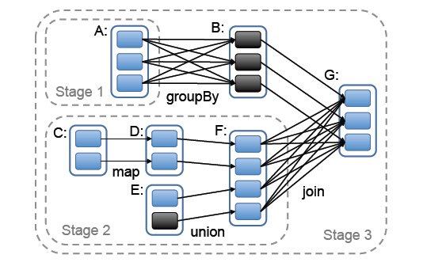

## 11、Spark有哪⼏种join 

Spark 中和 join 相关的算⼦有： join 、 fullOuterJoin 、 leftOuterJoin 、 rightOuterJoin

### 11.1、join

join函数会输出两个RDD中key相同的所有项，并将它们的value联结起来，它联结的key要求在两个表中都存在，类似于SQL中的INNER JOIN。但它不满⾜交换律，a.join(b)与b.join(a)的结果不完全相同，值插⼊的顺序与调⽤关系有关。

### 11.2、leftOuterJoin

leftOuterJoin会保留对象的所有key，⽽⽤None填充在参数RDD other中缺失的值，因此调⽤顺序会使结果完全不同。如下⾯展示的结果，

### 11.3、rightOuterJoin

rightOuterJoin与leftOuterJoin基本⼀致，区别在于它的结果保留的是参数other这个RDD中所有的key。

### 11.4、fullOuterJoin

fullOuterJoin会保留两个RDD中所有的key，因此所有的值列都有可能出现缺失的情况，所有的值列都会转为Some对象。

## 12、Spark中的⼴播变量


顾名思义，broadcast 就是将数据从⼀个节点发送到其他各个节点上去。这样的场景很多，⽐如 driver 上有⼀张表，其他节点上运⾏的 task 需要 lookup 这张表，那么 driver 可以先把这张表 copy 到这些节点，这样 task 就可以在本地查表了。如何实现⼀个可靠⾼效的 broadcast 机制是⼀个有挑战性的问题。先看看 Spark 官⽹上的⼀段话：

 Broadcast variables allow the programmer to keep a read-only variable cached on each machine rather than shipping a copy of it with tasks. They can be used， for example， to give every node a copy of a large input dataset in an efficient manner. Spark also attempts to distribute broadcast variables using efficient broadcast algorithms to reduce communication cost.

### 12.1、问题：为什么只能 broadcast 只读的变量？

这就涉及⼀致性的问题，如果变量可以被更新，那么⼀旦变量被某个节点更新，其他节点要不要⼀块更新？如果多个节点同时在更新，更新顺序是什么？怎么做同步？还会涉及 fault-tolerance 的问题。为了避免维护数据⼀致性问题，Spark ⽬前只⽀持 broadcast 只读变量。

### 12.2、问题：broadcast 到节点⽽不是 broadcast 到每个 task？

因为每个 task 是⼀个线程，⽽且同在⼀个进程运⾏ tasks 都属于同⼀个 application。因此每个节点（executor）上放⼀份就可以被所有 task 共享。

问题：具体怎么⽤ broadcast？

driver program 例⼦：

```scala
val data = List(1, 2, 3, 4, 5, 6)
val bdata = sc.broadcast(data)
val rdd = sc.parallelize(1 to 6, 2)
val observedSizes = rdd.map(_ => bdata.value.size)
```

driver 使⽤声明要 broadcast 的 data，bdata 的类型是 Broadcast。

当需要⽤ bdata 时，直接在 func 中调⽤，⽐如上⾯的例⼦中的 map()就使⽤了bdata.value.size。

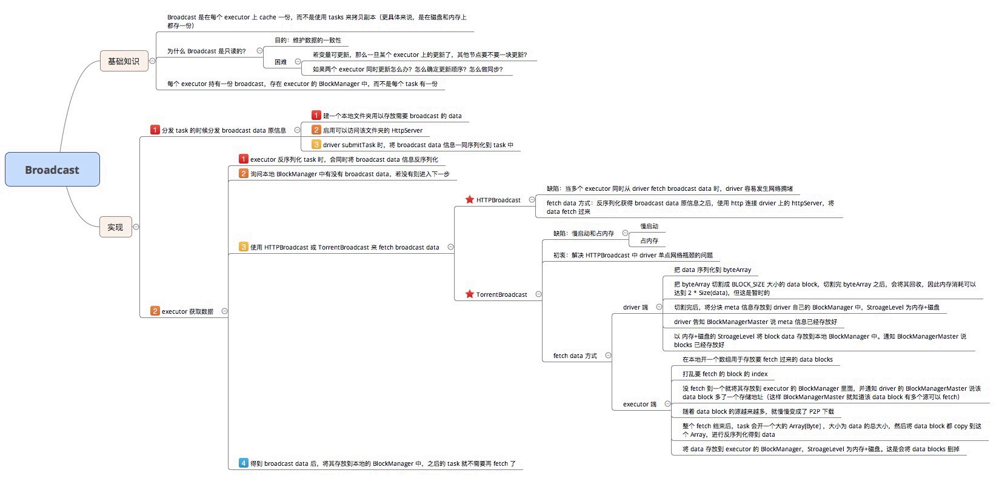

### 12.3、问题：怎么实现 broadcast？

broadcast 的实现机制很有意思：

分发 task 的时候先分发 bdata 的元信息

Driver 先建⼀个本地⽂件夹⽤以存放需要 broadcast 的 data，并启动⼀个可以访问该⽂件夹的 HttpServer。当调⽤ val bdata = sc.broadcast(data)时就把 data 写⼊⽂件夹，同时写⼊ driver ⾃⼰的 blockManger 中（StorageLevel 为内存＋磁盘），获得⼀个 blockId，类型为 BroadcastBlockId。当调⽤rdd.transformation(func)时，如果 func ⽤到了 bdata，那么 driver submitTask()的时候会将 bdata ⼀同 func 进⾏序列化得到 serialized task，注意序列化的时候不会序列化 bdata 中包含的 data。上⼀章讲到 serialized task 从 driverActor 传递到 executor 时使⽤ Akka 的传消息机制，消息不能太⼤，⽽实际的 data 可能很⼤，所以这时候还不能 broadcast data。

 driver 为什么会同时将 data 放到磁盘和 blockManager ⾥⾯？放到磁盘是为了让 HttpServer 访问到，放到blockManager 是为了让 driver program ⾃身使⽤ bdata 时⽅便（其实我觉得不放到 blockManger ⾥⾯也⾏）。

那么什么时候传送真正的 data？在 executor 反序列化 task 的时候，会同时反序列化 task 中的 bdata 对象，这时候会调⽤ bdata 的 readObject()⽅法。该⽅法先去本地 blockManager 那⾥询问 bdata 的 data 在不在blockManager ⾥⾯，如果不在就使⽤下⾯的两种 fetch ⽅式之⼀去将 data fetch 过来。得到 data 后，将其存放到 blockManager ⾥⾯，这样后⾯运⾏的 task 如果需要 bdata 就不需要再去 fetch data 了。如果在，就直接拿来⽤了。

下⾯探讨 broadcast data 时候的两种实现⽅式：

### 12.4、HttpBroadcast

顾名思义，HttpBroadcast 就是每个 executor 通过的 http 协议连接 driver 并从 driver 那⾥ fetch data。Driver 先准备好要 broadcast 的 data，调⽤ sc.broadcast(data)后会调⽤⼯⼚⽅法建⽴⼀个 HttpBroadcast对象。该对象做的第⼀件事就是将 data 存到 driver 的blockManager ⾥⾯，StorageLevel 为内存＋磁盘，blockId 类型为 BroadcastBlockId。

同时 driver 也会将 broadcast 的 data 写到本地磁盘，例如写⼊后得到

/var/folders/87/grpn1_fn4xq5wdqmxk31v0l00000gp/T/Spark-6233b09c-3c72-4a4d-832b-6c0791d0eb9c/broadcast_0 ，这个⽂件夹作为 HttpServer 的⽂件⽬录。

 Driver 和 executor 启动的时候，都会⽣成 broadcastManager 对象，调⽤ HttpBroadcast.initialize()，driver 会在本地建⽴⼀个临时⽬录⽤来存放 broadcast 的 data，并启动可以访问该⽬录的 httpServer。

Fetch data：在 executor 反序列化 task 的时候，会同时反序列化 task 中的 bdata 对象，这时候会调⽤ bdata的 readObject()⽅法。该⽅法先去本地 blockManager 那⾥询问 bdata 的 data 在不在 blockManager ⾥⾯，如果不在就使⽤ http 协议连接 driver 上的 httpServer，将 data fetch 过来。得到 data 后，将其存放到blockManager ⾥⾯，这样后⾯运⾏的 task 如果需要 bdata 就不需要再去 fetch data 了。如果在，就直接拿来⽤了。

HttpBroadcast 最⼤的问题就是 driver 所在的节点可能会出现⽹络拥堵，因为 worker 上的 executor 都会去driver 那⾥ fetch 数据。

### 12.5、TorrentBroadcast

为了解决 HttpBroadast 中 driver 单点⽹络瓶颈的问题，Spark ⼜设计了⼀种 broadcast 的⽅法称为TorrentBroadcast，这个类似于⼤家常⽤的 BitTorrent 技术。基本思想就是将 data 分块成 data blocks，然后假设有 executor fetch 到了⼀些 data blocks，那么这个 executor 就可以被当作 data server 了，随着 fetch 的executor 越来越多，有更多的 data server 加⼊，data 就很快能传播到全部的 executor 那⾥去了。

HttpBroadcast 是通过传统的 http 协议和 httpServer 去传 data，在 TorrentBroadcast ⾥⾯使⽤在上⼀章介绍的blockManager.getRemote()= NIO ConnectionManager 传数据的⽅法来传递，读取数据的过程与读取 cached rdd 的⽅式类似。

### 12.6、driver 端：

 Driver 先把 data 序列化到 byteArray，然后切割成 BLOCK_SIZE（由设置）⼤⼩的 data block，每个 data block 被 TorrentBlock 对象持有。切割完 byteArray 后，会将其回收，因此内存消耗虽然可以达到2  Size(data)，但这是暂时的。

完成分块切割后，就将分块信息（称为 meta 信息）存放到 driver ⾃⼰的 blockManager ⾥⾯，StorageLevel 为内存＋磁盘，同时会通知 driver ⾃⼰的 blockManagerMaster 说 meta 信息已经存放好。通知blockManagerMaster 这⼀步很重要，因为 blockManagerMaster 可以被 driver 和所有 executor 访问到，信息被存放到 blockManagerMaster 就变成了全局信息。之后将每个分块 data block 存放到 driver 的 blockManager ⾥⾯，StorageLevel 为内存＋磁盘。存放后仍然通知blockManagerMaster 说 blocks 已经存放好。到这⼀步，driver 的任务已经完成。

### 12.7、Executor 端：

executor 收到 serialized task 后，先反序列化 task，这时候会反序列化 serialized task 中包含的 bdata 类型是TorrentBroadcast，也就是去调⽤ TorrentBroadcast.readObject()。这个⽅法⾸先得到 bdata 对象，然后发现bdata ⾥⾯没有包含实际的 data。怎么办？先询问所在的 executor ⾥的 blockManager 是会否包含 data（通过查询 data 的 broadcastId），包含就直接从本地 blockManager 读取 data。否则，就通过本地 blockManager 去连接 driver 的 blockManagerMaster 获取 data 分块的 meta 信息，获取信息后，就开始了 BT 过程。

BT 过程：task 先在本地开⼀个数组⽤于存放将要 fetch 过来的 data blocks Array\[TorrentBlock](totalBlocks)，TorrentBlock 是对 data block 的包装。然后打乱要 fetch 的 data blocks 的顺序，⽐如如果 data block 共有5 个，那么打乱后的 fetch 顺序可能是3-1-2-4-5。然后按照打乱后的顺序去 fetch ⼀个个 data block。fetch 的过程就是通过"本地 blockManager －本地 connectionManager－ driver/executor 的 connectionManager－driver/executor 的 blockManager－data"得到 data，这个过程与 fetch cached rdd 类似。每 fetch 到⼀个 block 就将其存放到 executor 的 blockManager ⾥⾯，同时通知driver 上的 blockManagerMaster 说该 data block 多了⼀个存储地址。这⼀步通知⾮常重要，意味着blockManagerMaster 知道 data block 现在在 cluster 中有多份，下⼀个不同节点上的 task 再去 fetch 这个 data block 的时候，可以有两个选择了，⽽且会随机选择⼀个去 fetch。这个过程持续下去就是 BT 协议，随着下载的客户端越来越多，data block 服务器也越来越多，就变成 p2p下载了。关于 BT 协议，Wikipedia 上有⼀个[动画](http://zh.wikipedia.org/wiki/BitTorrent_(%E5%8D%8F%E8%AE%AE))。

整个 fetch 过程结束后，task 会开⼀个⼤ Array[Byte]，⼤⼩为 data 的总⼤⼩，然后将 data block 都 copy 到这个 Array，然后对 Array 中 bytes 进⾏反序列化得到原始的 data，这个过程就是 driver 序列化 data 的反过程。

最后将 data 存放到 task 所在 executor 的 blockManager ⾥⾯，StorageLevel 为内存＋磁盘。显然，这时候

 data 在 blockManager ⾥存了两份，不过等全部 executor 都 fetch 结束，存储 data blocks 那份可以删掉了。

##问题：broadcast RDD 会怎样?

不会怎样，就是这个rdd在每个executor中实例化⼀份。

## 13、Discussion 

公共数据的 broadcast 是很实⽤的功能，在 Hadoop 中使⽤ DistributedCache，⽐如常⽤的-libjars 就是使⽤

 DistributedCache 来将 task 依赖的 jars 分发到每个 task 的⼯作⽬录。不过分发前 DistributedCache 要先将⽂件上传到 HDFS。这种⽅式的主要问题是资源浪费，如果某个节点上要运⾏来⾃同⼀ job 的4 个 mapper，那么公共数据会在该节点上存在4 份（每个 task 的⼯作⽬录会有⼀份）。但是通过 HDFS 进⾏ broadcast 的好处在于单点瓶颈不明显，因为公共 data ⾸先被分成多个 block，然后不同的 block 存放在不同的节点。这样，只要所有的

 task 不是同时去同⼀个节点 fetch 同⼀个 block，⽹络拥塞不会很严重。

对于 Spark 来讲，broadcast 时考虑的不仅是如何将公共 data 分发下去的问题，还要考虑如何让同⼀节点上的

 task 共享 data。

对于第⼀个问题，Spark 设计了两种 broadcast 的⽅式，传统存在单点瓶颈问题的 HttpBroadcast，和类似 BT ⽅式的 TorrentBroadcast。HttpBroadcast 使⽤传统的 client-server 形式的 HttpServer 来传递真正的 data，⽽

 TorrentBroadcast 使⽤ blockManager ⾃带的 NIO 通信⽅式来传递 data。TorrentBroadcast 存在的问题是慢启动和占内存，慢启动指的是刚开始 data 只在 driver 上有，要等 executors fetch 很多轮 data block 后，data

 server 才会变得可观，后⾯的 fetch 速度才会变快。executor 所占内存的在 fetch 完 data blocks 后进⾏反序列化时需要将近两倍 data size 的内存消耗。不管哪⼀种⽅式，driver 在分块时会有两倍 data size 的内存消耗。

对于第⼆个问题，每个 executor 都包含⼀个 blockManager ⽤来管理存放在 executor ⾥的数据，将公共数据存放在 blockManager 中（StorageLevel 为内存＋磁盘），可以保证在 executor 执⾏的 tasks 能够共享 data。

[其实 Spark 之前还尝试了⼀种称为 TreeBroadcast 的机制，详情可以⻅技术报告 Performance and Scalability of Broadcast in Spark。](http://www.cs.berkeley.edu/%7Eagearh/cs267.sp10/files/mosharaf-Spark-bc-report-spring10.pdf)

更深⼊点，broadcast 可以⽤多播协议来做，不过多播使⽤ UDP，不是可靠的，仍然需要应⽤层的设计⼀些可靠性保障机制。

## 14、 Spark中的算⼦都有哪些

总的来说，Spark分为两⼤类算⼦:

### 14.1、Transformation 变换/转换算⼦：这种变换并不触发提交作业，完成作业中间过程处理

 Transformation 操作是延迟计算的，也就是说从⼀个RDD 转换⽣成另⼀个 RDD 的转换操作不是⻢上执⾏，需要等到有 Action 操作的时候才会真正触发运算

### 14.2、Action ⾏动算⼦：这类算⼦会触发 SparkContext 提交 Job 作业

 Action 算⼦会触发 Spark 提交作业（Job），并将数据输出 Spark系统

1. Value数据类型的Transformation算⼦

输⼊分区与输出分区⼀对⼀型

map算⼦

flatMap算⼦

mapPartitions算⼦

glom算⼦

输⼊分区与输出分区多对⼀型

union算⼦

cartesian算⼦

输⼊分区与输出分区多对多型

grouBy算⼦

输出分区为输⼊分区⼦集型

filter算⼦

distinct算⼦

subtract算⼦

sample算⼦

takeSample算⼦

 Cache型

cache算⼦

persist算⼦

### 14.3、Key-Value数据类型的Transfromation算⼦

输⼊分区与输出分区⼀对⼀

 mapValues算⼦

对单个RDD或两个RDD聚集

combineByKey算⼦

reduceByKey算⼦

partitionBy算⼦

Cogroup算⼦

连接

join算⼦

leftOutJoin 和 rightOutJoin算⼦

### 14.4、Action算⼦

⽆输出

foreach算⼦

 HDFS算⼦

saveAsTextFile算⼦

saveAsObjectFile算⼦

 Scala集合和数据类型

collect算⼦

collectAsMap算⼦

reduceByKeyLocally算⼦

lookup算⼦

count算⼦

top算⼦

reduce算⼦

fold算⼦

aggregate算⼦ countByValue countByKey


## 15、Spark on yarn 模式下的 cluster模式和 client模式有什么区别

1. yarn-cluster 适⽤于⽣产环境。⽽ yarn-client 适⽤于交互和调试，也就是希望快速地看到 application 的输出.

2. yarn-cluster 和 yarn-client 模式的区别其实就是 Application Master 进程的区别，yarn-cluster 模式下，

 driver 运⾏在 AM(Application Master)中，它负责向 YARN 申请资源，并监督作业的运⾏状况。当⽤户提交了作业之后，就可以关掉 Client，作业会继续在 YARN 上运⾏。然⽽ yarn-cluster 模式不适合运⾏交互类型的作业。⽽ yarn-client 模式下，Application Master 仅仅向 YARN 请求 executor，Client 会和请求的

 container 通信来调度他们⼯作，也就是说 Client 不能离开。

注：资料来源于⽹络。


# Hive

## 1、Hive的metastore的三种模式

### 内嵌Derby⽅式

这个是Hive默认的启动模式，⼀般⽤于单元测试，这种存储⽅式有⼀个缺点：在同⼀时间只能有⼀个进程连接使⽤数据库。

### Local⽅式

本地MySQL

### Remote⽅式

远程MySQL，⼀般常⽤此种⽅式

## 2、Hive 内部表和外部表的区别

建表时带有external关键字为外部表，否则为内部表内部表和外部表建表时都可以⾃⼰指定location

删除表时，外部表不会删除对应的数据，只会删除元数据信息，内部表则会删除其他⽤法是⼀样的

## 3、Hive 四种排序⽅式的区别

### order by

order by 是要对输出的结果进⾏全局排序，这就意味着只有⼀个reducer才能实现（多个reducer⽆法保证全局有序）但是当数据量过⼤的时候，效率就很低。如果在严格模式下（hive.mapred.mode=strict），则必须配合limit使⽤

### sort by

sort by 不是全局排序，只是在进⼊到reducer之前完成排序，只保证了每个reducer中数据按照指定字段的有序性，是局部排序。配置mapred.reduce.tasks=[nums]可以对输出的数据执⾏归并排序。可以配合limit使⽤，提⾼性能

### distribute by

distribute by 指的是按照指定的字段划分到不同的输出reduce⽂件中，和sort by⼀起使⽤时需要注意， distribute by必须放在前⾯

### cluster by

cluster by 可以看做是⼀个特殊的distribute by+sort by，它具备⼆者的功能，但是只能实现倒序排序的⽅式，不能指定排序规则为asc 或者desc

## 4、Hive中⼤表join⼩表的优化⽅法

在⼩表和⼤表进⾏join时，将⼩表放在前边，效率会⾼，hive会将⼩表进⾏缓存

## 5、Hive中join都有哪些

 Hive中除了⽀持和传统数据库中⼀样的内关联（JOIN）、左关联（LEFT JOIN）、右关联（RIGHT JOIN）、全关联

（FULL JOIN），还⽀持左半关联（LEFT SEMI JOIN）

### 内关联（JOIN）

只返回能关联上的结果。

### 左外关联（LEFT [OUTER] JOIN）

以LEFT [OUTER] JOIN关键字前⾯的表作为主表，和其他表进⾏关联，返回记录和主表的记录数⼀致，关联不上的字段置为NULL。

### 右外关联（RIGHT [OUTER] JOIN）

和左外关联相反，以RIGTH [OUTER] JOIN关键词后⾯的表作为主表，和前⾯的表做关联，返回记录数和主表⼀致，关联不上的字段为NULL。

### 全外关联（FULL [OUTER] JOIN）

以两个表的记录为基准，返回两个表的记录去重之和，关联不上的字段为NULL。

### LEFT SEMI JOIN

以LEFT SEMI JOIN关键字前⾯的表为主表，返回主表的KEY也在副表中的记录

### 笛卡尔积关联（CROSS JOIN）

返回两个表的笛卡尔积结果，不需要指定关联键。

## 6、Hive SQL 是怎样解析成 MR job 的? 

### 主要分为6个阶段:

1.Hive使⽤Antlr实现语法解析.根据Antlr制定的SQL语法解析规则，完成SQL语句的词法/语法解析，将SQL转为抽象语法树AST.

2.遍历AST，⽣成基本查询单元QueryBlock.QueryBlock是⼀条SQL最基本的组成单元，包括三个部分：输⼊源，计算过程，输出.

3.遍历QueryBlock，⽣成OperatorTree.Hive最终⽣成的MapReduce任务，Map阶段和Reduce阶段均由OperatorTree组成。Operator就是在Map阶段或者Reduce阶段完成单⼀特定的操作。QueryBlock⽣成 Operator Tree就是遍历上⼀个过程中⽣成的QB和QBParseInfo对象的保存语法的属性.

4.优化OperatorTree.⼤部分逻辑层优化器通过变换OperatorTree，合并操作符，达到减少MapReduce Job，减少shuffle数据量的⽬的

5.OperatorTree⽣成MapReduce Job.遍历OperatorTree，翻译成MR任务.

对输出表⽣成MoveTask

从OperatorTree的其中⼀个根节点向下深度优先遍历

ReduceSinkOperator标示Map/Reduce的界限，多个Job间的界限遍历其他根节点，遇过碰到JoinOperator合并MapReduceTask

⽣成StatTask更新元数据

剪断Map与Reduce间的Operator的关系

6.优化任务.使⽤物理优化器对MR任务进⾏优化，⽣成最终执⾏任务

## 7、Hive UDF 简单介绍

在Hive中，⽤户可以⾃定义⼀些函数，⽤于扩展HiveQL的功能，⽽这类函数叫做UDF（⽤户⾃定义函数）。UDF分为两⼤类：UDAF（⽤户⾃定义聚合函数）和UDTF（⽤户⾃定义表⽣成函数）。

Hive有两个不同的接⼝编写UDF程序。⼀个是基础的UDF接⼝，⼀个是复杂的GenericUDF接⼝。

1. org.apache.hadoop.hive.ql. exec.UDF 基础UDF的函数读取和返回基本类型，即Hadoop和Hive的基本类型。如，Text、IntWritable、LongWritable、DoubleWritable等。

2. org.apache.hadoop.hive.ql.udf.generic.GenericUDF 复杂的GenericUDF可以处理Map、List、Set类型。

## 8、HMaster宕机的时候，哪些操作还能正常⼯作

对表内数据的增删查改是可以正常进⾏的，因为hbase client 访问数据只需要通过 Zookeeper 来找到 rowkey 的具体 region 位置即可。

但是对于创建表/删除表等的操作就⽆法进⾏了，因为这时候是需要HMaster介⼊，并且region的拆分、合并、迁移等操作也都⽆法进⾏了。

## 9、Impala 和 hive 的查询有哪些区别

 Impala是基于Hive的⼤数据实时分析查询引擎，直接使⽤Hive的元数据库Metadata，意味着impala元数据都存储在Hive的metastore中。并且impala兼容Hive的sql解析，实现了Hive的SQL语义的⼦集，功能还在不断的完善中。

 Impala相对于Hive所使⽤的优化技术

1、没有使⽤ MapReduce进⾏并⾏计算，虽然MapReduce是⾮常好的并⾏计算框架，但它更多的⾯向批处理模式，⽽不是⾯向交互式的SQL执⾏。与 MapReduce相⽐：Impala把整个查询分成⼀执⾏计划树，⽽不是⼀连串的MapReduce任务，在分发执⾏计划后，Impala使⽤拉式获取数据的⽅式获取结果，把结果数据组成按执⾏树流式传递汇集，减少的了把中间结果写⼊磁盘的步骤，再从磁盘读取数据的开销。Impala使⽤服务的⽅式避免每次执⾏查询都需要启动的开销，即相⽐Hive没了MapReduce启动时间。

2、使⽤LLVM产⽣运⾏代码，针对特定查询⽣成特定代码，同时使⽤Inline的⽅式减少函数调⽤的开销，加快执⾏效率。

3、充分利⽤可⽤的硬件指令（SSE4.2）。

4、更好的IO调度，Impala知道数据块所在的磁盘位置能够更好的利⽤多磁盘的优势，同时Impala⽀持直接数据块读取和本地代码计算checksum。

5、通过选择合适的数据存储格式可以得到最好的性能（Impala⽀持多种存储格式）。

6、最⼤使⽤内存，中间结果不写磁盘，及时通过⽹络以stream的⽅式传递。

注：资料来源于⽹络。


# Hbase

## 1. HBase的存储结构，这样的存储结构有什么优缺点

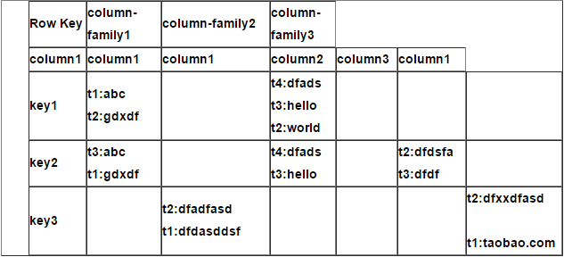

**HBase的优点及应⽤场景:**

1.半结构化或⾮结构化数据:

对于数据结构字段不够确定或杂乱⽆章⾮常难按⼀个概念去进⾏抽取的数据适合⽤HBase，因为HBase⽀持动态添加列。

2.记录很稀疏：

RDBMS的⾏有多少列是固定的。为null的列浪费了存储空间。HBase为null的Column不会被存储，这样既节省了空间⼜提⾼了读性能。

3.多版本号数据：

依据Row key和Column key定位到的Value能够有随意数量的版本号值，因此对于须要存储变动历史记录的数据，⽤HBase是很⽅便的。⽐⽅某个⽤户的Address变更，⽤户的Address变更记录也许也是具有研究意义的。

4.仅要求最终⼀致性：

对于数据存储事务的要求不像⾦融⾏业和财务系统这么⾼，只要保证最终⼀致性就⾏。（⽐如HBase+elasticsearch时，可能出现数据不⼀致）

5.⾼可⽤和海量数据以及很⼤的瞬间写⼊量：

WAL解决⾼可⽤，⽀持PB级数据，put性能⾼

适⽤于插⼊⽐查询操作更频繁的情况。⽐如，对于历史记录表和⽇志⽂件。（HBase的写操作更加⾼效）

6.业务场景简单：

不需要太多的关系型数据库特性，列⼊交叉列，交叉表，事务，连接等。

**HBase的缺点：**

1.单⼀RowKey固有的局限性决定了它不可能有效地⽀持多条件查询

2.不适合于⼤范围扫描查询

3.不直接⽀持 SQL 的语句查询

## 2. HBase的写数据的流程

1.Client先访问Zookeeper，从.META.表获取相应region信息，然后从meta表获取相应region信息

2.根据namespace、表名和rowkey根据meta表的数据找到写⼊数据对应的region信息

3.找到对应的regionserver 把数据先写到WAL中，即HLog，然后写到MemStore上

4.MemStore达到设置的阈值后则把数据刷成⼀个磁盘上的StoreFile⽂件。

5.当多个StoreFile⽂件达到⼀定的⼤⼩后(这个可以称之为⼩合并，合并数据可以进⾏设置，必须⼤于等于2，⼩于10------hbase.hstore.compaction.max和hbase.hstore.compactionThreshold，默认为10和3)，会触发Compact合并操作，合并为⼀个StoreFile，（这⾥同时进⾏版本的合并和数据删除。）

6.当Storefile⼤⼩超过⼀定阈值后，会把当前的Region分割为两个（Split）【可称之为⼤合并，该阈值通过hbase.hregion.max.filesize设置，默认为10G】，并由Hmaster分配到相应的HRegionServer，实现负载均衡

## 3. HBase读数据的流程

1.⾸先，客户端需要获知其想要读取的信息的Region的位置，这个时候，Client访问hbase上数据时并不需要Hmaster参与（HMaster仅仅维护着table和Region的元数据信息，负载很低），只需要访问Zookeeper，从meta表获取相应region信息(地址和端⼝等)。【Client请求ZK获取.META.所在的RegionServer的地址。】

2.客户端会将该保存着RegionServer的位置信息的元数据表.META.进⾏缓存。然后在表中确定待检索rowkey所在的RegionServer信息（得到持有对应⾏键的.META表的服务器名）。【获取访问数据所在的RegionServer地址】

3.根据数据所在RegionServer的访问信息，客户端会向该RegionServer发送真正的数据读取请求。服务器端接收到该请求之后需要进⾏复杂的处理。

4.先从MemStore找数据，如果没有，再到StoreFile上读(为了读取的效率)。

## 4.HBase 架构

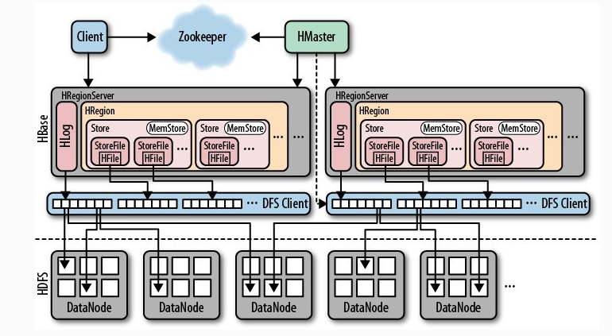

**Hbase主要包含HMaster/HRegionServer/Zookeeper**

HRegionServer 负责实际数据的读写.当访问数据时，客户端直接与RegionServer通信.

HBase的表根据Row Key的区域分成多个Region，⼀个Region包含这这个区域内所有数据.⽽Region server负责管理多个Region，负责在这个Region server上的所有region的读写操作.

**HMaster 负责管理Region的位置， DDL(新增和删除表结构)**

协调RegionServer

在集群处于数据恢复或者动态调整负载时，分配Region到某⼀个RegionServer中管控集群，监控所有Region Server的状态

提供DDL相关的API，新建(create)，删除(delete)和更新(update)表结构.

**Zookeeper 负责维护和记录整个Hbase集群的状态**

Zookeeper探测和记录Hbase集群中服务器的状态信息.如果Zookeeper发现服务器宕机，它会通知Hbase的master节点.

## 5. HBase 的HA实现，ZooKeeper在其中的作⽤

 HBase中可以启动多个HMaster，通过Zookeeper的Master Election机制保证总有⼀个Master运⾏。配置HBase⾼可⽤，只需要启动两个HMaster，让Zookeeper⾃⼰去选择⼀个Master Acitve即可

 zk的在这⾥起到的作⽤就是⽤来管理master节点，以及帮助hbase做master选举

## 6. HBase数据结构

**RowKey**

与nosql数据库们⼀样，RowKey是⽤来检索记录的主键。访问HBASE table中的⾏，只有三种⽅式：通过单个RowKey访问(get)

通过RowKey的range（正则）(like)全表扫描(scan)

 RowKey⾏键(RowKey)可以是任意字符串(最⼤⻓度是64KB，实际应⽤中⻓度⼀般为10-100bytes)，在HBASE内部，RowKey保存为字节数组。存储时，数据按照RowKey的字典序(byte order)排序存储。设计RowKey时，要充分排序存储这个特性，将经常⼀起读取的⾏存储放到⼀起。(位置相关性)。

**Column Family**

列族：HBASE表中的每个列，都归属于某个列族。列族是表的schema的⼀部分(⽽列不是)，必须在使⽤表之前定义。列名都以列族作为前缀。例如 courses:history，courses:math都属于courses 这个列族。

**Cell**

由{rowkey， column Family:columu， version}唯⼀确定的单元。cell中的数据是没有类型的，全部是字节码形式存贮。

关键字：⽆类型、字节码

**TimeStamp**

 HBASE 中通过rowkey和columns确定的为⼀个存贮单元称为cell。每个 cell都保存着同⼀份数据的多个版本。版本通过时间戳来索引。时间戳的类型是64位整型。时间戳可以由HBASE(在数据写⼊时⾃动)赋值，此时时间戳是精确到毫秒的当前系统时间。时间戳也可以由客户显式赋值。如果应⽤程序要避免数据版本冲突，就必须⾃⼰⽣成具有唯⼀性的时间戳。每个 cell中，不同版本的数据按照时间倒序排序，即最新的数据排在最前⾯。

为了避免数据存在过多版本造成的的管理(包括存贮和索引)负担，HBASE提供了两种数据版本回收⽅式。⼀是保存数据的最后n个版本，⼆是保存最近⼀段时间内的版本（⽐如最近七天）。⽤户可以针对每个列族进⾏设置。

**命名空间**

命名空间结构如下：

1. Table：表，所有的表都是命名空间的成员，即表必属于某个命名空间，如果没有指定，则在default默认的命名空间中。

2. RegionServer group：⼀个命名空间包含了默认的RegionServer Group。

3. Permission：权限，命名空间能够让我们来定义访问控制列表ACL（Access Control List）。例如，创建表，读取表，删除，更新等等操作。

4. Quota：限额，可以强制⼀个命名空间可包含的region的数量。

## 7. HBase 如何设计rowkey 

**RowKey⻓度原则**

Rowkey是⼀个⼆进制码流，Rowkey的⻓度被很多开发者建议说设计在10~100个字节，不过建议是越短越好，不要超过16个字节。

原因如下：

数据的持久化⽂件HFile中是按照KeyValue存储的，如果Rowkey过⻓⽐如100个字节，1000万列数据光

 Rowkey就要占⽤1001000万=10亿个字节，将近1G数据，这会极⼤影响HFile的存储效率；

 MemStore将缓存部分数据到内存，如果Rowkey字段过⻓内存的有效利⽤率会降低，系统将⽆法缓存更多的数据，这会降低检索效率。因此Rowkey的字节⻓度越短越好。

⽬前操作系统是都是64位系统，内存8字节对⻬。控制在16个字节，8字节的整数倍利⽤操作系统的最佳特性。

**RowKey散列原则**

如果Rowkey是按时间戳的⽅式递增，不要将时间放在⼆进制码的前⾯，建议将Rowkey的⾼位作为散列字段，由程序循环⽣成，低位放时间字段，这样将提⾼数据均衡分布在每个Regionserver实现负载均衡的⼏率。如果没有散列字段，⾸字段直接是时间信息将产⽣所有新数据都在⼀个RegionServer上堆积的热点现象，这样在做数据检索的时候负载将会集中在个别RegionServer，降低查询效率。

**RowKey唯⼀原则**

必须在设计上保证其唯⼀性。

注：资料来源于⽹络。

# Flink

## 1、Flink的运⾏架构

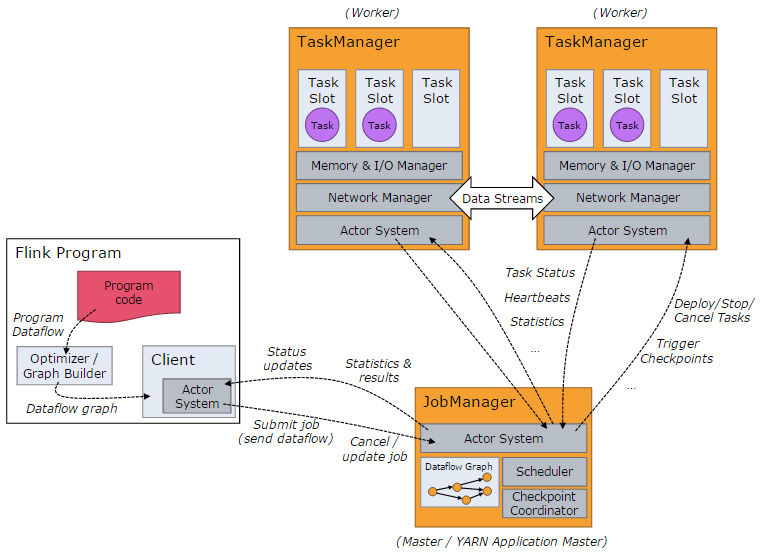

当 Flink 集群启动后，⾸先会启动⼀个 JobManger 和⼀个或多个的 TaskManager。由 Client 提交任务给JobManager，JobManager 再调度任务到各个 TaskManager 去执⾏，然后 TaskManager 将⼼跳和统计信息汇报给 JobManager。TaskManager 之间以流的形式进⾏数据的传输。上述三者均为独⽴的 JVM 进程。

Client 为提交 Job 的客户端，可以是运⾏在任何机器上（与 JobManager 环境连通即可）。提交 Job 后，Client 可以结束进程（Streaming的任务），也可以不结束并等待结果返回。

JobManager 主要负责调度 Job 并协调 Task 做 checkpoint，职责上很像 Storm 的 Nimbus。从 Client 处接收到 Job 和 JAR 包等资源后，会⽣成优化后的执⾏计划，并以 Task 的单元调度到各个 TaskManager 去执⾏。

TaskManager 在启动的时候就设置好了槽位数（Slot），每个 slot 能启动⼀个 Task，Task 为线程。从

JobManager 处接收需要部署的 Task，部署启动后，与⾃⼰的上游建⽴ Netty 连接，接收数据并处理。

## 2、Flink的作业执⾏流程

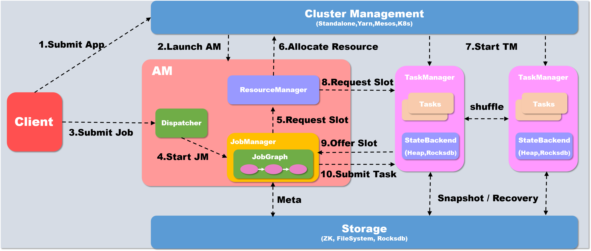

以yarn模式Per-job⽅式为例概述作业提交执⾏流程

1.当执⾏executor()之后，会⾸先在本地client 中将代码转化为可以提交的 JobGraph

如果提交为Per-Job模式，则⾸先需要启动AM， client会⾸先向资源系统申请资源，在yarn下即为申请container开启AM，如果是Session模式的话则不需要这个步骤

2. Yarn分配资源，开启AM

3. Client将Job提交给Dispatcher

4. Dispatcher 会开启⼀个新的 JobManager线程

5. JM 向Flink ⾃⼰的 Resourcemanager申请slot资源来执⾏任务

6. RM 向 Yarn申请资源来启动 TaskManger (Session模式跳过此步)

7. Yarn 分配 Container 来启动 taskManger (Session模式跳过此步)

8. Flink 的 RM 向 TM 申请 slot资源来启动 task

9. TM 将待分配的 slot 提供给 JM

10. JM 提交 task， TM 会启动新的线程来执⾏任务，开始启动后就可以通过 shuffle模块进⾏ task之间的数据交换

## 3、Flink的部署模式都有哪些

flink可以以多种⽅式部署，包括standlone模式/yarn/Mesos/Kubernetes/Docker/AWS/Google Compute Engine/MAPR等

⼀般公司中主要采⽤ on yarn模式

## 4、Flink on yarn的部署

 Flink作业提交有两种类型:

- yarn session

需要先启动集群，然后在提交作业，接着会向yarn申请⼀块空间后，资源永远保持不变。如果资源满了，下⼀个作业就⽆法提交，只能等到yarn中的其中⼀个作业执⾏完成后，释放了资源，那下⼀个作业才会正常提交.

**客户端模式**

对于客户端模式⽽⾔，你可以启动多个yarn session，⼀个yarn session模式对应⼀个JobManager，并按照需求提交作业，同⼀个Session中可以提交多个Flink作业。如果想要停⽌Flink Yarn Application，需要通过yarn application -kill命令来停⽌.

**分离式模式**

对于分离式模式，并不像客户端那样可以启动多个yarn session，如果启动多个，会出现下⾯的session⼀直处在等待状态。JobManager的个数只能是⼀个，同⼀个Session中可以提交多个Flink作业。如果想要停⽌Flink Yarn Application，需要通过yarn application -kill命令来停⽌

- Flink run(Per-Job)

直接在YARN上提交运⾏Flink作业(Run a Flink job on YARN)，这种⽅式的好处是⼀个任务会对应⼀个job，即没提交⼀个作业会根据⾃身的情况，向yarn申请资源，直到作业执⾏完成，并不会影响下⼀个作业的正常运⾏，除⾮是yarn上⾯没有任何资源的情况下

| Session                          |                                  |
| -------------------------------- | -------------------------------- |
| 共享Dispatcher和Resource Manager | Dispatcher和Resource Manager     |
| 共享资源(即 TaskExecutor)        | 按需要申请资源 (即 TaskExecutor) |
| 适合规模⼩,执⾏时间短的作业      |                                  |

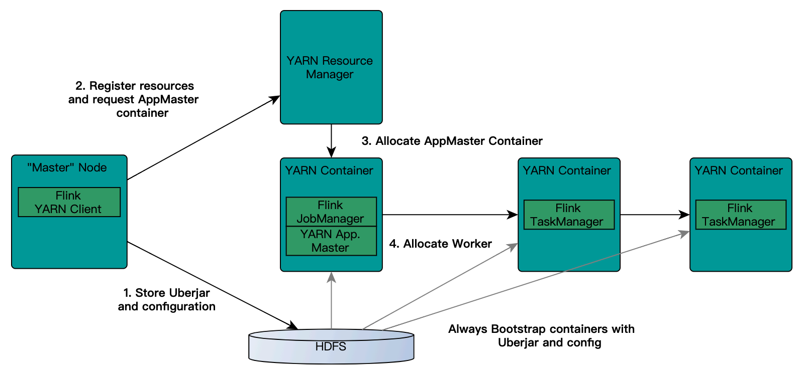

## 5、Flink 的 state 是存储在哪⾥的

 Apache Flink内部有四种state的存储实现，具体如下：

基于内存的HeapStateBackend -在debug模式使⽤，不建议在⽣产模式下应⽤；

基于HDFS的FsStateBackend -分布式⽂件持久化，每次读写都产⽣⽹络IO，整体性能不佳；

基于RocksDB的RocksDBStateBackend -本地⽂件+异步HDFS持久化；

基于Niagara(Alibaba内部实现)NiagaraStateBackend -分布式持久化-在Alibaba⽣产环境应⽤；

## 6、Flink 的 window 分类

flink中的窗⼝主要分为3⼤类共5种窗⼝:

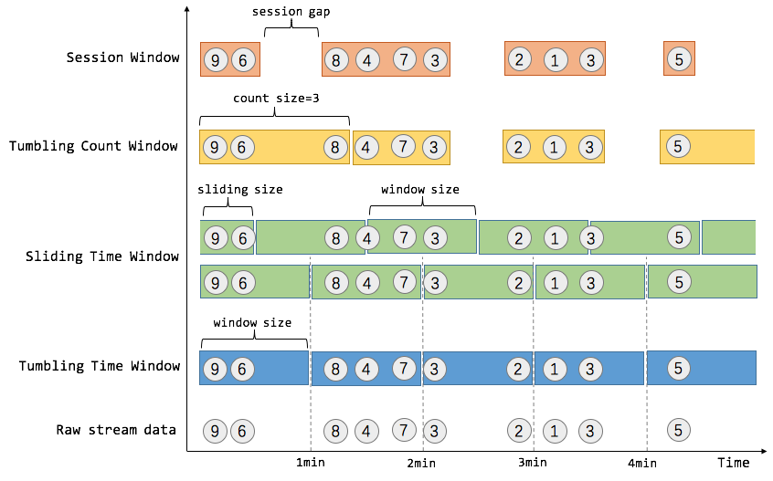

 **Time Window 时间窗⼝**

 Tumbing Time Window 滚动时间窗⼝

实现统计每⼀分钟(或其他⻓度)窗⼝内计算的效果

Sliding Time Window 滑动时间窗⼝

实现每过xxx时间统计 xxx时间窗⼝的效果.⽐如，我们可以每30秒计算⼀次最近⼀分钟⽤户购买的商品总数。

**Count Window 计数窗⼝**

 Tumbing Count Window 滚动计数窗⼝

当我们想要每100个⽤户购买⾏为事件统计购买总数，那么每当窗⼝中填满100个元素了，就会对窗⼝进⾏计算，这种窗⼝我们称之为翻滚计数窗⼝（Tumbling Count Window）

Sliding Count Window 滑动计数窗⼝

和Sliding Time Window含义是类似的，例如计算每10个元素计算⼀次最近100个元素的总和

**Session Window 会话窗⼝**

在这种⽤户交互事件流中，我们⾸先想到的是将事件聚合到会话窗⼝中（⼀段⽤户持续活跃的周期），由⾮活跃的间隙分隔开。如上图所示，就是需要计算每个⽤户在活跃期间总共购买的商品数量，如果⽤户30秒没有活动则视为会话断开（假设raw data stream是单个⽤户的购买⾏为流）

## 7、Flink 的 window 实现机制

Flink 中定义⼀个窗⼝主要需要以下三个组件。

Window Assigner：⽤来决定某个元素被分配到哪个/哪些窗⼝中去。

Trigger：触发器。决定了⼀个窗⼝何时能够被计算或清除，每个窗⼝都会拥有⼀个⾃⼰的Trigger。

Evictor：可以译为"驱逐者"。在Trigger触发之后，在窗⼝被处理之前，Evictor（如果有Evictor的话）会⽤来剔除窗⼝中不需要的元素，相当于⼀个filter。

Window 的实现

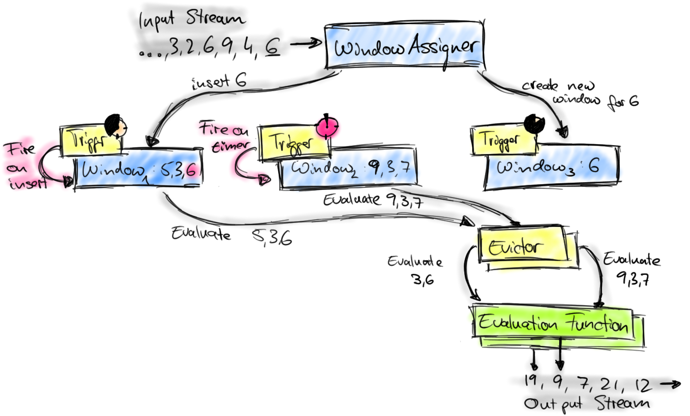

⾸先上图中的组件都位于⼀个算⼦（window operator）中，数据流源源不断地进⼊算⼦，每⼀个到达的元素都会被交给 WindowAssigner。WindowAssigner 会决定元素被放到哪个或哪些窗⼝（window），可能会创建新窗⼝。因为⼀个元素可以被放⼊多个窗⼝中，所以同时存在多个窗⼝是可能的。注意， Window 本身只是⼀个ID标识符，其内部可能存储了⼀些元数据，如TimeWindow 中有开始和结束时间，但是并不会存储窗⼝中的元素。窗⼝中的元素实际存储在 Key/Value State 中，key为 Window ，value为元素集合（或聚合值）。为了保证窗⼝的容错性，该实现依赖了 Flink 的 State 机制（参⻅[state⽂档](https://ci.apache.org/projects/flink/flink-docs-master/apis/streaming/state.html)）。

每⼀个窗⼝都拥有⼀个属于⾃⼰的 Trigger，Trigger上会有定时器，⽤来决定⼀个窗⼝何时能够被计算或清除。每当有元素加⼊到该窗⼝，或者之前注册的定时器超时了，那么Trigger都会被调⽤。Trigger的返回结果可以是 continue（不做任何操作），fire（处理窗⼝数据），purge（移除窗⼝和窗⼝中的数据），或者 fire + purge。⼀个Trigger的调⽤结果只是fire的话，那么会计算窗⼝并保留窗⼝原样，也就是说窗⼝中的数据仍然保留不变，等待下次Trigger fire的时候再次执⾏计算。⼀个窗⼝可以被重复计算多次知道它被 purge 了。在purge之前，窗⼝会⼀直占⽤着内存。

当Trigger fire了，窗⼝中的元素集合就会交给Evictor （如果指定了的话）。Evictor 主要⽤来遍历窗⼝中的元素列表，并决定最先进⼊窗⼝的多少个元素需要被移除。剩余的元素会交给⽤户指定的函数进⾏窗⼝的计算。如果没有 Evictor 的话，窗⼝中的所有元素会⼀起交给函数进⾏计算。

计算函数收到了窗⼝的元素（可能经过了 Evictor 的过滤），并计算出窗⼝的结果值，并发送给下游。窗⼝的结果值可以是⼀个也可以是多个。DataStream API 上可以接收不同类型的计算函数，包括预定义的sum()， min()， max()，还有 ReduceFunction ， FoldFunction ，还有WindowFunction 。WindowFunction是最通⽤的计算函数，其他的预定义的函数基本都是基于该函数实现的。

 Flink 对于⼀些聚合类的窗⼝计算（如sum，min）做了优化，因为聚合类的计算不需要将窗⼝中的所有数据都保存下来，只需要保存⼀个result值就可以了。每个进⼊窗⼝的元素都会执⾏⼀次聚合函数并修改result值。这样可以⼤⼤降低内存的消耗并提升性能。但是如果⽤户定义了 Evictor，则不会启⽤对聚合窗⼝的优化，因为 Evictor 需要遍历窗⼝中的所有元素，必须要将窗⼝中所有元素都存下来。

## 8、Flink具体是如何实现exactly once 语义

在谈到 flink 所实现的 exactly-once语义时，主要是2个层⾯上的，⾸先 flink在0.9版本以后已经实现了基于state的内部⼀致性语义，在1.4版本以后也可以实现端到端 Exactly-Once语义

- 状态 Exactly-Once

Flink 提供 exactly-once 的状态（state）投递语义，这为有状态的（stateful）计算提供了准确性保证。也就是状态是不会重复使⽤的，有且仅有⼀次消费

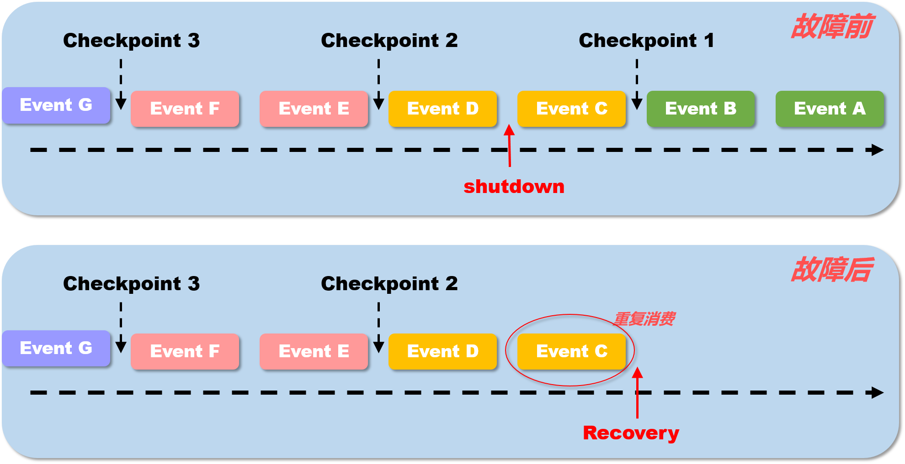

这⾥需要注意的⼀点是如何理解state语义的exactly-once，并不是说在flink中的所有事件均只会处理⼀次，⽽是所有的事件所影响⽣成的state只有作⽤⼀次.

在上图中，假设每两条消息后出发⼀次checkPoint操作，持久化⼀次state. TaskManager 在处理完 event c 之后被shutdown，这时候当 JobManager重启task之后， TaskManager 会从 checkpoint 1 处恢复状态，重新执⾏流处理，也就是说此时 event c 事件的的确确是会被再⼀次处理的.那么这⾥所说的⼀致性语义是何意思呢? 本身，flink每处理完⼀条数据都会记录当前进度到 state中，也就是说在故障前，处理完 event c 这件事情已经记录到了state中，但是，由于在checkPoint 2 之前，就已经发⽣了宕机，那么 event c 对于state的影响并没有被记录下来，对于整个

 flink内部系统来说就好像没有发⽣过⼀样，在故障恢复后，当触发 checkpoint 2 时， event c 的 state才最终被保存下来.所以说，可以这样理解，进⼊flink 系统中的事件永远只会被⼀次state记录并checkpoint下来，⽽state是永远不会发⽣重复被消费的，这也就是 flink内部的⼀致性语义，就叫做状态 Exactly once.

- 端到端（end-to-end）Exactly-Once

2017年12⽉份发布的Apache Flink 1.4版本，引进了⼀个重要的特性：

TwoPhaseCommitSinkFunction.，它抽取了两阶段提交协议的公共部分，使得构建端到端Excatly-Once的Flink程序变为了可能。这些外部系统包括Kafka0.11及以上的版本，以及⼀些其他的数据输⼊（data sources）和数据接收(data sink)。它提供了⼀个抽象层，需要⽤户⾃⼰⼿动去实现Exactly-Once语义.

为了提供端到端Exactly-Once语义，除了Flink应⽤程序本身的状态，Flink写⼊的外部存储也需要满⾜这个语义。也就是说，这些外部系统必须提供提交或者回滚的⽅法，然后通过Flink的checkpoint来协调

## 9、flink是如何实现反压的

 flink的反压经历了两个发展阶段，分别是基于TCP的反压(<1.5)和基于credit的反压(1.5)

- 基于 TCP 的反压

flink中的消息发送通过RS(ResultPartition)，消息接收通过IC(InputGate)，两者的数据都是以 LocalBufferPool的形式来存储和提取，进⼀步的依托于Netty的NetworkBufferPool，之后更底层的便是依托于TCP的滑动窗⼝机制，当IC端的buffer池满了之后，两个task之间的滑动窗⼝⼤⼩便为0，此时RS端便⽆法再发送数据

基于TCP的反压最⼤的问题是会造成整个TaskManager端的反压，所有的task都会受到影响

- 基于 Credit 的反压

RS与IC之间通过backlog和credit来确定双⽅可以发送和接受的数据量的⼤⼩以提前感知，⽽不是通过TCP滑动窗⼝的形式来确定buffer的⼤⼩之后再进⾏反压

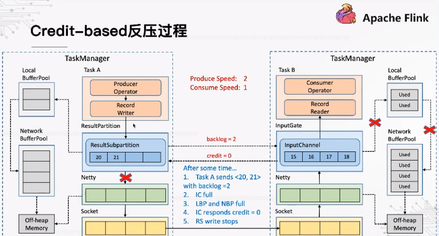

## 10、flink中的时间概念， eventTime 和 processTime的区别

Flink中有三种时间概念，分别是 Processing Time、Event Time 和 Ingestion Time

**Processing Time**

Processing Time 是指事件被处理时机器的系统时间。

当流程序在 Processing Time 上运⾏时，所有基于时间的操作(如时间窗⼝)将使⽤当时机器的系统时间。每⼩时 Processing Time 窗⼝将包括在系统时钟指示整个⼩时之间到达特定操作的所有事件

**Event Time**

Event Time 是事件发⽣的时间，⼀般就是数据本身携带的时间。这个时间通常是在事件到达 Flink 之前就确定的，并且可以从每个事件中获取到事件时间戳。在 Event Time 中，时间取决于数据，⽽跟其他没什么关系。Event Time 程序必须指定如何⽣成 Event Time ⽔印，这是表示 Event Time 进度的机制

**Ingestion Time**

Ingestion Time 是事件进⼊ Flink 的时间。在源操作处，每个事件将源的当前时间作为时间戳，并且基于时间的操作（如时间窗⼝）会利⽤这个时间戳

Ingestion Time 在概念上位于 Event Time 和 Processing Time 之间。与 Processing Time 相⽐，它稍微贵⼀些，但结果更可预测。因为 Ingestion Time 使⽤稳定的时间戳（在源处分配⼀次），所以对事件的不同窗⼝操作将引⽤相同的时间戳，⽽在 Processing Time 中，每个窗⼝操作符可以将事件分配给不同的窗⼝（基于机器系统时间和到达延迟）与 Event Time 相⽐，Ingestion Time 程序⽆法处理任何⽆序事件或延迟数据，但程序不必指定如何⽣成⽔印

## 11、flink中的session Window怎样使⽤

会话窗⼝主要是将某段时间内活跃度较⾼的数据聚合成⼀个窗⼝进⾏计算，窗⼝的触发条件是 Session Gap，是指在规定的时间内如果没有数据活跃接⼊，则认为窗⼝结束，然后触发窗⼝结果

 Session Windows窗⼝类型⽐较适合⾮连续性数据处理或周期性产⽣数据的场景，根据⽤户在线上某段时间内的活跃度对⽤户⾏为进⾏数据统计

```java
val sessionWindowStream = inputStream
.keyBy(_.id)
//使⽤EventTimeSessionWindow 定义 Event Time 滚动窗⼝
.window(EventTimeSessionWindow.withGap(Time.milliseconds(10)))
.process(......)
```


 Session Window 本质上没有固定的起⽌时间点，因此底层计算逻辑和Tumbling窗⼝及Sliding 窗⼝有⼀定的区别。

 Session Window 为每个进⼊的数据都创建了⼀个窗⼝，最后再将距离窗⼝Session Gap 最近的窗⼝进⾏合并，然后计算窗⼝结果。


#  Zookeeper

## 1、ZooKeeper是什么，有什么功能

Zookeeper 是⼀个典型的分布式数据⼀致性的解决⽅案。

**Zookeeper的典型应⽤场景:**

- 数据发布/订阅
- 负载均衡

- 命名服务

- 分布式协调/通知
- 集群管理 
- Master
- 分布式锁
- 分布式队列

## 2、leader 选举过程

这⾥选取3台机器组成的服务器集群为例。在集群初始化阶段，当有⼀台服务器Server1启动时，其单独⽆法进⾏和完成Leader选举，当第⼆台服务器Server2启动时，此时两台机器可以相互通信，每台机器都试图找到Leader，于是进⼊Leader选举过程。选举过程如下：

**(1)每个Server发出⼀个投票。**由于是初始情况，Server1和Server2都会将⾃⼰作为Leader服务器来进⾏投票，每次投票会包含所推举的服务器的myid和ZXID，使⽤(myid， ZXID)来表示，此时Server1的投票为(1，0)，Server2的投票为(2，0)，然后各⾃将这个投票发给集群中其他机器。

**(2)接受来⾃各个服务器的投票。**集群的每个服务器收到投票后，⾸先判断该投票的有效性，如检查是否是本轮投票、是否来⾃LOOKING状态的服务器。

**(3)处理投票。**针对每⼀个投票，服务器都需要将别⼈的投票和⾃⼰的投票进⾏PK，PK规则如下

- 优先检查ZXID。ZXID⽐较⼤的服务器优先作为Leader。

- 如果ZXID相同，那么就⽐较myid。myid较⼤的服务器作为Leader服务器。

对于Server1⽽⾔，它的投票是(1，0)，接收Server2的投票为(2，0)，⾸先会⽐较两者的ZXID，均为0，再⽐较myid，此时Server2的myid最⼤，于是更新⾃⼰的投票为(2，0)，然后重新投票，对于Server2⽽⾔，其⽆须更新⾃⼰的投票，只是再次向集群中所有机器发出上⼀次投票信息即可。

**(4)统计投票。**每次投票后，服务器都会统计投票信息，判断是否已经有过半机器接受到相同的投票信息，对于Server1、Server2⽽⾔，都统计出集群中已经有两台机器接受了(2，0)的投票信息，此时便认为已经选出了Leader。

**(5)改变服务器状态。**⼀旦确定了Leader，每个服务器就会更新⾃⼰的状态，如果是Follower，那么就变更为FOLLOWING，如果是Leader，就变更为LEADING。

### Leader 选取算法分析

在3.4.0后的Zookeeper的版本只保留了TCP版本的FastLeaderElection选举算法。当⼀台机器进⼊Leader选举时，当前集群可能会处于以下两种状态

- 集群中已经存在Leader。

- 集群中不存在Leader。

对于集群中已经存在Leader⽽⾔，此种情况⼀般都是某台机器启动得较晚，在其启动之前，集群已经在正常⼯作，对这种情况，该机器试图去选举Leader时，会被告知当前服务器的Leader信息，对于该机器⽽⾔，仅仅需要和Leader机器建⽴起连接，并进⾏状态同步即可。⽽在集群中不存在Leader情况下则会相对复杂，其步骤如下：

**（1）第⼀次投票。**⽆论哪种导致进⾏Leader选举，集群的所有机器都处于试图选举出⼀个Leader的状态，即LOOKING状态，LOOKING机器会向所有其他机器发送消息，该消息称为投票。投票中包含了SID（服务器的唯⼀标识）和ZXID（事务ID），(SID， ZXID)形式来标识⼀次投票信息。假定Zookeeper由5台机器组成，SID分别为1、2、3、4、5，ZXID分别为9、9、9、8、8，并且此时SID为2的机器是Leader机器，某⼀时刻，1、2所在机器出现故障，因此集群开始进⾏Leader选举。在第⼀次投票时，每台机器都会将⾃⼰作为投票对象，于是SID为3、4、5的机器投票情况分别为(3，9)，(4，8)，(5，8)。

**（2）变更投票。**每台机器发出投票后，也会收到其他机器的投票，每台机器会根据⼀定规则来处理收到的其他机器的投票，并以此来决定是否需要变更⾃⼰的投票，这个规则也是整个Leader选举算法的核⼼所在，其中术语描述如下

- vote_sid：接收到的投票中所推举Leader服务器的SID。

- vote_zxid：接收到的投票中所推举Leader服务器的ZXID。

- self_sid：当前服务器⾃⼰的SID。

- self_zxid：当前服务器⾃⼰的ZXID。

每次对收到的投票的处理，都是对(vote_sid， vote_zxid)和(self_sid， self_zxid)对⽐的过程。

规则⼀：如果vote_zxid⼤于self_zxid，就认可当前收到的投票，并再次将该投票发送出去。

规则⼆：如果vote_zxid⼩于self_zxid，那么坚持⾃⼰的投票，不做任何变更。

规则三：如果vote_zxid等于self_zxid，那么就对⽐两者的SID，如果vote_sid⼤于self_sid，那么就认可当前收到的投票，并再次将该投票发送出去。

规则四：如果vote_zxid等于self_zxid，并且vote_sid⼩于self_sid，那么坚持⾃⼰的投票，不做任何变更。结合上⾯规则，给出下⾯的集群变更过程。

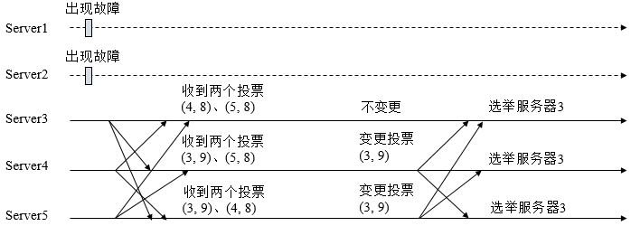

**（3）确定Leader。**经过第⼆轮投票后，集群中的每台机器都会再次接收到其他机器的投票，然后开始统计投票，如果⼀台机器收到了超过半数的相同投票，那么这个投票对应的SID机器即为Leader。此时Server3将成为Leader。

由上⾯规则可知，通常那台服务器上的数据越新（ZXID会越⼤），其成为Leader的可能性越⼤，也就越能够保证数据的恢复。如果ZXID相同，则SID越⼤机会越⼤。

## 3、ZooKeeper在Kafka中的作⽤

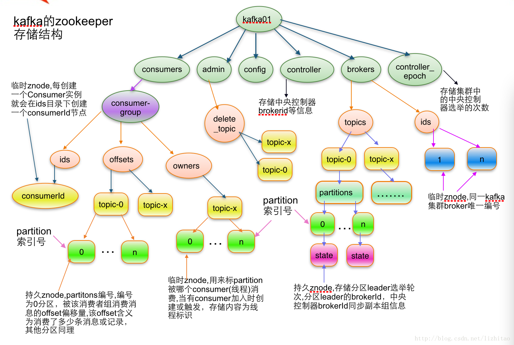

### zk的作⽤主要有如下⼏点:

1、Kafka的元数据都存放在zk上⾯，由zk来管理

2、0.8之前版本的Kafka， consumer的消费状态，group的管理以及 offset的值都是由zk管理的，现在offset会保存在本地topic⽂件⾥

3、负责borker的lead选举和管理

## 4、说⼀下ZooKeeper的通知机制

客户端端会对某个 znode 建⽴⼀个 watcher 事件，当该 znode 发⽣变化时，这些客户端会收到 Zookeeper 的通知，然后客户端可以根据 znode 变化来做出业务上的改变

## 5、ZooKeeper的分布式锁实现⽅式

使⽤Zookeeper实现分布式锁的算法流程，假设锁空间的根节点为/lock：

1、客户端连接Zookeeper，并在/lock下创建临时的且有序的⼦节点，第⼀个客户端对应的⼦节点为/lock/lock-0000000000，第⼆个为/lock/lock-0000000001，以此类推。

2、客户端获取/lock下的⼦节点列表，判断⾃⼰创建的⼦节点是否为当前⼦节点列表中序号最⼩的⼦节点，如果是则认为获得锁，否则监听刚好在⾃⼰之前⼀位的⼦节点删除消息，获得⼦节点变更通知后重复此步骤直⾄获得锁；

3、执⾏业务代码；

4、完成业务流程后，删除对应的⼦节点释放锁。

## 6、ZooKeeper是怎样保证主从节点的状态同步

Zookeeper 的核⼼是原⼦⼴播，这个机制保证了各个 server 之间的同步。实现这个机制的协议叫做 zab 协议。

zab 协议有两种模式，分别是恢复模式（选主）和⼴播模式（同步）。当服务启动或者在领导者崩溃后，zab 就进⼊了恢复模式，当领导者被选举出来，且⼤多数 server 完成了和 leader 的状态同步以后，恢复模式就结束了。状态同步保证了 leader 和 server 具有相同的系统状态。

## 7、ZooKeeper有⼏种部署模式

Zookeeper有两种运⾏模式: 集群模式和单机模式，还有⼀种伪集群模式，在单机模式下模拟集群的Zookeeper服务

## 8、ZooKeeper采⽤的哪种分布式⼀致性协议? 还有哪些分布式⼀致性协议

常⻅的分布式⼀致性协议有: 两阶段提交协议，三阶段提交协议，向量时钟，RWN协议，paxos协议，Raft协议. zk采⽤的是paxos协议.

- 两阶段提交协议(2PC)

两阶段提交协议，简称2PC，是⽐较常⽤的解决分布式事务问题的⽅式，要么所有参与进程都提交事务，要么都取消事务，即实现ACID中的原⼦性(A)的常⽤⼿段。

- 三阶段提交协议(3PC)

3PC就是在2PC基础上将2PC的提交阶段细分位两个阶段：预提交阶段和提交阶段

- 向量时钟

通过向量空间祖先继承的关系⽐较，使数据保持最终⼀致性，这就是向量时钟的基本定义。

- NWR协议

 NWR是⼀种在分布式存储系统中⽤于控制⼀致性级别的⼀种策略。在Amazon的Dynamo云存储系统中，就应⽤NWR来控制⼀致性。

让我们先来看看这三个字⺟的含义：

 N：在分布式存储系统中，有多少份备份数据

 W：代表⼀次成功的更新操作要求⾄少有w份数据写⼊成功

 R：代表⼀次成功的读数据操作要求⾄少有R份数据成功读取

 NWR值的不同组合会产⽣不同的⼀致性效果，当W+RN的时候，整个系统对于客户端来讲能保证强⼀致性。当W+R 以常⻅的N=3、W=2、R=2为例：

 N=3，表示，任何⼀个对象都必须有三个副本（Replica），W=2表示，对数据的修改操作（Write）只需要在3个Replica中的2个上⾯完成就返回，R=2表示，从三个对象中要读取到2个数据对象，才能返回。

在分布式系统中，数据的单点是不允许存在的。即线上正常存在的Replica数量是1的情况是⾮常危险的，因为⼀旦这个Replica再次错误，就可能发⽣数据的永久性错误。假如我们把N设置成为2，那么，只要有⼀个存储节点发⽣损坏，就会有单点的存在。所以N必须⼤于2。N约⾼，系统的维护和整体成本就越⾼。⼯业界通常把N设置为3。

当W是2、R是2的时候，W+RN，这种情况对于客户端就是强⼀致性的。

- paxos协议

[架构师需要了解的Paxos原理，历程及实践](http://chuansong.me/n/2189245)

- Raft协议

[Raft协议的动画](http://thesecretlivesofdata.com/raft/)


# Hadoop

## 1、启动Hadoop集群会分别启动哪些进程，各⾃的作⽤

- NameNode：

维护⽂件系统树及整棵树内所有的⽂件和⽬录。这些信息永久保存在本地磁盘的两个⽂件中：命名空间镜像⽂件、编辑⽇志⽂件；

记录每个⽂件中各个块所在的数据节点信息，这些信息在内存中保存，每次启动系统时重建这些信息负责响应客户端的数据块位置请求。也就是客户端想存数据，应该往哪些节点的哪些块存；客户端想取数据，应该到哪些节点取；

接受记录在数据存取过程中，datanode节点报告过来的故障、损坏信息；

- SecondaryNameNode(⾮HA模式)：

实现namenode容错的⼀种机制。定期合并编辑⽇志与命名空间镜像，当namenode挂掉时，可通过⼀定步骤进⾏上顶。(注意并不是NameNode的备⽤节点)

- DataNode：

根据需要存取并检索数据块

定期向namenode发送其存储的数据块列表

- ResourceManager：

负责Job的调度，将⼀个任务与⼀个NodeManager相匹配。也就是将⼀个MapReduce之类的任务分配给⼀个从节点的NodeManager来执⾏。

- NodeManager：

运⾏ResourceManager分配的任务，同时将任务进度向application master报告

- JournalNode(HA下启⽤):

⾼可⽤情况下存放namenode的editlog⽂件

## 2、Hadoop1.x的缺点

1、JobTracker存在单点故障的隐患

2、任务调度和资源管理全部是JobTracker来完成，单点负担过重

3、TaskTracker以Map/Reduce数量表示资源太过简单

4、TaskTracker 分Map Slot 和 Reduce Slot，如果任务只需要map任务可能会造成资源浪费

## 3、Hadoop1.x 和Hadoop 2.x 的区别

1、资源调度⽅式的改变

在1.x，使⽤Jobtracker负责任务调度和资源管理，单点负担过重，在2.x中，新增了yarn作为集群的调度⼯具。在yarn中，使⽤ResourceManager进⾏资源管理，单独开启⼀个Container作为ApplicationMaster来进⾏任务管理.

2、HA模式

在1.x中没有HA模式，集群中只有⼀个NameNode，⽽在2.x中可以启⽤HA模式，存在⼀个Active NameNode 和Standby NameNode.

3、HDFS Federation

Hadoop 2.0中对HDFS进⾏了改进，使NameNode可以横向扩展成多个，每个NameNode分管⼀部分⽬录，进⽽产⽣了HDFS Federation，该机制的引⼊不仅增强了HDFS的扩展性，也使HDFS具备了隔离性

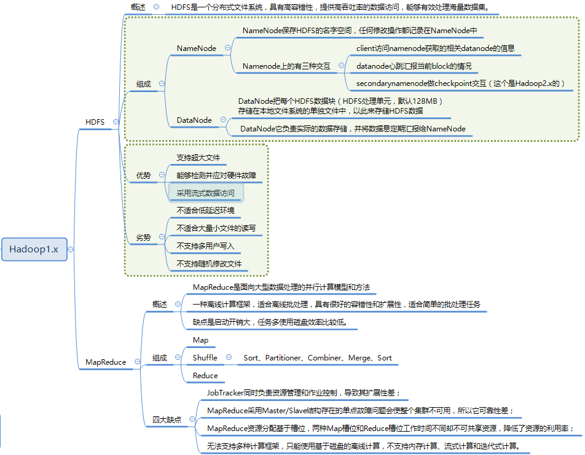

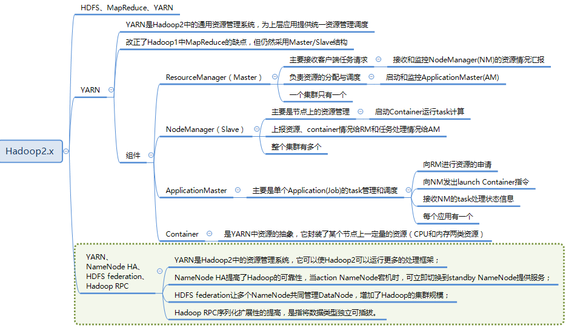

## 4、Hadoop 的常⽤配置⽂件有哪些

- hadoop-env.sh: ⽤于定义hadoop运⾏环境相关的配置信息，⽐如配置JAVA_HOME环境变量、为hadoop的JVM指定特定的选项、指定⽇志⽂件所在的⽬录路径以及master和slave⽂件的位置等；

- core-site.xml: ⽤于定义系统级别的参数，如HDFS URL、Hadoop的临时⽬录以及⽤于rack-aware集群中的配置⽂件的配置等，此中的参数定义会覆盖core-default.xml⽂件中的默认配置；

- hdfs-site.xml: HDFS的相关设定，如⽂件副本的个数、块⼤⼩及是否使⽤强制权限等，此中的参数定义会覆盖hdfs-default.xml⽂件中的默认配置；

- mapred-site.xml：HDFS的相关设定，如reduce任务的默认个数、任务所能够使⽤内存的默认上下限等，此中的参数定义会覆盖mapred-default.xml⽂件中的默认配置。

## 5、Hadoop HA介绍

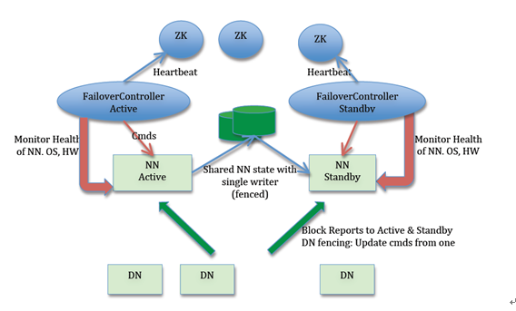

1、Active NameNode 和 Standby NameNode：两台 NameNode 形成互备，⼀台处于 Active 状态，为主 NameNode，另外⼀台处于 Standby 状态，为备 NameNode，只有主 NameNode 才能对外提供读写服务；

2、ZKFailoverController（主备切换控制器，FC）：ZKFailoverController 作为独⽴的进程运⾏，对NameNode 的主备切换进⾏总体控制。ZKFailoverController 能及时检测到 NameNode 的健康状况，在主NameNode 故障时借助 Zookeeper 实现⾃动的主备选举和切换（当然 NameNode ⽬前也⽀持不依赖于Zookeeper 的⼿动主备切换）；

3、Zookeeper 集群：为主备切换控制器提供主备选举⽀持；

4、共享存储系统：共享存储系统是实现 NameNode 的⾼可⽤最为关键的部分，共享存储系统保存了NameNode 在运⾏过程中所产⽣的 HDFS 的元数据。主 NameNode 和备 NameNode 通过共享存储系统实现元数据同步。在进⾏主备切换的时候，新的主 NameNode 在确认元数据完全同步之后才能继续对外提供服务。

5、DataNode 节点：因为主 NameNode 和备 NameNode 需要共享 HDFS 的数据块和 DataNode 之间的映射关系，为了使故障切换能够快速进⾏，DataNode 会同时向主 NameNode 和备 NameNode 上报数据块的位置信息。

## 6、HDFS 创建⼀个⽂件的流程

1、客户端通过ClientProtocol协议向RpcServer发起创建⽂件的RPC请求。

2、FSNamesystem封装了各种HDFS操作的实现细节，RpcServer调⽤FSNamesystem中的相关⽅法以创建⽬录。

3、进⼀步的，FSDirectory封装了各种⽬录树操作的实现细节，FSNamesystem调⽤FSDirectory中的相关⽅法在⽬录树中创建⽬标⽂件，并通过⽇志系统备份⽂件系统的修改。

4、最后，RpcServer将RPC响应返回给客户端。

## 7、HDFS 读流程

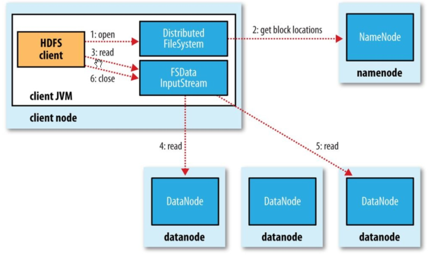

1、Client 通过 DistributedFileSystem 对象与集群的 NameNode 进⾏⼀次 RPC 远程调⽤，获取⽂件 block 位置信息；

2、NameNode 返回存储的每个块的 DataNode 列表；

3、Client 将连接到列表中最近的 DataNode；

4、Client 开始从 DataNode 并⾏读取数据；

5、⼀旦 Client 获得了所有必须的 block，它就会将这些 block 组合起来形成⼀个⽂件。

## 8、HDFS 写流程

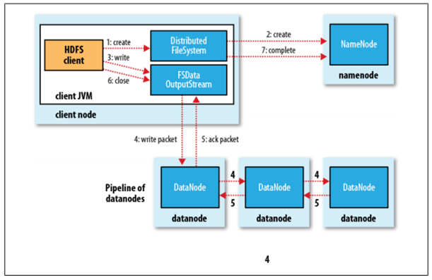

1、Client 调⽤ DistributedFileSystem 对象的 create ⽅法，创建⼀个⽂件输出流（FSDataOutputStream）对象；  

2、通过 DistributedFileSystem 对象与集群的 NameNode 进⾏⼀次 RPC 远程调⽤，在 HDFS 的 Namespace中创建⼀个⽂件条⽬（Entry），此时该条⽬没有任何的 Block，NameNode 会返回该数据每个块需要拷⻉的 DataNode 地址信息；

3、通过 FSDataOutputStream 对象，开始向 DataNode 写⼊数据，数据⾸先被写⼊ FSDataOutputStream 对象内部的数据队列中，数据队列由 DataStreamer 使⽤，它通过选择合适的 DataNode 列表来存储副本，从⽽要求 NameNode 分配新的 block；

4、DataStreamer 将数据包以流式传输的⽅式传输到分配的第⼀个 DataNode 中，该数据流将数据包存储到第⼀个 DataNode 中并将其转发到第⼆个 DataNode 中，接着第⼆个 DataNode 节点会将数据包转发到第三个DataNode 节点；

5、DataNode 确认数据传输完成，最后由第⼀个 DataNode 通知 client 数据写⼊成功；

6、完成向⽂件写⼊数据， Client 在⽂件输出流（FSDataOutputStream）对象上调⽤ close ⽅法，完成⽂件写⼊；  

7、调⽤ DistributedFileSystem 对象的 complete ⽅法，通知 NameNode ⽂件写⼊成功，NameNode 会将相关结果记录到 editlog 中。

## 9、HDFS 架构

### 1、HDFS 1.0 架构

 HDFS 采⽤的是 Master/Slave 架构，⼀个 HDFS 集群包含⼀个单独的 NameNode 和多个 DataNode 节点

- NameNode

NameNode 负责管理整个分布式系统的元数据，主要包括：

- ⽬录树结构；

- ⽂件到数据库 Block 的映射关系；

- Block 副本及其存储位置等管理数据；

- DataNode 的状态监控，两者通过段时间间隔的⼼跳来传递管理信息和数据信息，通过这种⽅式的信息传递，NameNode 可以获知每个 DataNode 保存的 Block 信息、DataNode 的健康状况、命令 DataNode 启动停⽌等（如果发现某个 DataNode 节点故障，NameNode 会将其负责的 block 在其他 DataNode 上进⾏备份）。

这些数据保存在内存中，同时在磁盘保存两个元数据管理⽂件：fsimage 和 editlog。 

- fsimage：是内存命名空间元数据在外存的镜像⽂件；

- editlog：则是各种元数据操作的 write-ahead-log ⽂件，在体现到内存数据变化前⾸先会将操作记⼊ editlog中，以防⽌数据丢失。

这两个⽂件相结合可以构造完整的内存数据。

- Secondary NameNode

Secondary NameNode 并不是 NameNode 的热备机，⽽是定期从 NameNode 拉取 fsimage 和 editlog ⽂件，并对两个⽂件进⾏合并，形成新的 fsimage ⽂件并传回 NameNode，这样做的⽬的是减轻 NameNod 的⼯作压⼒，本质上 SNN 是⼀个提供检查点功能服务的服务点。

- DataNode

负责数据块的实际存储和读写⼯作，Block 默认是64MB（HDFS2.0改成了128MB），当客户端上传⼀个⼤⽂件时，HDFS 会⾃动将其切割成固定⼤⼩的 Block，为了保证数据可⽤性，每个 Block 会以多备份的形式存储，默认是3份。

### 2、HDFS 2.0 的 HA 实现

- Active NameNode 和 Standby NameNode：两台 NameNode 形成互备，⼀台处于 Active 状态，为主 NameNode，另外⼀台处于 Standby 状态，为备 NameNode，只有主 NameNode 才能对外提供读写服务；

- ZKFailoverController（主备切换控制器，FC）：ZKFailoverController 作为独⽴的进程运⾏，对NameNode 的主备切换进⾏总体控制。ZKFailoverController 能及时检测到 NameNode 的健康状况，在主NameNode 故障时借助 Zookeeper 实现⾃动的主备选举和切换（当然 NameNode ⽬前也⽀持不依赖于Zookeeper 的⼿动主备切换）；

- Zookeeper 集群：为主备切换控制器提供主备选举⽀持；

- 共享存储系统：共享存储系统是实现 NameNode 的⾼可⽤最为关键的部分，共享存储系统保存了NameNode 在运⾏过程中所产⽣的 HDFS 的元数据。主 NameNode 和备 NameNode 通过共享存储系统实现元数据同步。在进⾏主备切换的时候，新的主 NameNode 在确认元数据完全同步之后才能继续对外提供服务。

- DataNode 节点：因为主 NameNode 和备 NameNode 需要共享 HDFS 的数据块和 DataNode 之间的映射关系，为了使故障切换能够快速进⾏，DataNode 会同时向主 NameNode 和备 NameNode 上报数据块的位置信息。

## 10、Yarn 调度MapReduce过程

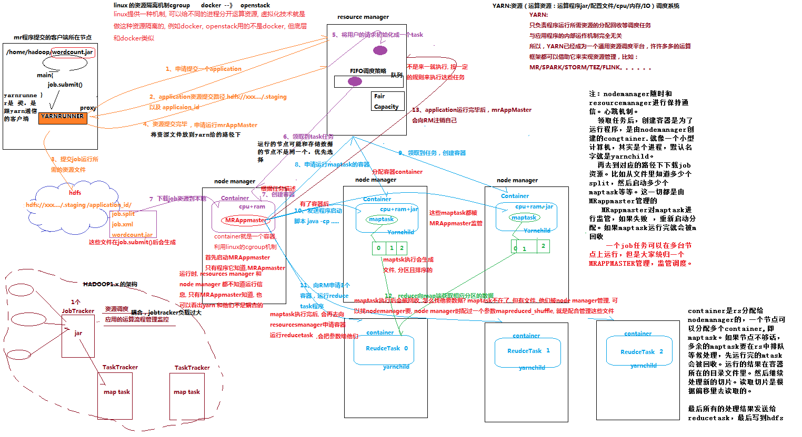

1、Mr程序提交到客户端所在的节点（MapReduce）

2、yarnrunner向Resourcemanager申请⼀个application。

3、rm将该应⽤程序的资源路径返回给yarnrunner

4、该程序将运⾏所需资源提交到HDFS上

5、程序资源提交完毕后，申请运⾏mrAppMaster

6、RM将⽤户的请求初始化成⼀个task

7、其中⼀个NodeManager领取到task任务。

8、该NodeManager创建容器Container，并产⽣MRAppmaster

9、Container从HDFS上拷⻉资源到本地

10、MRAppmaster向RM申请运⾏maptask容器

11、RM将运⾏maptask任务分配给另外两个NodeManager，另两个NodeManager分别领取任务并创建容器.

12、MR向两个接收到任务的NodeManager发送程序启动脚本，这两个NodeManager分别启动maptask，maptask对数据分区排序。

13、MRAppmaster向RM申请2个容器，运⾏reduce task。

14、reduce task向maptask获取相应分区的数据。

15、程序运⾏完毕后，MR会向RM注销⾃⼰。

## 11、Yarn架构

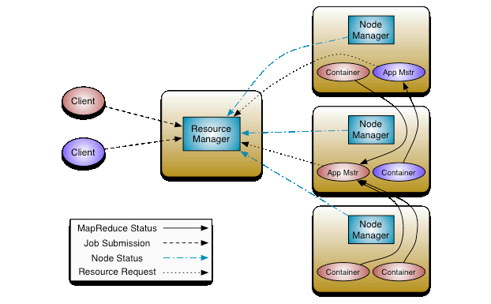

### 1、ResourceManager（RM）

RM 是⼀个全局的资源管理器，负责整个系统的资源管理和分配，它主要有两个组件构成：

1.调度器：Scheduler；

2.应⽤程序管理器：Applications Manager，ASM。

#### 调度器

调度器根据容量、队列等限制条件（如某个队列分配⼀定的资源，最多执⾏⼀定数量的作业等），将系统中的资源分配给各个正在运⾏的应⽤程序。要注意的是，该调度器是⼀个纯调度器，它不再从事任何与应⽤程序有关的⼯作，⽐如不负责重新启动（因应⽤程序失败或者硬件故障导致的失败），这些均交由应⽤程序相关的ApplicationMaster 完成。调度器仅根据各个应⽤程序的资源需求进⾏资源分配，⽽资源分配单位⽤⼀个抽象概念资源容器(Resource Container，也即 Container)，Container 是⼀个动态资源分配单位，它将内存、CPU、磁盘、⽹络等资源封装在⼀起，从⽽限定每个任务使⽤的资源量。此外，该调度器是⼀个可插拔的组件，⽤户可根据⾃⼰的需求设计新的调度器，YARN 提供了多种直接可⽤的调度器，⽐如 Fair Scheduler 和 Capacity Schedule等。

#### 应⽤程序管理器

应⽤程序管理器负责管理整个系统中所有应⽤程序，包括应⽤程序提交、与调度器协商资源以 AM、监控 AM 运⾏状态并在失败时重新启动它等。

### 2、NodeManager（NM）

 NM 是每个节点上运⾏的资源和任务管理器，⼀⽅⾯，它会定时向 RM 汇报本节点上的资源使⽤情况和各个Container 的运⾏状态；另⼀⽅⾯，它接收并处理来⾃ AM 的 Container 启动/停⽌等各种请求。

### 3、ApplicationMaster（AM）

提交的每个作业都会包含⼀个 AM，主要功能包括：

1、与 RM 协商以获取资源（⽤ container 表示）；

2、将得到的任务进⼀步分配给内部的任务；

3、与 NM 通信以启动/停⽌任务；

4、监控所有任务的运⾏状态，当任务有失败时，重新为任务申请资源并重启任务。

 MapReduce 就是原⽣⽀持 ON YARN 的⼀种框架，可以在 YARN 上运⾏ MapReduce 作业。有很多分布式应⽤都开发了对应的应⽤程序框架，⽤于在 YARN 上运⾏任务，例如 Spark，Storm、Flink 等。

### 4、Container

 Container 是 YARN 中的资源抽象，它封装了某个节点上的多维度资源，如内存、CPU、磁盘、⽹络等，当 AM 向RM 申请资源时，RM 为 AM 返回的资源便是⽤ Container 表示的。 YARN 会为每个任务分配⼀个 Container 且该任务只能使⽤该 Container 中描述的资源。

注：资料来源于⽹络。


# Kafka

## 1、Kafka 的架构

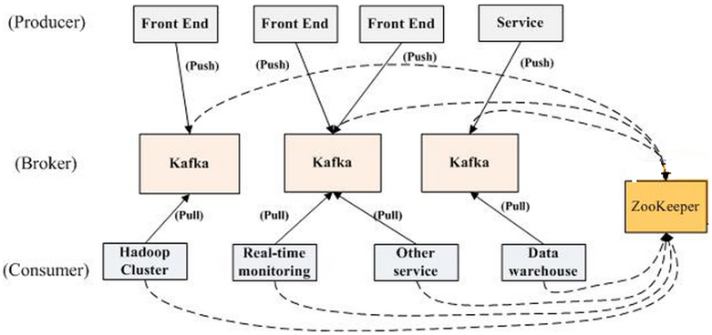

- **Producer：消息⽣产者**

  Producer可以发送消息到Topic

  Topic的消息存放在不同Partition中，不同Partition存放在不同Broker中

  Producer只需要指定Topic的名字、要连接到的Broker，这样Kafka就可以⾃动地把消息数据路由到合适的Broker（不⼀定是指定连接的Broker）

  Producer发送消息后，可以选择是否要确认消息写⼊成功（ACK，Acknowledgment）

  ACK=0：Producer不会等待ACK（消息可能丢失）

  ACK=1：Producer会等待Leader Partition的ACK（Follower Partition消息可能丢失）

  ACK=all：Producer会等待Leader Partition和Follower Partition的ACK（消息不会丢失）

  消息key：Producer可以给消息加上key，带相同key的消息会被分发到同⼀个Partition，这样就可以保证带相同key的消息的消费是有序的

- **Broker**：每个Broker⾥包含了不同Topic的不同Partition，Partition中包含了有序的消息

  ⼀个Kafka集群由多个Broker（server）组成每个Broker都有ID标识

  每个Broker⾥保存⼀定数量的Partition

  客户端只要连接上任意⼀个Broker，就可以连接上整个Kafka集群

  ⼤多数Kafka集群刚开始的时候建议使⽤⾄少3个Broker，集群⼤了可以有上百个Broker

- **Consumer：消息消费者**

  Consumer可以从Topic读取消息进⾏消费

  Topic的消息存放在不同Partition中，不同Partition存放在不同Broker中

  Consumer只需要指定Topic的名字、要连接到的Broker，这样Kafka就可以⾃动地把Consumer路由到合适的Broker拉取消息进⾏消费（不⼀定是指定连接的Broker）

  每⼀个Partition中的消息都会被有序消费

  Consumer Group：

  Consumer Group由多个Consumer组成

  Consumer Group⾥的每个Consumer都会从不同的Partition中读取消息

  如果Consumer的数量⼤于Partition的数量，那么多出来的Consumer就会空闲下来（浪费资源）

  Consumer offset：

  Kafka会为Consumer Group要消费的每个Partion保存⼀个offset，这个offset标记了该 Consumer Group最后消费消息的位置

  这个offset保存在Kafka⾥⼀个名为" consumer_offsets"的Topic中；当Consumer从Kafka拉取消息消费时，同时也要对这个offset提交修改更新操作。这样若⼀个Consumer消费消息时挂了，其他Consumer可以通过这个offset值重新找到上⼀个消息再进⾏处理

## 2、Kafka的message包括哪些信息

⼀个Kafka的Message由⼀个固定⻓度的header和⼀个变⻓的消息体body组成 header部分由⼀个字节的magic(⽂件格式)和四个字节的CRC32(⽤于判断body消息体是否正常)构成。当magic的值为1的时候，会在magic和crc32之间多⼀个字节的数据：attributes(保存⼀些相关属性，⽐如是否压缩、压缩格式等等)；如果magic的值为0，那么不存在attributes属性 body是由N个字节构成的⼀个消息体，包含了具体的key/value消息

## Kafka 可以脱离 Zookeeper 单独使⽤吗

Kafka 不能脱离 Zookeeper 单独使⽤，因为 Kafka 使⽤ Zookeeper 管理和协调 Kafka 的节点服务器。

## Kafka 实现⾼吞吐的原理

读写⽂件依赖OS⽂件系统的⻚缓存，⽽不是在JVM内部缓存数据，利⽤OS来缓存，内存利⽤率⾼

 sendfile技术（零拷⻉），避免了传统⽹络IO四步流程

⽀持End-to-End的压缩

顺序IO以及常量时间get、put消息

 Partition 可以很好的横向扩展和提供⾼并发处理

## Kafka同时设置了7天和10G清除数据，到第5天的时候消息到达了10G，这个时候Kafka如何处理?

这个时候 Kafka 会执⾏数据清除⼯作，时间和⼤⼩不论那个满⾜条件，都会清空数据。

## Kafka 有⼏种数据保留策略

Kafka 有两种数据保存策略：按照过期时间保留和按照存储的消息⼤⼩保留。

## Kafka 与其他消息组件对⽐

+-------------------------+-----------------------+---------------------------------------------+-------------------------------------------------------------------------------------------------------------+--------------------------------------------------------------------------------------------------------------+
|特性| ActiveMQ | RabbitMQ | RocketMQ | Kafka |
+=========================+=======================+=============================================+=============================================================================================================+==============================================================================================================+
|单机吞吐量|万级，⽐|同|10 万级，⽀撑⾼吞吐|10 万级，⾼吞吐，⼀般配合⼤数据类的系统来进⾏实时数据计算、⽇志采集等场景|
||||||
|| RocketMQ、| ActiveMQ |||
||||||
|| Kafka 低⼀个数量级||||
+-------------------------+-----------------------+---------------------------------------------+-------------------------------------------------------------------------------------------------------------+--------------------------------------------------------------------------------------------------------------+
| topic数量对吞吐量的影响||| topic 可以达到⼏百/⼏千的级别，吞吐量会有较⼩幅度的下降，这是 RocketMQ 的⼀⼤优势，在同等机器下，可以⽀撑| topic 从⼏⼗到⼏百个时候，吞吐量会|
||||||
||||⼤量的 topic |⼤幅度下降，在同等机器下，Kafka尽量保证 topic 数量不要过多，如果要⽀撑⼤规模的 topic，需要增加更多的机器资源|
+-------------------------+-----------------------+---------------------------------------------+-------------------------------------------------------------------------------------------------------------+--------------------------------------------------------------------------------------------------------------+
|时效性| ms 级|微秒级，这是 RabbitMQ的⼀⼤特点，延迟最低| ms 级|延迟在 ms 级以内|
+-------------------------+-----------------------+---------------------------------------------+-------------------------------------------------------------------------------------------------------------+--------------------------------------------------------------------------------------------------------------+
|可⽤性|⾼，基于主从架构实现|同|⾮常⾼，分布式架构|⾮常⾼，分布式，⼀个数据多个副本，少数机器宕机，不会丢失数据，不会导致不可⽤|
||||||
||⾼可⽤| ActiveMQ |||
+-------------------------+-----------------------+---------------------------------------------+-------------------------------------------------------------------------------------------------------------+--------------------------------------------------------------------------------------------------------------+
|消息可靠性|有较低的概率丢失数据|基本不丢|经过参数优化配置，可以做到|同 RocketMQ |
||||||
||||0 丢失||
+-------------------------+-----------------------+---------------------------------------------+-------------------------------------------------------------------------------------------------------------+--------------------------------------------------------------------------------------------------------------+
|功能| MQ 领域的功能极其完备|基于| MQ 功能较为完善，还是分布式的，扩展性好|功能较为简单，主要⽀持简单的 MQ |
||||||
|⽀持|| erlang 开发，并发能||功能，在⼤数据领域的实时计算以及|
||||||
|||⼒很强，性能极好，延时很低||⽇志采集被⼤规模使⽤|
+-------------------------+-----------------------+---------------------------------------------+-------------------------------------------------------------------------------------------------------------+--------------------------------------------------------------------------------------------------------------+

8. Kafka 与 Spark streaming 集成，如何保证 exactly once 语义

## Spark Streaming上游对接Kafka时保证Exactly Once

Spark Streaming使⽤Direct模式对接上游Kafka。⽆论Kafka有多少个partition，使⽤Direct模式总能保证SS中有相同数量的partition与之相对，也就是说SS中的KafkaRDD的并发数量在Direct模式下是由上游Kafka决定的。在这个模式下，Kafka的offset是作为KafkaRDD的⼀部分存在，会存储在checkpoints中，由于checkpoints只存储

offset内容，⽽不存储数据，这就使得checkpoints是相对轻的操作。这就使得SS在遇到故障时，可以从

checkpoint中恢复上游Kafka的offset，从⽽保证exactly once

## Spark Streaming输出下游保证Exactly once

第⼀种"鸵⻦做法"，就是期望下游（数据）具有幂等特性。

多次尝试总是写⼊相同的数据，例如，saveAsFiles 总是将相同的数据写⼊⽣成的⽂件使⽤事务更新

所有更新都是事务性的，以便更新完全按原⼦进⾏。这样做的⼀个⽅法如下：使⽤批处理时间(在

 foreachRDD中可⽤)和RDD的partitionIndex（分区索引）来创建identifier（标识符)。该标识符唯⼀地标识streaming application 中的blob数据。使⽤该identifier，blob 事务地更新到外部系统中。也就是说，如果identifier尚未提交，则以(atomicall)原⼦⽅式提交分区数据和identifier。否则，如果已经提交，请跳过更新。

# Kafka怎样保证不丢失消息

##消费端弄丢了数据

唯⼀可能导致消费者弄丢数据的情况，就是说，你消费到了这个消息，然后消费者那边⾃动提交了 offset，让

Kafka 以为你已经消费好了这个消息，但其实你才刚准备处理这个消息，你还没处理，你⾃⼰就挂了，此时这条消息就丢咯。

这不是跟 RabbitMQ 差不多吗，⼤家都知道 Kafka 会⾃动提交 offset，那么只要关闭⾃动提交 offset，在处理完之后⾃⼰⼿动提交 offset，就可以保证数据不会丢。但是此时确实还是可能会有重复消费，⽐如你刚处理完，还没提交 offset，结果⾃⼰挂了，此时肯定会重复消费⼀次，⾃⼰保证幂等性就好了。

⽣产环境碰到的⼀个问题，就是说我们的 Kafka 消费者消费到了数据之后是写到⼀个内存的 queue ⾥先缓冲⼀下，结果有的时候，你刚把消息写⼊内存 queue，然后消费者会⾃动提交 offset。然后此时我们重启了系统，就会导致内存 queue ⾥还没来得及处理的数据就丢失了。

## Kafka 弄丢了数据

这块⽐较常⻅的⼀个场景，就是 Kafka 某个 broker 宕机，然后重新选举 partition 的 leader。⼤家想想，要是此时其他的 follower 刚好还有些数据没有同步，结果此时 leader 挂了，然后选举某个 follower 成 leader 之后，不就少了⼀些数据？这就丢了⼀些数据啊。

⽣产环境也遇到过，我们也是，之前 Kafka 的 leader 机器宕机了，将 follower 切换为 leader 之后，就会发现说这个数据就丢了。

所以此时⼀般是要求起码设置如下4 个参数：

给 topic 设置 replication.factor 参数：这个值必须⼤于1，要求每个 partition 必须有⾄少2 个副本。在 Kafka 服务端设置 min.insync.replicas 参数：这个值必须⼤于1，这个是要求⼀个 leader ⾄少感知到有⾄少⼀个 follower 还跟⾃⼰保持联系，没掉队，这样才能确保 leader 挂了还有⼀个 follower 吧。

在 producer 端设置 acks=all ：这个是要求每条数据，必须是写⼊所有 replica 之后，才能认为是写成功

了。

在 producer 端设置 retries=MAX （很⼤很⼤很⼤的⼀个值，⽆限次重试的意思）：这个是要求⼀旦写⼊失败，就⽆限重试，卡在这⾥了。

我们⽣产环境就是按照上述要求配置的，这样配置之后，⾄少在 Kafka broker 端就可以保证在 leader 所在

broker 发⽣故障，进⾏ leader 切换时，数据不会丢失。

##⽣产者会不会弄丢数据？

如果按照上述的思路设置了 acks=all ，⼀定不会丢，要求是，你的 leader 接收到消息，所有的 follower 都同步到了消息之后，才认为本次写成功了。如果没满⾜这个条件，⽣产者会⾃动不断的重试，重试⽆限次。

# Kafka怎样保证不重复消费

此问题其实等价于保证消息队列消费的幂等性主要需要结合实际业务来操作:

⽐如你拿个数据要写库，你先根据主键查⼀下，如果这数据都有了，你就别插⼊了，update ⼀下好吧。

⽐如你是写 Redis，那没问题了，反正每次都是 set，天然幂等性。

⽐如你不是上⾯两个场景，那做的稍微复杂⼀点，你需要让⽣产者发送每条数据的时候，⾥⾯加⼀个全局唯

⼀的 id，类似订单 id 之类的东⻄，然后你这⾥消费到了之后，先根据这个 id 去⽐如 Redis ⾥查⼀下，之前消费过吗？如果没有消费过，你就处理，然后这个 id 写 Redis。如果消费过了，那你就别处理了，保证别重复处理相同的消息即可。

⽐如基于数据库的唯⼀键来保证重复数据不会重复插⼊多条。因为有唯⼀键约束了，重复数据插⼊只会报错，不会导致数据库中出现脏数据。

注：资料来源于⽹络。

2. DAG是在哪⼀端被构建的？

 Driver端

3. RDD是在哪⼀端⽣成的？

 Driver端

4.调⽤RDD的算⼦（Transformation和Action）是在哪⼀端调⽤的

 Driver端

5. RDD在调⽤Transformation和Action时需要传⼊函数，函数是在哪⼀端声明【定义】和传⼊的?

 Driver端

6. RDD在调⽤Transformation和Action时需要传⼊函数，请问传⼊的函数是在哪⼀端执⾏了函数的业务逻辑？

 Executor

7. Task是在哪⼀端⽣成的呢？

 Driver端

8. DAG是在哪⼀端构建好的并被切分成⼀到多个Stage的

 Driver端

9. DAG是哪个类完成的切分Stage的功能？

 DAGScheduler

10. DAGScheduler将切分好的Task以什么样的形式给TaskScheduler

 TaskSet

11.⾃定义的分区器这个类是在哪⼀端实例化的？

 Driver端

12.分区器中的getParitition⽅法在哪⼀端调⽤的呢？

 Executor

14.要⼴播的数据应该在哪⼀端先创建好再⼴播呢？

 Driver端

15.⼴播变量以后能修改吗？

不能

16.⼴播变量⼴播到Executor后，⼀个Executor进程中有⼏份⼴播变量的数据

⼀个

17.累加器事先在哪⼀端创建的？

 Driver端

18.累加器事先在哪⼀端累加的

 Executor

19. shuffle算⼦是否⼀定会触发shuffle

不会，需要看情况。如果现有数据已经按照⼀定规则和分区进⾏过划分，将要做的操作还是⼀样的分区规则和分区数量，则不需要再次shuffle了。

20. RDD为何⾼效？

 RDD是不可变的+lazy。转化操作，⾏为操作。

 RDD是粗度。[每次操作都作⽤于所以集合]对于RDD的写是粗粒度的 RDD的读操作可以是粗粒度的也可以是细粒度的：可以读其中的⼀条记录。

注：资料来源于⽹络。


#1、什么是ClickHouse？

 ClickHouse是近年来备受关注的开源列式数据库管理系统，主要⽤于数据分析（OLAP）领域。通过向量化执⾏以及对cpu底层指令集（SIMD）的使⽤，它可以对海量数据进⾏并⾏处理，从⽽加快数据的处理速度。ClickHouse从

 OLAP场景需求出发，定制开发了⼀套全新的⾼效列式存储引擎，并且实现了数据有序存储、主键索引、稀疏索引、数据Sharding、数据Partitioning、TTL、主备复制等丰富功能。

#2、ClickHouse有哪些应⽤场景？

1.绝⼤多数请求都是⽤于读访问的；

2.数据需要以⼤批次（⼤于1000⾏）进⾏更新，⽽不是单⾏更新；

3.数据只是添加到数据库，没有必要修改；

4.读取数据时，会从数据库中提取出⼤量的⾏，但只⽤到⼀⼩部分列；

5.表很"宽"，即表中包含⼤量的列；

6.查询频率相对较低（通常每台服务器每秒查询数百次或更少）；

7.对于简单查询，允许⼤约50毫秒的延迟；

8.列的值是⽐较⼩的数值和短字符串（例如，每个URL只有60个字节）；

9.在处理单个查询时需要⾼吞吐量（每台服务器每秒⾼达数⼗亿⾏）；

10.不需要事务；

11.数据⼀致性要求较低；

12.每次查询中只会查询⼀个⼤表。除了⼀个⼤表，其余都是⼩表；

13.查询结果显著⼩于数据源。即数据有过滤或聚合。返回结果不超过单个服务器内存。

#3、ClickHouse列式存储的优点有哪些？

当分析场景中往往需要读⼤量⾏但是少数⼏个列时，在⾏存模式下，数据按⾏连续存储，所有列的数据都存储在⼀个block中，不参与计算的列在IO时也要全部读出，读取操作被严重放⼤。⽽列存模式下，只需要读取参与计算的列即可，极⼤的减低了IO cost，加速了查询。

同⼀列中的数据属于同⼀类型，压缩效果显著。列存往往有着⾼达⼗倍甚⾄更⾼的压缩⽐，节省了⼤量的存储空间，降低了存储成本。

更⾼的压缩⽐意味着更⼩的data size，从磁盘中读取相应数据耗时更短。

⾃由的压缩算法选择。不同列的数据具有不同的数据类型，适⽤的压缩算法也就不尽相同。可以针对不同列类型，选择最合适的压缩算法。

⾼压缩⽐，意味着同等⼤⼩的内存能够存放更多数据，系统cache效果更好。

4、ClickHouse的缺点是是什么？

不⽀持事务，不⽀持真正的删除/更新；不⽀持⼆级索引；

 join实现与众不同；不⽀持窗⼝功能；

元数据管理需要⼈为⼲预。

#5、ClickHouse的架构是怎样的？

{width="7.232182852143482in" height="4.6168744531933505in"}

 ClickHouse 采⽤典型的分组式的分布式架构，其中：

 Shard。集群内划分为多个分⽚或分组（Shard 0 ... Shard N），通过Shard的线性扩展能⼒，⽀持海量数据的分布式存储计算。

 Node。每个Shard内包含⼀定数量的节点（Node，即进程），同⼀Shard内的节点互为副本，保障数据可靠。ClickHouse中副本数可按需建设，且逻辑上不同Shard内的副本数可不同。

 ZooKeeper Service。集群所有节点对等，节点间通过ZooKeeper服务进⾏分布式协调。

#6、ClickHouse的逻辑数据模型？

从⽤户使⽤⻆度看，ClickHouse 的逻辑数据模型与关系型数据库有⼀定的相似：⼀个集群包含多个数据库，⼀个数据库包含多张表，表⽤于实际存储数据。

{width="7.228272090988626in" height="3.2162489063867015in"}

#7、ClickHouse的核⼼特性？

列存储：列存储是指仅从存储系统中读取必要的列数据，⽆⽤列不读取，速度⾮常快。ClickHouse采⽤列存储，这对于分析型请求⾮常⾼效。⼀个典型且真实的情况是，如果我们需要分析的数据有50列，⽽每次分析仅读取其中的5 列，那么通过列存储，我们仅需读取必要的列数据，相⽐于普通⾏存，可减少10 倍左右的读取、解压、处理等开销，对性能会有质的影响。

向量化执⾏：在⽀持列存的基础上，ClickHouse 实现了⼀套⾯向向量化处理的计算引擎，⼤量的处理操作都是向量化执⾏的。相⽐于传统⽕⼭模型中的逐⾏处理模式，向量化执⾏引擎采⽤批量处理模式，可以⼤幅减少函数调⽤开销，降低指令、数据的 Cache Miss，提升 CPU 利⽤效率。并且ClickHouse 可利⽤ SIMD 指令进

⼀步加速执⾏效率。这部分是 ClickHouse 优于⼤量同类 OLAP 产品的重要因素。

编码压缩：由于 ClickHouse 采⽤列存储，相同列的数据连续存储，且底层数据在存储时是经过排序的，这样数据的局部规律性⾮常强，有利于获得更⾼的数据压缩⽐。此外，ClickHouse 除了⽀持 LZ4、ZSTD 等通⽤压缩算法外，还⽀持 Delta、DoubleDelta、Gorilla 等专⽤编码算法，⽤于进⼀步提⾼数据压缩⽐。

多索引：列存⽤于裁剪不必要的字段读取，⽽索引则⽤于裁剪不必要的记录读取。ClickHouse⽀持丰富的索引，从⽽在查询时尽可能的裁剪不必要的记录读取，提⾼查询性能。

#8、使⽤ClickHouse时有哪些注意点？

##分区和索引

分区粒度根据业务特点决定，不宜过粗或过细。⼀般选择按天分区，也可指定为tuple()；以单表1亿数据为例，分区⼤⼩控制在10-30个为最佳。

必须指定索引列，clickhouse中的索引列即排序列，通过order by指定，⼀般在查询条件中经常被⽤来充当筛选条件的属性被纳⼊进来；可以是单⼀维度，也可以是组合维度的索引；通常需要满⾜⾼级列在前、查询频率⼤的在前原则；还有基数特别⼤的不适合做索引列，如⽤户表的userid字段；通常筛选后的数据满⾜在百万以内为最佳。

##数据采样策略

通过采⽤运算可极⼤提升数据分析的性能。

数据量太⼤时应避免使⽤select 操作，查询的性能会与查询的字段⼤⼩和数量成线性变换；字段越少，消耗的IO资源就越少，性能就会越⾼。

千万以上数据集⽤order by查询时需要搭配where条件和limit语句⼀起使⽤。

如⾮必须不要在结果集上构建虚拟列，虚拟列⾮常消耗资源浪费性能，可以考虑在前端进⾏处理，或者在表中构造实际字段进⾏额外存储。

不建议在⾼基列上执⾏distinct去重查询，改为近似去重 uniqCombined。

多表Join时要满⾜⼩表在右的原则，右表关联时被加载到内存中与左表进⾏⽐较。

##存储

 ClickHouse不⽀持设置多数据⽬录，为了提升数据io性能，可以挂载虚拟券组，⼀个券组绑定多块物理磁盘提升读写性能；多数查询场景SSD盘会⽐普通机械硬盘快2-3倍。

#9、 ClickHouse 的引擎有哪些？

 ClickHouse提供了⼤量的数据引擎，分为数据库引擎、表引擎，根据数据特点及使⽤场景选择合适的引擎⾄关重要。

 ClickHouse引擎分类

{width="7.230184820647419in" height="6.069374453193351in"}

在以下⼏种情况下，ClickHouse使⽤⾃⼰的数据库引擎：

决定表存储在哪⾥以及以何种⽅式存储；

⽀持哪些查询以及如何⽀持；并发数据访问；

索引的使⽤；

是否可以执⾏多线程请求；数据复制参数。

在所有的表引擎中，最为核⼼的当属MergeTree系列表引擎，这些表引擎拥有最为强⼤的性能和最⼴泛的使⽤场合。对于⾮MergeTree系列的其他引擎⽽⾔，主要⽤于特殊⽤途，场景相对有限。⽽MergeTree系列表引擎是官⽅主推的存储引擎，⽀持⼏乎所有ClickHouse核⼼功能。

 MergeTree作为家族系列最基础的表引擎，主要有以下特点：

存储的数据按照主键排序：允许创建稀疏索引，从⽽加快数据查询速度；

⽀持分区，可以通过PRIMARY KEY语句指定分区字段；

⽀持数据副本；

⽀持数据采样。

#10、建表引擎参数有哪些？

 ENGINE：ENGINE = MergeTree()，MergeTree引擎没有参数。

 ORDER BY：order by 设定了分区内的数据按照哪些字段顺序进⾏有序保存。

 order by是MergeTree中唯⼀⼀个必填项，甚⾄⽐primary key 还重要，因为当⽤户不设置主键的情况，很多处理会依照order by的字段进⾏处理。

要求：主键必须是order by字段的前缀字段。

如果ORDER BY与PRIMARY KEY不同，PRIMARY KEY必须是ORDER BY的前缀(为了保证分区内数据和主键的有序性)。

 ORDER BY 决定了每个分区中数据的排序规则; PRIMARY KEY 决定了⼀级索引(primary.idx);

 ORDER BY 可以指代PRIMARY KEY，通常只⽤声明ORDER BY 即可。

 PARTITION BY：分区字段，可选。如果不填：只会使⽤⼀个分区。

分区⽬录：MergeTree 是以列⽂件+索引⽂件+表定义⽂件组成的，但是如果设定了分区那么这些⽂件就会保存到不同的分区⽬录中。

 PRIMARY KEY：指定主键，如果排序字段与主键不⼀致，可以单独指定主键字段。否则默认主键是排序字段。可选。

 SAMPLE BY：采样字段，如果指定了该字段，那么主键中也必须包含该字段。⽐如SAMPLE BY intHash32(UserID) ORDER BY (CounterID， EventDate， intHash32(UserID))。可选。

 TTL：数据的存活时间。在MergeTree中，可以为某个列字段或整张表设置TTL。当时间到达时，如果是列字段级别的TTL，则会删除这⼀列的数据；如果是表级别的TTL，则会删除整张表的数据。可选。

 SETTINGS：额外的参数配置。可选。

注：资料来源于⽹络。

#事实表的类型？

事实表有：事务事实表、周期快照事实表、累积快照事实表、⾮事实事实表。

###事务事实表

事务事实表记录的是事务层⾯的事实，保存的是最原⼦的数据，也称"原⼦事实表"。事务事实表中的数据在事务事件发⽣后产⽣，数据的粒度通常是每个事务记录⼀条记录。

###周期快照事实表

以具有规律性的、可预⻅的时间间隔来记录事实。它统计的是间隔周期内的度量统计，每个时间段⼀条记录，是在事务事实表之上建⽴的聚集表。

###累积快照事实表

累积快照表记录的不确定的周期的数据。代表的是完全覆盖⼀个事务或产品的⽣命周期的时间跨度，通常具有多个

⽇期字段，⽤来记录整个⽣命周期中的关键时间点。

###⾮事实型事实表

这个与上⾯三个有所不同。事实表中通常要保留度量事实和多个维度外键，度量事实是事实表的关键所在。

⾮事实表中没有这些度量事实，只有多个维度外键。⾮事实型事实表通常⽤来跟踪⼀些事件或说明某些活动的范围。

第⼀类⾮事实型事实表是⽤来跟踪事件的事实表。例如：学⽣注册事件

第⼆类⾮事实型事实表是⽤来说明某些活动范围的事实表。例如：促销范围事实表。

{width="7.1533814523184605in" height="3.4340616797900263in"}

#数仓分层

⼀般情况下，将数据模型分为3层:

###源数据层ODS

存放的是接⼊的原始数据

经过ETL之后装⼊本层，⼤多是按照源头业务系统的分类⽅式⽽分类的。为了考虑后续可能追溯数据，因此对这⼀层不建议做过多的数据清洗⼯作，原封不动接⼊元数据即可，⾄于数据的去噪，去重，异常处理等过程可以放在后

⾯的DW层。

###数据仓库层DW

重点设计的数据仓库中间层数据，在这⾥ODS层获得的数据按照主题建⽴各种数据模型，DW⼜细分：

###数据明细层：DWD(Data Warehouse Detail)

该层⼀般保持和ODS层⼀样的数据粒度，并且提供⼀定的数据质量保证，同时为了提⾼数据明细层的易⽤性，该层会采⽤⼀些维度退化⼿法，将维度退化到事实表中，减少事实表和维度表的关联。另外在该层也会做⼀部分的数据聚合，将相同主题的数据汇集到⼀张表中，提⾼数据的可⽤性。

###数据中间层：DWM(Data Warehouse Middle)

在DWD层的数据基础上，对数据做轻度的聚合操作，⽣成⼀系列的中间表提升公共指标的复⽤性，减少重复加

⼯，直观来说，就是对通⽤的核⼼维度进⾏聚合操作，算出相应的统计指标。

###数据服务层：DWS(Data Warehouse Service)

⼜称为数据集市或者宽表，按照业务划分，例如流量，订单，⽤户等，⽣成字段⽐较多的宽表，⽤于后续的业务查询，OLAP分析，数据分析等。

###数据应⽤层APP：⾯向业务定制的应⽤数据

主要提供给数据铲平和数据分析使⽤的数据，⼀般会放在ES，MYSQL，Redis等系统供线上系统使⽤，也可以放在

 Hive中供数据分析和数据挖掘使⽤。

###补充：维表层 Dimension

⾼基数维度数据：⼀般是⽤户资料表，商品资料表类似的资料表。数据量可能是千万级或者上亿级别

低基数维度数据：⼀般是配置表，⽐如枚举值对应的中⽂含义，或者⽇期维表。数据量可能是个位数或者⼏千⼏万。

#数仓和普通数据库区别

数据库与数据⻓裤的区别实际讲的是OLTP和OLAP的区别。

## OLTP特点如下

联机事务处理OLTP(on-line transaction processing)主要是执⾏基本的，⽇常的事务处理，⽐如数据库记录的增删改查，⽐如在银⾏存取⼀笔款，就是⼀个事务交易

实时性要求⾼数据量不是很⼤

交易⼀般是确定的，所以是OLTP是对确定性的数据进⾏存取(⽐如存取款都有⼀个特定的⾦额)

并发现要求⾼并且严格要求事物的完整性安全性(⽐如你和你的家⼈同时间在不同的银⾏取同⼀账户的钱)

## OLAP特点如下

联机分析处理OLAP(on-line Analytical Processing)是数据仓库系统的主要应⽤，⽀持复杂的分析操作，侧重决策

⽀持，并且提供直观易懂的查询结果。典型的应⽤就是复杂的动态报表系统：

实时性要求不是很⾼，很多应⽤的顶多是每天更新⼀下数据

数据量⼤，因为OLAP⽀持的是动态查询，所以⽤户也许要通过很多数据的统计后才能得到想要的信息，例如时间序列分析等，所以处理的数据量很⼤

因为重点在于决策⽀持，所以查询⼀般是动态的，也就是说允许⽤户随时提出查询的要求，所以在OLAP中通过⼀个重要概念维来搭建⼀个动态查询的平台或技术，供⽤户⾃⼰去决定需要知道什么信息

简单来说，OLTP就是我们常说的关系型数据库，即记录即时的增删改查就是我们常⽤的，这是数据库的基础，

 TPCC(Transaction Processing Performance Council)属于此类

 OLAP即联机分析处理，是数据仓库的核⼼部分。所谓数据仓库是对于⼤量已经由OLTP形成的数据的⼀种分析型的数据库，⽤于处理商业智能，决策⽀持等重要的决策信息。数据仓库是在数据库应⽤到⼀定程度后对历史数据的加

⼯与分析，读取较多，更新较少，TPCH属于此类，对于OLAP，列存储模式⽐通常的⾏存储模式可能更具有优势

 OLAP不应该对OLTP产⽣任何影响，(理想情况下)OLTP应该完全感觉不到OLAP的存在

{width="7.176339676290464in" height="3.3075in"}

#星型模型和雪花模型的区别

事实表：⼀般是⽤户⾏为产⽣的数据，数据量⽐较⼤

维度表：⼀般是⼀些属性信息，⽤户信息表，产品信息表等。这些属性信息不经常变动数据仓库模型：星型模型和雪花模型

星型模型：当所有维表都直接连接到事实表上时，整个图解就像星星⼀样，故将该模型称为星型模型。特点:星型架构是⼀种⾮正规化的结构，多维数据集的每⼀个维度都直接与事实表相连接，不存在渐变维表，所以数据有⼀定的冗余，如在地域维度表，存在国家A省B的城市C和国家A省B城市D两条记录，那么国家A和省B的信息分别存储了两次，即存在冗余。

{width="6.923124453193351in" height="6.0839577865266845in"}

雪花模型：当有⼀个或多个维表没有直接连接到事实表上，⽽是通过其他维表连接到事实表上，其图解就像多个雪花连接在⼀起，故称为雪花型。雪花模型是对星型模型的扩展。它对星型模型的维表进⼀步层次化，原有的各维表可能被扩展为⼩的事实表。如下图，将地域维表⼜分解为国家省份城市等维表。它的优点是通过最⼤限度地减少数据存储量及联合较⼩的维表来改善查询性能。雪花型结构去除了数据冗余。

{width="7.244876421697287in" height="4.655833333333334in"}

星型模型因为数据的冗余所以很多统计查询不需要做外部地连接，因此⼀般情况下效率⽐雪花模型⾼。星型结构不

⽤考虑很多正规化地因素，设计与实现都⽐较简单。雪花模型由于去除了冗余，有些统计就需要通过表连接才能产

⽣，所以效率不⼀定有星型模型⾼。正规化也是⼀种⽐较复杂地过程，相应地数据库结构设计，数据地ETL以及后期地维护都要复杂⼀些。因此在冗余可以接受地前提下，实际运⽤中星型模型使⽤更多，也更有效。

#拉链表

拉链表是针对数据仓库设计中表存储数据的⽅式⽽定义的，顾名思义，所谓拉链，就是记录历史。记录⼀个事物从开始，⼀直到当前状态的所有变化的信息

###拉链表的使⽤场景

在数据仓库的数据模型设计过程中，经常会遇到下⾯这种表的设计

有⼀些表的数据量很⼤，⽐如⼀张⽤户表，⼤约10亿条记录，50个字段，这种表即使使⽤ORC压缩，单张表的存储也会超过100G，在hdfs使⽤双备份或者三备份就更⼤了

表中的部分字段会被update更新操作，如⽤户联系⽅式，产品的描述信息，订单的状态等需要查看某⼀时间点或者时间段的历史快照信息，⽐如查看某⼀订单在历史某⼀时间点的状态

表中的记录变化的⽐例和频率不是很⼤，⽐如，总共有10亿的⽤户，每天新增和发⽣变化的有200万左右，变化的⽐例占的很⼩

对于这种表的设计，有⼏种⽅案可选

⽅案⼀：每天只留最新的⼀份，⽐如我们每天⽤datax抽取最新的⼀份全量数据到Hive中

⽅案⼆：每天保留⼀份全量的切⽚数据

⽅案三：使⽤拉链表

###使⽤拉链表的原因

对于⽅案⼀，实现起来很简单，每天删除前⼀天的数据，重新抽⼀份最新的。优点很明显，节省空间，⼀些普通的使⽤也很⽅便，不⽤在选择表的时候加⼀个时间分区。缺点同样很明显，没有历史数据，想翻旧账只能通过其他⽅式，⽐如从流⽔表⾥抽。

对于⽅案⼆，每天⼀份全量的切⽚是⼀种⽐较稳妥的⽅案，⽽且历史数据也在。缺点就是存储空间占⽤太⼤太⼤，如果对这边表每天都保留⼀份全量，那么每次全量中会保存很多不变的信息，对存储是极⼤的浪费。

对于⽅案三，拉链表在使⽤上基本兼顾了我们的需求。⾸先在空间上做了⼀个取舍，虽说不像⽅案⼀那样占⽤量那么⼩，但是它每⽇的增量可能只有⽅案⼆的千分之⼀甚⾄是万分之⼀。它能满⾜⽅案⼆所能满⾜的需求，既能获取最新数据，也能添加筛选条件获取历史数据，所以我们还是很有必要使⽤拉链表。

#数据漂移如何解决

###什么是数据漂移？

通常是指ods表的同⼀个业务⽇期数据中包含了前⼀天或后⼀天凌晨附近的数据或者丢失当天变更的数据，这种现象就叫做漂移，且在⼤部分公司中都会遇到的场景。

###如何解决数据漂移问题？

通常有两种解决⽅案：

1.多获取后⼀天的数据，保障数据只多不少

2.通过多个时间戳字段来限制时间获取相对准确的数据

第⼀种⽅案⽐较暴⼒，这⾥不做过多解释，主要来讲解⼀下第⼆种解决⽅案。（⾸先这种解决⽅案在⼤数据之路这本书有体现）。

第⼀种⽅案⾥，时间戳字段分为四类：

1.数据库表中⽤来标识数据记录更新时间的时间戳字段（假设这类字段叫 modified time ）。

2.数据库⽇志中⽤来标识数据记录更新时间的时间戳字段·（假设这类宇段叫 log_time）。

3.数据库表中⽤来记录具体业务过程发⽣时间的时间戳字段（假设这类字段叫 proc_time）。

4.标识数据记录被抽取到时间的时间戳字段（假设这类字段extract time）。

理论上这⼏个时间应该是⼀致的，但往往会出现差异，造成的原因可能为：

1.数据抽取需要⼀定的时间，extract_time往往晚于前三个时间。

2.业务系统⼿动改动数据并未更新modfied_time。

3.⽹络或系统压⼒问题，log_time或modified_time晚于proc_time。

通常都是根据以上的某⼏个字段来切分ODS表，这就产⽣了数据漂移。具体场景如下：

1.根据extract_time进⾏同步。

2.根据modified_time进⾏限制同步，在实际⽣产中这种情况最常⻅，但是往往会发⽣不更新 modified time

⽽导致的数据遗漏，或者凌晨时间产⽣的数据记录漂移到后天。由于⽹络或者系统压⼒问题， log_time 会晚

 proc_time ，从⽽导致凌晨时间产⽣的数据记录漂移到后⼀天。

3.根据proc_time来限制，会违背ods和业务库保持⼀致的原则，因为仅仅根据proc_time来限制，会遗漏很多其他过程的变化。

第⼆种解决⽅案：

1.⾸先通过log_time多同步前⼀天最后15分钟和后⼀天凌晨开始15分钟的数据，然后⽤modified_time过滤⾮当天的数据，这样确保数据不会因为系统问题被遗漏。

2.然后根据log_time获取后⼀天15分钟的数据，基于这部分数据，按照主键根据log_time做升序排序，那么第

⼀条数据也就是最接近当天记录变化的。

3.最后将前两步的数据做全外连接，通过限制业务时间proc_time来获取想要的数据。

#7.维度建模和范式建模的区别

通常数据建模有以下⼏个流程：

1.概念建模：即通常先将业务划分多个主题。

2.逻辑建模：即定义各种实体、属性和关系。

3.物理建模：设计数据对象的物理实现，⽐如表字段类型、命名等。

那么范式建模，即3NF模型具有以下特点：

1.原⼦性，即数据不可分割。

2.基于第⼀个条件，实体属性完全依赖于主键，不能存在仅依赖主关键字⼀部分属性。即不能存在部分依赖。

3.基于第⼆个条件，任何⾮主属性不依赖于其他⾮主属性。即消除传递依赖。

基于以上三个特点，3NF的最终⽬的就是为了降低数据冗余，保障数据⼀致性；同时也有了数据关联逻辑复杂的缺点。

⽽维度建模是⾯向分析场景的，主要关注点在于快速、灵活，能够提供⼤规模的数据响应。

常⽤的维度模型类型主要有：

1.星型模型：即由⼀个事实表和⼀组维度表组成，每个维表都有⼀个维度作为主键。事实表居中，多个维表呈辐射状分布在四周，并与事实表关联，形成⼀个星型结构。

2.雪花模型：在星型模型的基础上，基于范式理论进⼀步层次化，将某些维表扩展成事实表，最终形成雪花状结构

3.星系模型：基于多个事实表，共享⼀些维度表。

#数据仓库和数据库的区别？

从⽬标、⽤途、设计来说：

数据库是⾯向事物处理的，数据是由⽇常的业务产⽣的，常更新；数据仓库是⾯向主题的，数据来源多样，经过⼀定的规则转换得到，⽤来分析。

数据库⼀般⽤来存储当前事务性数据，如交易数据；数据仓库⼀般存储的历史数据。

数据库的设计⼀般是符合三范式的，有最⼤的精确度和最⼩的冗余度，有利于数据的插⼊；数据仓库的设计

⼀般不符合三范式，有利于查询。

#元数据的理解？

狭义来讲就是⽤来描述数据的数据。

⼴义来看，除了业务逻辑直接读写处理的业务数据，所有其他⽤来维护整个系统运转所需要的数据，都可以较为元数据。

定义：元数据metadata是关于数据的数据。在数仓系统中，元数据可以帮助数据仓库管理员和数据仓库开发⼈员

⽅便的找到他们所关⼼的数据；元数据是描述数据仓库内部数据的结构和建⽴⽅法的数据。按照⽤途可分为：技术元数据、业务元数据。

###技术元数据

存储关于数据仓库技术细节的数据，⽤于开发和管理数据仓库使⽤的数据。

数据仓库结构的描述，包括数据模式、视图、维、层次结构和导出数据的定义，以及数据集市的位置和内容业务系统、数据仓库和数据集市的体系结构和模式

由操作环境到数据仓库环境的映射，包括元数据和他们的内容、数据提取、转换规则和数据刷新规则、权限等。

###业务元数据

从业务⻆度描述了数据仓库中的数据，他提供了介于使⽤者和实际系统之间的语义层，使不懂计算机技术的业务⼈员也能读懂数仓中的数据。

企业概念模型：表示企业数据模型的⾼层信息。整个企业业务概念和相互关系。以这个企业模型为基础，不懂sql的⼈也能做到⼼中有数

多维数据模型。告诉业务分析⼈员在数据集市中有哪些维、维的类别、数据⽴⽅体以及数据集市中的聚合规则。

业务概念模型和物理数据之间的依赖。业务视图和实际数仓的表、字段、维的对应关系也应该在元数据知识库中有所体现。

#元数据管理系统？

元数据管理往往容易被忽视，但是元数据管理是不可或缺的。⼀⽅⾯元数据为数据需求⽅提供了完整的数仓使⽤⽂档，帮助他们能⾃主快速的获取数据；另⼀⽅⾯数仓团队可以从⽇常的数据解释中解脱出来，⽆论是对后期的迭代更新还是维护，都有很⼤的好处。元数据管理可以让数据仓库的应⽤和维护更加的⾼效。

###元数据管理功能

数据地图：以拓扑图的形式对数据系统的各类数据实体、数据处理过程元数据进⾏分层次的图形化展示，并通过不同层次的图形展现。

元数据分析：⾎缘分析、影响分析、实体关联分析、实体差异分析、指标⼀致性分析。辅助应⽤优化：结合元数据分析功能，可以对数据系统的应⽤进⾏优化。

辅助安全管理：采⽤合理的安全管理机制来保障系统的数据安全；对数据系统的数据访问和功能使⽤进⾏有效监控。

基于元数据的开发管理：通过元数据管理系统规范⽇常开发的⼯作流程。

###元数据管理标准

对于相对简单的环境，按照通⽤的元数据管理标准建⽴⼀个集中式的元数据知识库。

对于⽐较复杂的环境，分别建⽴各部分的元数据管理系统，形成分布式元数据知识库，然后通过建⽴标准的元数据交换格式，实现元数据的集成管理。

#数仓如何确定主题域？

##主题

主题是在较⾼层次上将数据进⾏综合、归类和分析利⽤的⼀个抽象概念，每⼀个主题基本对应⼀个宏观的分析领域。在逻辑意义上，它是对企业中某⼀宏观分析领域所涉及的分析对象。

⾯向主题的数据组织⽅式，就是在较⾼层次上对分析对象数据的⼀个完整并且⼀致的描述，能刻画各个分析对象所涉及的企业各项数据，以及数据之间的联系。

主题是根据分析的要求来确定的。

##主题域

###从数据⻆度看（集合论）

主题语通常是联系较为紧密的数据主题的集合。可以根据业务的关注点，将这些数据主题划分到不同的主题域。主题域的确定由最终⽤户和数仓设计⼈员共同完成。

###从需要建设的数仓主题看（边界论）

主题域是对某个主题进⾏分析后确定的主题的边界。

数仓建设过程中，需要对主题进⾏分析，确定主题所涉及到的表、字段、维度等界限。

###确定主题内容

数仓主题定义好以后，数仓中的逻辑模型也就基本成形了，需要在主题的逻辑关系中列出属性和系统相关⾏为。此阶段需要定义好数据仓库的存储结构，向主题模型中添加所需要的信息和能充分代表主题的属性组。

#如何控制数据质量？

校验机制：每天进⾏数据量的⽐对 select count()，早发现，早修复。数据内容的⽐对，抽样⽐对。

复盘、每⽉做⼀次全量。

#如何做数据治理？

数据治理不仅需要完善的保障机制，还需要理解具体的治理内容，⽐如数据应该怎么进⾏规范，元数据该怎么来管理，每个过程需要那些系统或者⼯具来配合？

数据治理领域包括但不限于以下内容：数据标准、元数据、数据模型、数据分布、数据存储、数据交换、数据声明周期管理、数据质量、数据安全以及数据共享服务。

{width="7.207115048118985in" height="4.15625in"}

#数据质量管理

数据质量管理是对数据从计划、获取、存储、共享、维护、应⽤、消亡⽣命周期的每个阶段⾥可能引发的数据质量问题，进⾏识别、度量、监控、预警等，通过改善了提⾼组织的管理⽔平使数据质量进⼀步提⾼。

数据质量管理是⼀个集⽅法论、技术、业务和管理为⼀体的解决⽅案。放过有效的数据质量控制⼿段，进⾏数据的管理和控制，消除数据质量问题，从⽽提⾼企业数据变现的能⼒。

会遇到的数据质量问题：数据真实性、数据准确性、数据⼀致性、数据完整性、数据唯⼀性、数据关联性、数据及时性。

#数仓架构为什么要分层?

分层可以清晰数据结构，使⽤时更好的定位和理解。

⽅便追踪数据的⾎缘关系。

规范数据分层，可以开发⼀些通⽤的中间层数据，能够减少极⼤的重复计算。把复杂问题简单化。

屏蔽原始数据的异常，不必改⼀次业务就重新接⼊数据。

注：资料来源于⽹络。

1.在表中建⽴索引，优先考虑 where group by 使⽤到的字段。

2.查询时尽量避免使⽤select ，只查询需要⽤到的字段。

3.避免在where⼦句中使⽤关键字两边都是%的模糊查询，尽量在关键字后使⽤模糊查询。

4.尽量避免在where⼦句中使⽤IN 和NOT IN。优化：能使⽤between就不⽤in

在⼦查询中使⽤exists ⼦句

5.尽量避免使⽤or，优化：可以⽤union代替or。

6.尽量避免在where⼦句中使⽤表达式操作。

7.尽量避免在where⼦句中使⽤null判断，优化：给字段添加默认值，对默认值判断。

8.尽量不要在where条件中等号的左侧进⾏表达式.函数操作。

9.尽量避免使⽤where 1=1，优化：⽤代码拼接sql，需要where的地⽅加where，需要and的地⽅加and

10.尽量避免⼤事务操作，提⾼并发能⼒。

11.⼀个表中的索引最好不要超过6个。

12.应尽量避免在where⼦句中使⽤!= 或<。

13.在使⽤索引字段作为条件时，如果该索引是复合索引，那么必须使⽤到该索引中的第⼀个。字段作为条件时才能保证系统使⽤该索引，否则该索引将不会被使⽤，并且应尽可能的让字段顺序与索引顺序相⼀致。

14. Update 语句，如果只更改1、2个字段，不要Update全部字段，否则频繁调⽤会引起明显的性能消耗，同时带来⼤量⽇志。

15.对于多张⼤数据量（这⾥⼏百条就算⼤了）的表JOIN，要先分⻚再JOIN，否则逻辑读会很⾼，性能很差。

16.尽量使⽤数字型字段，若只含数值信息的字段尽量不要设计为字符型，这会降低查询和连接的性能，并会增加存储开销。

这是因为引擎在处理查询和连接时会逐个⽐较字符串中每⼀个字符，⽽对于数字型⽽⾔只需要⽐较⼀次就够了。

17.尽量避免使⽤游标，因为游标的效率较差，如果游标操作的数据超过1万⾏，那么就应该考虑改写。游标的⼀个常⻅⽤途就是保存查询结果，以便以后使⽤。

游标的结果集是由SELECT语句产⽣，如果处理过程需要重复使⽤⼀个记录集，那么创建⼀次游标⽽重复使⽤若⼲次，⽐重复查询数据库要快的多。

18.尽量避免向客户端返回⼤数据量，若数据量过⼤，应该考虑相应需求是否合理。

19.什么时候【要】创建索引？表经常进⾏ SELECT 操作。

表很⼤(记录超多)，记录内容分布范围很⼴。列名经常在 WHERE ⼦句或连接条件中出现。

什么时候【不要】创建索引？

表经常进⾏ INSERT/UPDATE/DELETE 操作。表很⼩(记录超少)。

列名不经常作为连接条件或出现在 WHERE ⼦句中。

20.索引优缺点：

索引加快数据库的检索速度。

索引降低了插⼊、删除、修改等维护任务的速度。

唯⼀索引可以确保每⼀⾏数据的唯⼀性，通过使⽤索引，可以在查询的过程中使⽤优化隐藏器，提⾼系统的性能。

索引需要占物理和数据空间，另外虽然索引可以提⾼查询速度，但是它们也会导致数据库系统更新数据的性能下降，因为⼤部分数据更新需要同时更新索引。

注：资料来源于⽹络。

#怎么解决Kafka的数据丢失

 producer端：宏观上看保证数据的可靠安全性，肯定是依据分区数做好数据备份，设⽴副本数。 broker端：

 topic设置多分区，分区⾃适应所在机器，为了让各分区均匀分布在所在的broker中，分区数要⼤于broker数。分区是Kafka进⾏并⾏读写的单位，是提升Kafka速度的关键。 Consumer端 consumer端丢失消息的情形⽐较简单：如果在消息处理完成前就提交了offset，那么就有可能造成数据的丢失。由于Kafka consumer默认是⾃动提交位移的，所以在后台提交位移前⼀定要保证消息被正常处理了，因此不建议采⽤很重的处理逻辑，如果处理耗时很

⻓，则建议把逻辑放到另⼀个线程中去做。为了避免数据丢失，现给出两点建议： enable.auto.commit=false 关闭⾃动提交位移在消息被完整处理之后再⼿动提交位移

2.# fsimage和edit的区别？

3.列举⼏个配置⽂件优化？

4. datanode ⾸次加⼊ cluster 的时候，如果 log 报告不兼容⽂件版本，那需要namenode执⾏格式化操作，这样处理的原因是？

5. MapReduce 中排序发⽣在哪⼏个阶段？这些排序是否可以避免？为什么？

6. Hadoop的优化？

 mapred.tasktracker.map.tasks.maximum 2 mapred.tasktracker.reduce.tasks.maximum 2 b、调整⼼跳间隔：集群规模⼩于300 时，⼼跳间隔为300 毫秒 mapreduce.jobtracker.heartbeat.interval.min ⼼跳时间

 mapred.heartbeats.in.second 集群每增加多少节点，时间增加下⾯的值

 mapreduce.jobtracker.heartbeat.scaling.factor 集群每增加上⾯的个数，⼼跳增多少 c、启动带外⼼跳

 mapreduce.tasktracker.outofband.heartbeat 默认是 false d、配置多块磁盘 mapreduce.local.dir e、配置 RPC

 hander 数⽬ mapred.job.tracker.handler.count 默认是10，可以改成50，根据机器的能⼒ f、配置 HTTP 线程数⽬ tasktracker.http.threads 默认是40，可以改成100 根据机器的能⼒ g、选择合适的压缩⽅式，以 snappy为例： mapred.compress.map.output true mapred.map.output.compression.codec org.apache.hadoop.io.compress.SnappyCodec

#设计题

 A、某个⽤户某天访问某个URL的次数 B、某个URL某天被访问的总次数实时思路是：使⽤Logstash + Kafka + Spark-streaming + Redis +报表展示平台离线的思路是：Logstash + Kafka + Elasticsearch + Spark-streaming

+关系型数据库 A、B、数据在进⼊到Spark-streaming 中进⾏过滤，把符合要求的数据保存到Redis中

#有10 个⽂件，每个⽂件1G，每个⽂件的每⼀⾏存放的都是⽤户的

 query，每个⽂件的query 都可能重复。要求你按照 query 的频度排序。还是典型的 TOP K 算法

9.在2.5亿个整数中找出不重复的整数，注，内存不⾜以容纳这2.5亿个整数。

10.给40亿个不重复的 unsigned int 的整数，没排过序的，然后再给⼀个数，如何快速判断这个数是否在那40 亿个数当中？

1.最⾼位为0 2.最⾼位为1 并将这两类分别写⼊到两个⽂件中，其中⼀个⽂件中数的个数<=20 亿，⽽另⼀个=20亿（这相当于折半了）；与要查找的数的最⾼位⽐较并接着进⼊相应的⽂件再查找再然后把这个⽂件为⼜分成两类: 1.次最⾼位为0 2.次最⾼位为1 并将这两类分别写⼊到两个⽂件中，其中⼀个⽂件中数的个数<=10 亿，⽽另⼀个=10 亿（这相当于折半了）；与要查找的数的次最⾼位⽐较并接着进⼊相应的⽂件再查找。.....以此类推，就可以找到了，⽽且时间复杂度为 O(logn)，⽅案2 完。3)附：这⾥，再简单介绍下，位图⽅法：使⽤位图法判断整形数组是否存在重复，判断集合中存在重复是常⻅编程任务之⼀，当集合中数据量⽐较⼤时我们通常希望少进⾏⼏

次扫描，这时双重循环法就不可取了。位图法⽐较适合于这种情况，它的做法是按照集合中最⼤元素 max 创建⼀个⻓度为 max+1的新数组，然后再次扫描原数组，遇到⼏就给新数组的第⼏位置上1，如遇到5 就给新数组的第六个元素置1，这样下次再遇到5 想置位时发现新数组的第六个元素已经是1 了，这说明这次的数据肯定和以前的数据存在着重复。这种给新数组初始化时置零其后置⼀的做法类似于位图的处理⽅法故称位图法。它的运算次数最坏的情况为2N。如果已知数组的最⼤值即能事先给新数组定⻓的话效率还能提⾼⼀倍。

#怎么在海量数据中找出重复次数最多的⼀个？

上千万或上亿数据（有重复），统计其中出现次数最多的钱 N 个数据。

13.⼀个⽂本⽂件，⼤约有⼀万⾏，每⾏⼀个词，要求统计出其中最频繁出现的前10 个词，给出思想，给出时间复杂度分析。

14.100w 个数中找出最⼤的100 个数。

15.有⼀千万条短信，有重复，以⽂本⽂件的形式保存，⼀⾏⼀条，有重复。请⽤5 分钟时间，找出重复出现最多的前10 条。

注：资料来源于⽹络。

#主要负责的产品

这个根据简历或者你⾃⼰的情况实际实说就⾏。

2.产品的指标如何知道带来多少价值这题没有标准答案，根据⾃⼰的理解回答即可。以下仅供参考：

在《精益数据分析》⼀书中给出了两套⽐较常⽤的指标体系建设⽅法论，其中⼀个就是⽐较有名的海盗指标法，也就是我们经常听到的AARRR海盗模型。海盗模型是⽤户分析的经典模型，它反映了增⻓是系统性地贯穿于⽤户⽣命周期各个阶段的：⽤户拉新(Acquisition)、⽤户激活(Activation)、⽤户留存(Retention)、商业变现

(Revenue)、⽤户推荐(Referral)。

为什么要说这个模型呢，因为通过这个模型中的⼀些关键指标我们可以反推出产品的指标所带来的价值有哪些。

## AARRR 模型：

 A 拉新: 通过各种推⼴渠道，以各种⽅式获取⽬标⽤户，并对各种营销渠道的效果评估，不断优化投⼊策略，降低获客成本。涉及关键指标例如新增注册⽤户数、激活率、注册转化率、新客留存率、下载量、安装量等，我们通过这些指标就可反应出获取⽬标⽤户的效果是怎样的。

 A 活跃：活跃⽤户指真正开始使⽤了产品提供的价值，我们需要掌握⽤户的⾏为数据，监控产品健康程度。这个模块主要反映⽤户进⼊产品的⾏为表现，是产品体验的核⼼所在。涉及关键指标例如 DAU/MAU 、⽇均使⽤时⻓、启动APP时⻓、启动APP次数等。通过这些指标可以反映出⽤户的活跃情况。

 R 留存：衡量⽤户粘性和质量的指标。涉及关键指标例如留存率、流失率等。通过这些指标可以反映出⽤户的留存情况。

 R 变现: 主要⽤来衡量产品商业价值。涉及关键指标例如⽣命周期价值(LTV)、客单价、GMV等。这些指标可以反映出产品的商业价值。

 R 推荐：衡量⽤户⾃传播程度和⼝碑情况。涉及关键指标例如邀请率、裂变系数等。

3.指标如何做到精准？同上题，没有标准答案。仅供参考：

指标要做到精准，就必须使⽤科学⽅法选指标。选指标常⽤⽅法是指标分级⽅法和OSM模型。

指标分级⽅法：指标分级主要是指标内容纵向的思考，根据企业战略⽬标、组织及业务过程进⾏⾃上⽽下的指标分级，对指标进⾏层层剖析，主要分为三级T1、T2、T3。

 T1指标：公司战略层⾯指标⽤于衡量公司整体⽬标达成情况的指标，主要是决策类指标，T1指标使⽤通常服

务于公司战略决策层。

 T2指标：业务策略层⾯指标为达成T1指标的⽬标，公司会对⽬标拆解到业务线或事业群，并有针对性做出⼀系列运营策略，T2指标通常反映的是策略结果属于⽀持性指标同时也是业务线或事业群的核⼼指标。T2指标是T1指标的纵向的路径拆解，便于T1指标的问题定位，T2指标使⽤通常服务业务线或事业群。

 T3指标：业务执⾏层⾯指标 T3指标是对T2指标的拆解，⽤于定位T2指标的问题。T3指标通常也是业务过程中最多的指标。根据各职能部⻔⽬标的不同，其关注的指标也各有差异。T3指标的使⽤通常可以指导⼀线运营或分析⼈员开展⼯作，内容偏过程性指标，可以快速引导⼀线⼈员做出相应的动作。

OSM模型（Obejective，Strategy，Measurement）：是指标体系建设过程中辅助确定核⼼的重要⽅法，包含业务⽬标、业务策略、业务度量，是指标内容横向的思考。

O：⽤户使⽤产品的⽬标是什么？产品满⾜了⽤户的什么需求？主要从⽤户视⻆和业务视⻆确定⽬标，原则是切实可⾏、易理解、可⼲预、正向有益。

S：为了达成上述⽬标我采取的策略是什么？ M：这些策略随之带来的数据指标变化有哪些？

#就项⽬中提到的某个实体，他对应的属性有哪些

实际项⽬问题，根据简历中写的叙述。

这⾥也给我们提个醒：简历中所写的项⽬我们必须⾮常熟悉才⾏，并且我们需要熟悉所写项⽬的整个⽣命周期，包

括项⽬开发期的所有内容，说的时候可以⽐简历上写的更详细，但是千万不能和简历上有出⼊。

#如果你建模的话，你会如何建模

提到建模，就牢记维度建模四步⾛，模型怎么建，就围绕以下四步叙说：

{width="2.4632294400699912in" height="4.023645013123359in"}

维度建模四步⾛

##1、选择业务过程

维度建模是紧贴业务的，所以必须以业务为根基进⾏建模，那么选择业务过程，顾名思义就是在整个业务流程中选取我们需要建模的业务，根据运营提供的需求及⽇后的易扩展性等进⾏选择业务。

##2、声明粒度

从关注原⼦粒度开始设计，也就是从最细粒度开始，因为原⼦粒度能够承受⽆法预期的⽤户查询。但是上卷汇总粒度对查询性能的提升很重要的，所以对于有明确需求的数据，我们建⽴针对需求的上卷汇总粒度，对需求不明朗的数据我们建⽴原⼦粒度。

##3、确认维度

维度表是作为业务分析的⼊⼝和描述性标识，所以也被称为数据仓库的"灵魂"。声明完粒度之后，就要确定哪些属性是维度，那么怎么确定哪些属于维度属性呢，这⾥就不详细展开了，可以点击上⾯的⽂章链接，有详细说明。

##4、确认事实

维度建模的核⼼原则之⼀是同⼀事实表中的所有度量必须具有相同的粒度。这样能确保不会出现重复计算度量的问题。有时候往往不能确定该列数据是事实属性还是维度属性。记住最实⽤的事实就是数值类型和可加类事实。

这块内容太多了，说完以上四步之后可以在具体的聊下数仓是怎么分层的，每层都存放什么数据等。

#主要都抽取哪些数据源，使⽤什么⼯具

根据简历的项⽬回答。

以下仅供参考，主要抽取的数据：

1.业务库数据，使⽤sqoop进⾏抽取

2.流量⽇志数据，使⽤flume实时采集

3.第三⽅公司数据，使⽤通⽤接⼝采集

#描述⼀下抽取的内部逻辑，怎么实现的

根据简历的项⽬回答。以下仅供参考：

在开始创建抽取系统之前，需要⼀份逻辑数据映射，它描述了那些提交到前台的表中原始字段和最终⽬标字段之间的关系。该⽂档贯穿ETL系统。

##设计逻辑：

1.有⼀个规划

2.确定候选的数据源

3.使⽤数据评估分析⼯具分析源系统

4.接受数据线和业务规则的遍历

5.充分理解数据仓库数据模型

6.验证计算和公式的有效性

逻辑数据映射的组成：⽬标表名称、表类型、SCD(缓慢变化维度)、源数据库、源表名称、源列名称、转换。这个表必须清晰的描述在转换的过程中包含的流程，不能有任何疑问的地⽅。

表类型给了我们数据加载过程执⾏的次序：先是维表，然后是事实表。与表类型⼀起，加载维表过程SCD类型很重要，开发之前需要理解哪些列需要保留历史信息以及如何获取历史信息所需的策略。

在源系统得到确认和分析之前，完整的逻辑数据映射是不存在的，源系统分析通常分为两个主要阶段：数据发现阶段，异常检测阶段。

数据发现阶段：需要ETL⼩组深⼊到数据的需求中，确定每⼀个需要加载到数据仓库中的源系统，表和属性，为每

⼀个元素确定适当的源或者记录系统是⼀个挑战，必须仔细评估。

异常检测阶段：检查源数据库中每⼀个外键是否有NULL值。如果存在NULL值，必须对表进⾏外关联。如果NULL不是外键⽽是⼀个列，那么必须有⼀个处理NULL数据的业务规则。只要允许，数据仓库加载数据⼀定⽤默认值代替NULL。

#除了⼯作，有去读什么书学习吗

仅供参考：

前段时间读了《数仓⼯具箱-维度建模权威指南》这本书，受益颇多，对维度建模有了⼀个清晰的认知，维度建模就是时刻考虑如何能够提供简单性，以业务为驱动，以⽤户理解性和查询性能为⽬标的这样⼀种建模⽅法。

⽬前正在读《⼤数据⽇知录：架构与算法》，这本书涉及到的知识⾮常多，全⾯梳理了⼤数据存储与处理的相关技术，看书能让我更加系统化，体系化的学习⼤数据的技术。

#你觉得flink和Spark streaming有什么区别？

这个问题是⼀个⾮常宏观的问题，因为两个框架的不同点⾮常之多。但是在⾯试时有⾮常重要的⼀点⼀定要回答出来：Flink 是标准的实时处理引擎，基于事件驱动。⽽ Spark Streaming 是微批（ Micro-Batch ）的模型。

##架构模型：

Spark Streaming 在运⾏时的主要⻆⾊包括：Master、Worker、Driver、Executor；

Flink 在运⾏时主要包:Jobmanager、Taskmanager 和 Slot。

##任务调度：

Spark Streaming 连续不断的⽣成微⼩的数据批次，构建有向⽆环图 DAG， Spark Streaming 会依次创

DStreamGraph、JobGenerator、JobScheduler；

Flink 根据⽤户提交的代码⽣成 StreamGraph，经过优化⽣成 JobGraph，然后提交给JobManager 进⾏处理，

JobManager 会根据 JobGraph ⽣成 ExecutionGraph，ExecutionGraph 是 Flink 调度最核⼼的数据结构，

JobManager 根据 ExecutionGraph 对 Job 进⾏调度。

##时间机制：

Spark Streaming ⽀持的时间机制有限，只⽀持处理时间。

Flink ⽀持了流处理程序在时间上的三个定义：处理时间、事件时间、注⼊时间。同时也⽀持 watermark 机制来处理滞后数据。

##容错机制：

对于 Spark Streaming 任务，我们可以设置 checkpoint，然后假如发⽣故障并重启，我们可以从上次 checkpoint

之处恢复，但是这个⾏为只能使得数据不丢失，可能会重复处理，不能做到恰好⼀次处理语义。

Flink 则使⽤两阶段提交协议来解决这个问题。

# Spark Streaming相⽐Flink有什么优点

⼀般都是问 Flink ⽐ Spark 有什么优势，这个是反过来问的，要注意哦微批处理优势：

Spark Streaming 的微批处理虽然实时性不如Flink，但是微批对于实时性要求不是很⾼的任务有着很⼤优势。

⽐如10W+的数据写⼊MySql，假如采⽤Flink实时处理，Sink 到 MySql 中，Flink是事件驱动的，每条都去插

⼊或更新数据库，明显不靠谱，因为数据库扛不住。假如在Flink的Sink处加上批处理，虽然可以提⾼性能，但是如果最后⼀个批次没有达到批⼤⼩阈值，数据就不会刷出进⽽导致数据丢失。

 Flink是基于状态的计算，所以在多个窗⼝内做关联操作是很难实现的，只能把所有状态丢到内存中，但如果超出内存，就会直接内存溢出。Spark 因为是基于RDD的可以利⽤RDD的优势，哪怕数据超出内存⼀样算，

所以在较粗时间粒度极限吞吐量上Spark Streaming要优于Flink。语⾔优势：

 Flink和Spark都是由Scla和Java混合编程实现，Spark的核⼼逻辑由Scala完成，⽽Flink的主要核⼼逻辑由Java

完成。在对第三⽅语⾔的⽀持上，Spark⽀持的更为⼴泛，Spark⼏乎完美的⽀持Scala，Java，Python，R语

⾔编程。

注：资料来源于⽹络。

#项⽬规模，⼀天/⽉数据量，各组件版本？

数据规模：⼀般100M数据由300万条数据；数据量：上百G；条数：达到⼏⼗亿条数据。美团数据规模：负责每天数百GB的数据存储和分析。

# Spark 2.x 和Spark 1.x版本的区别？

 Spark2.x实现了Spark sql和Hive Sql操作API的统⼀。

 Spark2.0中引⼊了 SparkSession 的概念，它为⽤户提供了⼀个统⼀的切⼊点来使⽤ Spark 的各项功能，统

⼀了旧的SQLContext与HiveContext。统⼀ DataFrames 和 Datasets 的 API

 Spark Streaming基于Spark SQL(DataFrame / Dataset )构建了high-level API，使得Spark Streaming充分受益Spark SQL的易⽤性和性能提升。

#项⽬中的遇⻅的问题，如何解决？

讲了数据倾斜。

# Hive元数据存储了哪些信息？

存储了hive中所有表格的信息，包括表格的名字，表格的字段，字段的类型就是表的定义。

#数据去重怎么做？【UDF使⽤】

在hive数据清洗这⾥总结三种常⽤的去重⽅式。

1. distinct

2. group by

3. row_number()

实例：

上⾯SQL对某⼀字段（tel）排序后分区去重，这样避免了其对不相⼲字段的数据⼲扰，影响数据处理的效率。

（推荐⽅法三）

# udf， udaf， udtf 有什么区别？

 UDF：⽤户⾃定义普通函数，1对1关系，常⽤于select语句。

 UDAF：⽤户⾃定义聚合函数，多对1关系，常⽤于group by语句。

 UDTF：⽤户⾃定义表⽣成函数，1对多关系分词输⼊⼀句话输出多个单词。

#项⽬上数仓分层如何做的？

{width="7.244405074365704in" height="3.566561679790026in"}

8. Spark Streaming和Spark联系和区别？

Spark (RDD)= Spark streaming ( DStream）

Spark (RDD DAG)= Spark streaming （DStreamGraph）

Dstream 是Spark Streaming特有的数据类型。

DStream代表⼀系列连续的RDD，带有时间维度的RDD，在原来RDD的基础上加上时间。⽐如上图的0到1秒有⼀个RDD，1-2秒有⼀个RDD，等等

Spark-core：RDD开发，RDD-DAG图。

Spark-Streaming：针对Dstream开发，DstreamGraph。

Dstream：代表了⼀系列连续的RDD，每⼀个RDD包含特定时间间隔数据。

RDD的DAG是⼀个空间概念，Dstream在RDD基础上加了⼀个时间维度。

Dstream各种操作是可以映射到内部RDD上进⾏的，对DStream的操作可以通过RDD的transformation⽣成新的

Dstream。

###算⼦⽅⾯的区别：

RDD算⼦：transform action。

DStream：transform ouput 保证数据有输⼊和输出，遇⻅输出的时候才激活整个DAG图。

# Kafka如何保证数据的安全性和可靠性？

##可靠性：

每个分区在Kafka集群的若⼲服务器中都有副本，这样这些持有副本的服务可以共同处理数据和请求，副本数量是可以配置的。

副本使Kafka具备了容每个分区都由⼀个服务器作为"leader"，零或若⼲服务器作为"followers"，leader负责处理消息的读和写，followers和Leader同步只负责读，fol。

followers中的⼀台则会⾃动成为leader。集群中的每个服务都会同时扮演两个⻆⾊：作为它所持有的⼀部分分区的leader，同时作为其他分区的follow。

##安全性：

Kafka 采⽤的是time-based消息保留策略（SLA），默认保存时间为7天。

持久化数据存储：直接到磁盘，没有内存缓存机制。[磁盘为什么慢：⼤量随机⽂件的读写]。可进⾏持久化操作。将消息持久化到磁盘，因此可⽤于批量消费。

持久化数据存储尽可能进⾏连续的读写，避免随机的读写。

# Kafka的数据是有序的吗？

Partition的功能

⽬的：实现负载均衡【partition分布在不同的节点上】，需要保证消息的顺序性。

顺序性的保证：订阅消息是从头后读的，写消息是尾部追加，所以对顺序性做了⼀个保证在⼀个partition上能保证消息的顺序性，但是在多个partition不能保证全局的顺序性。

11.# Spark优化？

1.对多次使⽤的RDD进⾏持久化处理避免重复计算。

 cahce() persist() checkpoint()

2.避免创建重复的RDD。

3.尽可能复⽤同⼀个RDD。

类似于多个RDD的数据有重叠或者包含的情况，应该尽量复⽤⼀个RDD，以尽可能减少RDD的数量，从⽽减少算⼦计算次数。

4.尽量避免使⽤shuffle类算⼦。

Broadcast+map：先将数据collectAsMap收集到Driver段，然后使⽤map的形式做⼀个分发，到从节点上做⼀个

join，这种形式只有map操作。

5.使⽤map-side预聚合的shuffle操作

因为业务需要，⼀定要使⽤shuffle操作，⽆法⽤map类算⼦替代，尽量使⽤map-side预聚合的算⼦。在每个节点本地对相同的key进⾏⼀次聚合操作map-side预聚合之后，每个节点本地就只会有⼀条相同的key，因为多条相同的key都被聚合起来了。其他节点在拉取所有节点上的相同key时，就会⼤通常来说，在可能的情况下，建议使⽤

reduceByKey或者aggregateByKey算⼦来替代掉groupByKey算⼦。因为reduceByKey和aggregateByKey算⼦⽽

groupByKey算⼦是不会进⾏预聚合的，全量的数据会在集群的各个节点之间分发和传输，性能相对来说⽐较差。

6.使⽤kryo优化序列化性能

# Spark Streaming计算速度远远⼩于Kafka缓存的数据，怎么解决？

或者通过反压机制控制。

Spark Streaming程序中当计算过程中出现batch processing time  batch interval的情况时，(其中batch processing time为实际计算⼀个批次花费时间，batch interval为Streaming应⽤设置的批处理间隔)。

意味着处理数据的速度⼩于接收数据的速度，如果这种情况持续过⻓的时间，会造成数据在内存中堆积，导致

Receiver所在Executor内存溢出等问题(如果设置StorageLevel包含disk，则内存存放不下的数据会溢写⾄disk，加⼤延迟)。

可以通过设置参数Spark.streaming.receiver.maxRate来限制Receiver的数据接收速率，此举虽然可以通过限制接收速率，来适配当前的处理能⼒，防⽌内存溢出，但也会引⼊其它问题。

⽐如：producer数据⽣产⾼于maxRate，当前集群处理能⼒也⾼于maxRate，这就会造成资源利⽤率下降等问题。为了更好的协调数据接收速率与资源处理能⼒，动态控制数据接收速率来适配Spark Streaming

Backpressure: 根据JobScheduler反馈作业的执⾏信息来动态调整Receiver数据接收率。

通过属性"Spark.streaming.backpressure.enabled"来控制是否启⽤backpressure机制，默认值false，即不启

⽤。

1. Spark.streaming.concurrentJobs=10：提⾼Job并发数，读过源码的话会发现，这个参数其实是指定了⼀个线程池的核⼼线程数⽽已，没有指定。

2. Spark.streaming.Kafka.maxRatePerPartition=2000：设置每秒每个分区最⼤获取⽇志数，控制处理数据量，保证数据均匀处理。

3. Spark.streaming.Kafka.maxRetries=50：获取topic分区leaders及其最新offsets时，调⼤重试次数。

4.在应⽤级别配置重试。 Spark.yarn.maxAppAttempts=5 Spark.yarn.am.attemptFailuresValidityInterval=1h

此处需要【注意】：

Spark.yarn.maxAppAttempts值不能超过hadoop集群中yarn.resourcemanager.am.max-attempts的值，原因可参照下⾯的源码或者官⽹配置。

# Spark Streaming对接Kafka的两种⽅式的区别？

Spark streaming是基于微批处理的流式计算引擎，通常是利⽤Spark core或者Spark core与Spark sql⼀起来处理数据。在企业实时处理架构中，通常将Spark streaming和Kafka集成作为整个⼤数据处理架构的核⼼环节之⼀。

针对不同的Spark、Kafka版本，集成处理数据的⽅式分为两种：Receiver based Approach和Direct Approach，不同集成版本处理⽅式的⽀持，可参考下图：

{width="7.187076771653543in" height="2.8593744531933507in"}

## Receiver based Approach

基于receiver的⽅式是使⽤Kafka消费者⾼阶API实现的。

对于所有的receiver，它通过Kafka接收的数据会被存储于Spark的executors上，底层是写⼊BlockManager中，默认200ms⽣成⼀个block（通过配置参数Spark.streaming.blockInterval决定）。然后由Spark streaming提交的

job构建BlockRdd，最终以Spark core任务的形式运⾏。

关于receiver⽅式，有以下⼏点需要注意：

 receiver作为⼀个常驻线程调度到executor上运⾏，占⽤⼀个cpu。

 receiver个数由KafkaUtils.createStream调⽤次数决定，⼀次⼀个receiver。

 Kafka中的topic分区并不能关联产⽣在Spark streaming中的rdd分区

增加在KafkaUtils.createStream()中的指定的topic分区数，仅仅增加了单个receiver消费的topic的线程数，它不会增加处理数据中的并⾏的Spark的数量。

【topicMap[topic，num_threads]map的value对应的数值是每个topic对应的消费线程数】

 receiver默认200ms⽣成⼀个block，建议根据数据量⼤⼩调整block⽣成周期。

 receiver接收的数据会放⼊到BlockManager，每个executor都会有⼀个BlockManager实例，由于数据本地性，那些存在receiver的executor会被调度执⾏更多的task，就会导致某些executor⽐较空闲。

建议通过参数Spark.locality.wait调整数据本地性。该参数设置的不合理，⽐如设置为10⽽任务2s就处理结束，就会导致越来越多的任务调度到数据存在的executor上执⾏，导致任务执⾏缓慢甚⾄失败（要和数据倾斜区分开）。

多个Kafka输⼊的DStreams可以使⽤不同的groups、topics创建，使⽤多个receivers接收处理数据。两种receiver：

可靠的receiver：可靠的receiver在接收到数据并通过复制机制存储在Spark中时准确的向可靠的数据源发送

 ack确认。

不可靠的receiver：不可靠的receiver不会向数据源发送数据已接收确认。这适⽤于⽤于不⽀持ack的数据源。

当然，我们也可以⾃定义receiver。

 receiver处理数据可靠性默认情况下，receiver是可能丢失数据的

可以通过设置Spark.streaming.receiver.writeAheadLog.enable为true开启预写⽇志机制，将数据先写⼊⼀个可靠地分布式⽂件系统如hdfs，确保数据不丢失，但会失去⼀定性能。

限制消费者消费的最⼤速率，涉及三个参数：

 Spark.streaming.backpressure.enabled：默认是false，设置为true，就开启了背压机制。

 Spark.streaming.backpressure.initialRate：默认没设置初始消费速率，第⼀次启动时每个receiver接收数据的最⼤值。

 Spark.streaming.receiver.maxRate：默认值没设置，每个receiver接收数据的最⼤速率（每秒记录数）。每个流每秒最多将消费此数量的记录，将此配置设置为0或负数将不会对最⼤速率进⾏限制。

在产⽣job时，会将当前job有效范围内的所有block组成⼀个BlockRDD，⼀个block对应⼀个分区。

 Kafka082版本消费者⾼阶API中，有分组的概念，建议使消费者组内的线程数（消费者个数）和Kafka分区数保持⼀致。如果多于分区数，会有部分消费者处于空闲状态。

## Direct Approach

direct approach是Spark streaming不使⽤receiver集成Kafka的⽅式，⼀般在企业⽣产环境中使⽤较多。相较于 receiver，有以下特点：

1.不使⽤receiver

 a.不需要创建多个Kafka streams并聚合它们。

 b.减少不必要的CPU占⽤。

 c.减少了receiver接收数据写⼊BlockManager，然后运⾏时再通过blockId、⽹络传输、磁盘读取等来获取数据的整个过程，提升了效率。

 d.⽆需wal，进⼀步减少磁盘IO操作。

2. direct⽅式⽣的rdd是KafkaRDD，它的分区数与Kafka分区数保持⼀致⼀样多的rdd分区来消费，更⽅便我们对并⾏度进⾏控制。

注意：在shuffle或者repartition操作后⽣成的rdd，这种对应关系会失效。

3.可以⼿动维护offset，实现exactly once语义。

4.数据本地性问题。在KafkaRDD在compute函数中，使⽤SimpleConsumer根据指定的topic、分区、offset去读取Kafka数据。

但在010版本后，⼜存在假如Kafka和Spark处于同⼀集群存在数据本地性的问题。

5.限制消费者消费的最⼤速率Spark.streaming.Kafka.maxRatePerPartition：从每个Kafka分区读取数据的最⼤速率（每秒记录数）。这是针对每个分区进⾏限速，需要事先知道Kafka分区数，来评估系统的吞吐量。

#数据质量如何监控？

数据质量管理是对数据从计划、获取、存储、共享、维护、应⽤、消亡⽣命周期的每个阶段⾥可能引发的数据质量问题，进⾏识别、度量、监控、预警等，通过改善了提⾼组织的管理⽔平使数据质量进⼀步提⾼。

数据质量管理是⼀个集⽅法论、技术、业务和管理为⼀体的解决⽅案。放过有效的数据质量控制⼿段，进⾏数据的管理和控制，消除数据质量问题，从⽽提⾼企业数据变现的能⼒。

会遇到的数据质量问题：数据真实性、数据准确性、数据⼀致性、数据完整性、数据唯⼀性、数据关联性、数据及时性。

{width="7.236018153980752in" height="6.641353893263342in"}

#算法题

##创建bean对象的三种⽅式

第⼀种⽅式：使⽤默认构造函数创建。

在spring中的配置⽂件中，使⽤bean标签，配以id和class属性之后，且没有其他标签时，采⽤的就是默认构造函数创建bean对象，

此时类中没有默认构造函数，则对象⽆法创建。

第⼆种⽅式：通过静态⼯⼚创建bean对象。⼯⼚类中提供⼀个静态⽅法，可以返回要⽤的bean对象。第三种⽅式：通过静态⼯⼚创建bean对象。⼯⼚类中提供⼀个普通⽅法，可以返回要⽤的bean对象。

## SpringBoot⾃动装配

先看看SpringBoot的主配置类：

{width="6.889998906386702in" height="1.943332239720035in"}

⾥⾯有⼀个main⽅法运⾏了⼀个run()⽅法，在run⽅法中必须要传⼊⼀个被@SpringBootApplication注解的类。

@SpringBootApplication

SpringBoot应⽤标注在某个类上说明这个类是SpringBoot的主配置类，SpringBoot就会运⾏这个类的main⽅法来启动SpringBoot项⽬。

那@SpringBootApplication注解到底是什么呢，点进去看看：

{width="7.177082239720035in" height="3.7983333333333333in"}

发现@@SpringBootApplication是⼀个组合注解。

@SpringBootConfiguration

先看看@SpringBootConfiguration注解：

{width="7.1108344269466315in" height="1.9322911198600174in"}

这个注解很简单，表名该类是⼀个Spring的配置类。再进去看看@Configuration：

{width="5.708541119860017in" height="2.4402077865266842in"}

说明Spring的配置类也是Spring的⼀个组件。

@EnableAutoConfiguration

这个注解是开启⾃动配置的功能。

{width="7.227716535433071in" height="2.68125in"}

先看看@AutoConfigurationPackage注解：

{width="5.675416666666667in" height="1.943332239720035in"}

{width="7.253997156605425in" height="1.56in"}这个注解是⾃动配置包，主要是使⽤的@Import来给Spring容器中导⼊⼀个组件，这⾥导⼊的是Registrar.class。来看下这个Registrar：

就是通过这个⽅法获取扫描的包路径，可以debug看看：在这⾏代码上打了⼀个断点：

{width="7.283729221347332in" height="0.6824989063867016in"}

{width="7.2458737970253715in" height="0.8626038932633421in"}启动项⽬：进⼊断点处：

看看能否获取扫描的包路径：

{width="7.253110236220472in" height="4.813124453193351in"}

已经获取到了包路径：

{width="7.229354768153981in" height="2.9039577865266843in"}

那那个metadata是什么呢：

可以看到是标注在@SpringBootApplication注解上的DemosbApplication，也就是我们的主配置类：

{width="7.2125940507436574in" height="1.811457786526684in"}

说⽩了就是将主配置类（即@SpringBootApplication标注的类）的所在包及⼦包⾥⾯所有组件扫描加载到Spring容器。所以包名⼀定要注意。

现在包扫描路径获取到了，那具体加载哪些组件呢，看看下⾯这个注解。

@Import({AutoConfigurationImportSelector.class})

{width="7.252962598425197in" height="2.5402077865266843in"}

@Import注解就是给Spring容器中导⼊⼀些组件，这⾥传⼊了⼀个组件的选择器:AutoConfigurationImportSelector。

⾥⾯有⼀个selectImports⽅法，将所有需要导⼊的组件以全类名的⽅式返回；这些组件就会被添加到容器中。

{width="7.168801399825022in" height="2.009687226596675in"}

debug运⾏看看：

会给容器中导⼊⾮常多的⾃动配置类（xxxAutoConfiguration）；就是给容器中导⼊这个场景需要的所有组件，并配置好这些组件:

{width="7.226453412073491in" height="1.0212489063867016in"}

{width="7.2473086176727906in" height="3.4566666666666666in"}

有了⾃动配置类，免去了我们⼿动编写配置注⼊功能组件等的⼯作。那他是如何获取到这些配置类的呢，看看上⾯这个⽅法：

{width="7.174695975503062in" height="2.22625in"}

{width="7.219708005249344in" height="0.809582239720035in"}{width="7.206986001749781in" height="0.8358333333333333in"}

会从META-INF/spring.factories中获取资源，然后通过Properties加载资源：

{width="7.232823709536308in" height="2.4609372265966756in"}

Spring Boot在启动的时候从类路径下的META-INF/spring.factories中获取EnableAutoConfiguration指定的值，

将这些值作为⾃动配置类导⼊到容器中，⾃动配置类就⽣效，帮我们进⾏⾃动配置⼯作。以前我们需要⾃⼰配置的东⻄，⾃动配置类都帮我们完成了。

{width="7.1951881014873145in" height="3.1831244531933507in"}

J2EE的整体整合解决⽅案和⾃动配置都在spring-boot-autoconfigure-2.0.3.RELEASE.jar：

{width="7.149655511811024in" height="2.284374453193351in"}

{width="7.24867125984252in" height="4.6765616797900265in"}

⽐如看看WebMvcAutoConfiguration：

都已经帮我们配置好了，我们不⽤再单独配置了：

{width="7.1951881014873145in" height="3.1831244531933507in"}

## Aop如何处理全局异常

使⽤@AfterThrowing异常通知:

注：使⽤异常通知，不会完全处理异常，异常会向上继续传递给调⽤者。

1.⾃定义注解：

2.编写切⾯

@Component

@Aspect

 public class UserAspect {

@Pointcut("@within(org.springframework.stereotype.Controller)") private void exceptionProcesser(){}

@AfterThrowing(value = "exceptionProcesser()"， throwing = "e") public void afterThrowingMethod(JoinPoint point， Throwable e){

 Class<? clazz = point.getTarget().getClass(); Method[] methods = clazz.getMethods();

 for (Method m : methods){

 ProcessException anno = m.getAnnotation(ProcessException.class); if (anno != null){

 Class<? extends Throwable[] exArr = anno.value(); if (exArr.length == 0){

 if (e instanceof RuntimeException){ try {

 m.invoke(clazz.newInstance()， e);

} catch(Exception ex){ e.printStackTrace();

}

}

} else {

 for (Class<? extends Throwable exClass : exArr){ if (exClass.isInstance(e)){

 try {

 m.invoke(clazz.newInstance()， e);

} catch(Exception ex){ e.printStackTrace();

}

}

}

3.写全局异常处理⽅法：

2、使⽤Around环绕通知：

1.⾃定义注解：

2.编写切⾯

3.写全局异常处理⽅法：

##堆

堆是计算机科学中⼀类特殊的数据结构的统称，堆通常可以被看做是⼀棵完全⼆叉树的数组对象。

如果⼀个结点的位置为k，则它的⽗结点的位置为[k/2]，⽽它的两个⼦结点的位置则分别为2k和2k+1。每个结点都⼤于等于它的两个⼦结点。

##⻚⾯置换算法

⾸先看⼀下什么是⻚⾯置换算法：地址映射过程中，若在⻚⾯中发现所要访问的⻚⾯不在内存中，则产⽣缺⻚中断。当发⽣缺⻚中断时，如果操作系统内存中没有空闲⻚⾯，则操作系统必须在内存选择⼀个⻚⾯将其移出内存，以便为即将调⼊的⻚⾯让出空间。⽽⽤来选择淘汰哪⼀⻚的规则叫做⻚⾯置换算法。

1．最佳置换算法（OPT）（理想置换算法）：从主存中移出永远不再需要的⻚⾯；如⽆这样的⻚⾯存在，则选择最⻓时间不需要访问的⻚⾯。于所选择的被淘汰⻚⾯将是以后永不使⽤的，或者是在最⻓时间内不再被访问的⻚

⾯，这样可以保证获得最低的缺⻚率。即被淘汰⻚⾯是以后永不使⽤或最⻓时间内不再访问的⻚⾯。

2．先进先出置换算法（FIFO）：是最简单的⻚⾯置换算法。这种算法的基本思想是：当需要淘汰⼀个⻚⾯时，总是选择驻留主存时间最⻓的⻚⾯进⾏淘汰，即先进⼊主存的⻚⾯先淘汰。其理由是：最早调⼊主存的⻚⾯不再被使

⽤的可能性最⼤。即优先淘汰最早进⼊内存的⻚⾯。

3．最近最久未使⽤（LRU）算法：这种算法的基本思想是：利⽤局部性原理，根据⼀个作业在执⾏过程中过去的

⻚⾯访问历史来推测未来的⾏为。它认为过去⼀段时间⾥不曾被访问过的⻚⾯，在最近的将来可能也不会再被访问。所以，这种算法的实质是：当需要淘汰⼀个⻚⾯时，总是选择在最近⼀段时间内最久不⽤的⻚⾯予以淘汰。即淘汰最近最⻓时间未访问过的⻚⾯。

###4.时钟(CLOCK)置换算法：

LRU算法的性能接近于OPT，但是实现起来⽐较困难，且开销⼤；FIFO算法实现简单，但性能差。所以操作系统的设计者尝试了很多算法，试图⽤⽐较⼩的开销接近LRU的性能，这类算法都是CLOCK算法的变体。

简单的CLOCK算法是给每⼀帧关联⼀个附加位，称为使⽤位。当某⼀⻚⾸次装⼊主存时，该帧的使⽤位设置为1;当该⻚随后再被访问到时，它的使⽤位也被置为1。对于⻚替换算法，⽤于替换的候选帧集合看做⼀个循环缓冲区，并且有⼀个指针与之相关联。当某⼀⻚被替换时，该指针被设置成指向缓冲区中的下⼀帧。当需要替换⼀⻚时，操作系统扫描缓冲区，以查找使⽤位被置为0的⼀帧。每当遇到⼀个使⽤位为1的帧时，操作系统就将该位重新置为0；如果在这个过程开始时，缓冲区中所有帧的使⽤位均为0，则选择遇到的第⼀个帧替换；如果所有帧的使⽤位均为1，则指针在缓冲区中完整地循环⼀周，把所有使⽤位都置为0，并且停留在最初的位置上，替换该帧中的⻚。由于该算法循环地检查各⻚⾯的情况，故称为CLOCK算法，⼜称为最近未⽤(Not Recently Used， NRU)算法。

##银⾏家算法

银⾏家算法（Banker's Algorithm）是⼀个避免死锁（Deadlock）的著名算法，是由艾兹格·迪杰斯特拉在1965年为T.H.E系统设计的⼀种避免死锁产⽣的算法。它以银⾏借贷系统的分配策略为基础，判断并保证系统的安全运

⾏。

在银⾏中，客户申请贷款的数量是有限的，每个客户在第⼀次申请贷款时要声明完成该项⽬所需的最⼤资⾦量，在满⾜所有贷款要求时，客户应及时归还。银⾏家在客户申请的贷款数量不超过⾃⼰拥有的最⼤值时，都应尽量满⾜客户的需要。在这样的描述中，银⾏家就好⽐操作系统，资⾦就是资源，客户就相当于要申请资源的进程。

银⾏家算法是⼀种最有代表性的避免死锁的算法。在避免死锁⽅法中允许进程动态地申请资源，但系统在进⾏资源分配之前，应先计算此次分配资源的安全性，若分配不会导致系统进⼊不安全状态，则分配，否则等待。为实现银

⾏家算法，系统必须设置若⼲数据结构。

银⾏家算法中的数据结构

为了实现银⾏家算法，在系统中必须设置这样四个数据结构，分别⽤来描述系统中可利⽤的资源、所有进程对资源的最⼤需求、系统中的资源分配，以及所有进程还需要多少资源的情况。

1.可利⽤资源向量 Available。这是⼀个含有 m 个元素的数组，其中的每⼀个元素代表⼀类可利⽤的资源数

⽬，其初始值是系统中所配置的该类全部可⽤资源的数⽬，其数值随该类资源的分配和回收⽽动态地改变。如果

Available[j]= K，则表示系统中现Rj类资源K个。

2.最⼤需求矩阵Max。这是⼀个n x m的矩阵，它定义了系统中n个进程中的每个进程对m类资源的最⼤需求。如果Max[i，j]= K，则表示进程i需要Rj 类资源的最⼤数⽬为K。

3.分配矩阵 Allocation。这也是⼀个n x m的矩阵，它定义了系统中每⼀类资源当前已分配给每⼀进程的资源数。如果 Allocation[i，jl = K，则表示进程i当前⼰分得Rj类资源的数⽬为K。

4.需求矩阵Need.这也是⼀个n×m的矩阵，⽤以表示每⼀个进程尚需的各类资源数。如果Need[i，j]= K，则表示进程i还需要Rj类资源K个⽅能完成其任务。

上述三个矩阵间存在下述关系:

Need[i，j]= Max[i，j]- allocation[i， j]

注：资料来源于⽹络。


#根据项⽬中的介绍，谈谈为什么要对数仓进⾏分层？

数仓进⾏分层的⼀个主要原因就是希望在管理数据的时候，能对数据有⼀个更加清晰的掌控。主要有以下优点：

划清层次结构：每⼀个数据分层都有它的作⽤域，这样我们在使⽤表的时候能更⽅便地定位和理解。

数据⾎缘追踪：简单来讲可以这样理解，我们最终给下游是直接能使⽤的业务表，但是它的来源有很多，如果有⼀张来源表出问题了，我们希望能够快速准确地定位到问题，并清楚它的危害范围。

减少重复开发：规范数据分层，开发⼀些通⽤的中间层数据，能够减少极⼤的重复计算。

把复杂问题简单化。将⼀个复杂的任务分解成多个步骤来完成，每⼀层只处理单⼀的步骤，⽐较简单和容易理解。

⽽且便于维护数据的准确性，当数据出现问题之后，可以不⽤修复所有的数据，只需要从有问题的步骤开始修复。屏蔽原始数据的异常。屏蔽业务的影响，不必改⼀次业务就需要重新接⼊数据。

#那数据仓库都分哪⼏层？

如果划分细致，数据仓库总共可以划分为5层：

## ODS 层

ODS 层: Operation Data Store，数据准备区，贴源层。直接接⼊源数据的：业务库、埋点⽇志、消息队列等。

ODS 层数数据仓库的准备区。

## DW数仓

DWD 层：Data Warehouse Details，数据明细层，属于业务层和数据仓库层的隔离层，把持和 ODS 层相同颗粒度。进⾏数据清洗和规范化操作，去空值/脏数据、离群值等。

DWM 层：Data Warehouse middle，数据中间层，在 DWD 的基础上进⾏轻微的聚合操作，算出相应的统计指标。

DWS 层：Data warehouse service，数据服务层，在 DWM 的基础上，整合汇总⼀个主题的数据服务层。汇总结果

⼀般为宽表，⽤于 OLAP、数据分发等。

## ADS层

ADS 层：Application data service，数据应⽤层，存放在 ES，Redis、PostgreSql 等系统中，供数据分析和挖掘使

⽤。

在数仓中看到你使⽤了MapReduce。

#那你介绍⼀下 Mapreduce ⼯作原理？

{width="7.187393919510061in" height="5.1228116797900265in"}

MapReduce ⼯作原理分为以下5 个步骤：在客户端启动⼀个作业。

向 JobTracker 请求⼀个 Job ID。

将运⾏作业所需要的资源⽂件复制到 HDFS 上，包括 MapReduce 程序打包的 JAR ⽂件、配置⽂件和客户端计算所得的输⼊划分信息。这些⽂件都存放在 JobTracker 专⻔为该作业创建的⽂件夹中。⽂件夹名为该作业的 Job ID

。JAR ⽂件默认会有10 个副本（mapred.submit.replication属性控制）；输⼊划分信息告诉了 JobTracker 应该为这个作业启动多少个 map 任务等信息。

JobTracker 接收到作业后，将其放在⼀个作业队列⾥，等待作业调度器对其进⾏调度，当作业调度器根据⾃⼰的调度算法调度到该作业时，会根据输⼊划分信息为每个划分创建⼀个 map 任务，并将 map 任务分配给

TaskTracker 执⾏。对于 map 和 reduce 任务，TaskTracker 根据主机核的数量和内存的⼤⼩有固定数量的 map槽和 reduce 槽。这⾥需要强调的是：map 任务不是随随便便地分配给某个 TaskTracker 的，这⾥有个概念叫：数据本地化（Data-Local）。意思是：将 map 任务分配给含有该 map 处理的数据块的 TaskTracker上，同时将程序 JAR 包复制到该 TaskTracker 上来运⾏，这叫"运算移动，数据不移动"。⽽分配 reduce 任务时并不考虑数据本地化。

TaskTracker 每隔⼀段时间会给 JobTracker 发送⼀个⼼跳，告诉 JobTracker 它依然在运⾏，同时⼼跳中还携带着很多的信息，⽐如当前 map 任务完成的进度等信息。当 JobTracker 收到作业的最后⼀个任务完成信息时，便把该作业设置成"成功"。当 JobClient 查询状态时，它将得知任务已完成，便显示⼀条消息给⽤户。

以上是在客户端、JobTracker、TaskTracker的层次来分析MapReduce的⼯作原理。

#那 Hdfs 读数据流程你了解吗？

（1）客户端通过 Distributed FileSystem 向 NameNode 请求下载⽂件，NameNode 通过查询元数据，找到⽂件块所在的 DataNode 地址。

（2）挑选⼀台 DataNode（就近原则，然后随机）服务器，请求读取数据。

（3）DataNode 开始传输数据给客户端（从磁盘⾥⾯读取数据输⼊流，以 Packet为单位来做校验）。

（4）客户端以 Packet 为单位接收，先在本地缓存，然后写⼊⽬标⽂件。

{width="7.186819772528434in" height="3.4443744531933507in"}

# Hdfs 写数据流程也介绍⼀下

（1）客户端通过 Distributed FileSystem 模块向 NameNode 请求上传⽂件，NameNode 检查⽬标⽂件是否已存在，⽗⽬录是否存在。

（2）NameNode 返回是否可以上传。

（3）客户端请求第⼀个 Block 上传到哪⼏个 DataNode 服务器上。

（4）NameNode 返回3 个 DataNode 节点，分别为 dn1、dn2、dn3。

（5）客户端通过 FSDataOutputStream 模块请求 dn1 上传数据，dn1 收到请求会继续调⽤ dn2，然后 dn2 调⽤

dn3 ，将这个通信管道建⽴完成。

（6）dn1、dn2、dn3 逐级应答客户端。

（7）客户端开始往 dn1 上传第⼀个 Block （先从磁盘读取数据放到⼀个本地内存缓存），以 Packet 为单位，

dn1 收到⼀个 Packet 就会传给 dn2，dn2 传给 dn3；dn1 每传⼀个 packet 会放⼊⼀个应答队列等待应答。

（8）当⼀个 Block 传输完成之后，客户端再次请求 NameNode 上传第⼆个 Block 的服务器。（重复执⾏3-7步）。

{width="7.195481189851269in" height="3.260624453193351in"}

# Spark 为什么⽐ MapReduce 快?

Spark 是基于内存计算，MapReduce 是基于磁盘运算，所以速度快

Spark 拥有⾼效的调度算法，是基于 DAG，形成⼀系列的有向⽆环图

Spark 是通过 RDD 算⼦来运算的，它拥有两种操作，⼀种转换操作，⼀种动作操作，可以将先运算的结果存储在内存中，随后在计算出来

Spark 还拥有容错机制 Linage。

# Spark 任务执⾏流程?

 SparkContext 向资源管理器注册并向资源管理器申请运⾏ Executor

资源管理器分配 Executor，然后资源管理器启动 Executor

 Executor 发送⼼跳⾄资源管理器

 SparkContext 构建 DAG 有向⽆环图将 DAG 分解成 Stage（TaskSet）把 Stage 发送给 TaskScheduler

 Executor 向 SparkContext 申请 Task

 TaskScheduler 将 Task 发送给 Executor 运⾏

同时 SparkContext 将应⽤程序代码发放给 Executor

 Task 在 Executor 上运⾏，运⾏完毕释放所有资源

# Flink 的四⼤基⽯都有哪些？

Flink四⼤基⽯分别是：Checkpoint（检查点）、State（状态）、Time（时间）、Window（窗⼝）。

# watermark 的作⽤是啥？如何保证数据不丢失？

WaterMark 的作⽤是⽤来触发窗⼝进⾏计算，解决数据延迟、数据乱序等问题。

⽔印就是⼀个时间戳（timestamp），Flink 可以给数据流添加⽔印。

⽔印并不会影响原有 Eventtime 事件时间。

当数据流添加⽔印后，会按照⽔印时间来触发窗⼝计算，也就是说 watermark ⽔印是⽤来触发窗⼝计算的。设置⽔印时间，会⽐事件时间⼩⼏秒钟，表示最⼤允许数据延迟达到多久。

⽔印时间= 事件时间-允许延迟时间（例如：10:09:57 = 10:10:00 -3s ）

要保证数据不丢失，需要使⽤：

WaterMark + EventTimeWindow + Allowed Lateness ⽅案（侧道输出），可以做到数据不丢失。

allowedLateness(lateness:Time)---设置允许延迟的时间，该⽅法传⼊⼀个 Time 值，设置允许数据迟到的时间。

#写⼀个算法

删除排序链表中的重复元素_II Leetcode83题

{width="7.187972440944882in" height="9.86in"}

注：资料来源于⽹络。